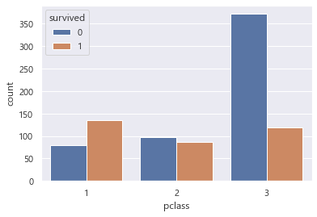

# 머신러닝 기본적인 데이터 준비

**데이터분석 위한 준비 위한 단계**
 1. 데이터 불러오기
 2. 데이터 살펴보기 
 3. 데이터 분할하기 - train, test
 4. 데이터 변환하기 - scale ... 

## 데이터 분석 위한 toy data set 불러오기 
-sklearn 사용해서 데이터 불러오기 


```python
from sklearn.datasets import load_boston
boston = load_boston()
print(type(boston))
```

    <class 'sklearn.utils.Bunch'>
    

sklearn.utils.Bunch는 현재 파이썬의 딕셔너리와 유사한 객체, 키로 구성  
key()이용해서 어떤 key 들었는지 확인하고 key값 이용해서 data 불러오기 가능


```python
print(boston.keys())
```

    dict_keys(['data', 'target', 'feature_names', 'DESCR', 'filename'])
    


```python
print(boston.DESCR) #데이터셋에 대한 설명
```

    .. _boston_dataset:
    
    Boston house prices dataset
    ---------------------------
    
    **Data Set Characteristics:**  
    
        :Number of Instances: 506 
    
        :Number of Attributes: 13 numeric/categorical predictive. Median Value (attribute 14) is usually the target.
    
        :Attribute Information (in order):
            - CRIM     per capita crime rate by town
            - ZN       proportion of residential land zoned for lots over 25,000 sq.ft.
            - INDUS    proportion of non-retail business acres per town
            - CHAS     Charles River dummy variable (= 1 if tract bounds river; 0 otherwise)
            - NOX      nitric oxides concentration (parts per 10 million)
            - RM       average number of rooms per dwelling
            - AGE      proportion of owner-occupied units built prior to 1940
            - DIS      weighted distances to five Boston employment centres
            - RAD      index of accessibility to radial highways
            - TAX      full-value property-tax rate per $10,000
            - PTRATIO  pupil-teacher ratio by town
            - B        1000(Bk - 0.63)^2 where Bk is the proportion of blacks by town
            - LSTAT    % lower status of the population
            - MEDV     Median value of owner-occupied homes in $1000's
    
        :Missing Attribute Values: None
    
        :Creator: Harrison, D. and Rubinfeld, D.L.
    
    This is a copy of UCI ML housing dataset.
    https://archive.ics.uci.edu/ml/machine-learning-databases/housing/
    
    
    This dataset was taken from the StatLib library which is maintained at Carnegie Mellon University.
    
    The Boston house-price data of Harrison, D. and Rubinfeld, D.L. 'Hedonic
    prices and the demand for clean air', J. Environ. Economics & Management,
    vol.5, 81-102, 1978.   Used in Belsley, Kuh & Welsch, 'Regression diagnostics
    ...', Wiley, 1980.   N.B. Various transformations are used in the table on
    pages 244-261 of the latter.
    
    The Boston house-price data has been used in many machine learning papers that address regression
    problems.   
         
    .. topic:: References
    
       - Belsley, Kuh & Welsch, 'Regression diagnostics: Identifying Influential Data and Sources of Collinearity', Wiley, 1980. 244-261.
       - Quinlan,R. (1993). Combining Instance-Based and Model-Based Learning. In Proceedings on the Tenth International Conference of Machine Learning, 236-243, University of Massachusetts, Amherst. Morgan Kaufmann.
    
    


```python
print(type(boston.data),type(boston.target)) #data는 사용할 변수 taret은 예측할 대상
print(boston.data.shape,boston.target.shape)
print(boston.data[:5])
print(boston.target[:5])
print(boston.feature_names)
```

    <class 'numpy.ndarray'> <class 'numpy.ndarray'>
    (506, 13) (506,)
    [[6.3200e-03 1.8000e+01 2.3100e+00 0.0000e+00 5.3800e-01 6.5750e+00
      6.5200e+01 4.0900e+00 1.0000e+00 2.9600e+02 1.5300e+01 3.9690e+02
      4.9800e+00]
     [2.7310e-02 0.0000e+00 7.0700e+00 0.0000e+00 4.6900e-01 6.4210e+00
      7.8900e+01 4.9671e+00 2.0000e+00 2.4200e+02 1.7800e+01 3.9690e+02
      9.1400e+00]
     [2.7290e-02 0.0000e+00 7.0700e+00 0.0000e+00 4.6900e-01 7.1850e+00
      6.1100e+01 4.9671e+00 2.0000e+00 2.4200e+02 1.7800e+01 3.9283e+02
      4.0300e+00]
     [3.2370e-02 0.0000e+00 2.1800e+00 0.0000e+00 4.5800e-01 6.9980e+00
      4.5800e+01 6.0622e+00 3.0000e+00 2.2200e+02 1.8700e+01 3.9463e+02
      2.9400e+00]
     [6.9050e-02 0.0000e+00 2.1800e+00 0.0000e+00 4.5800e-01 7.1470e+00
      5.4200e+01 6.0622e+00 3.0000e+00 2.2200e+02 1.8700e+01 3.9690e+02
      5.3300e+00]]
    [24.  21.6 34.7 33.4 36.2]
    ['CRIM' 'ZN' 'INDUS' 'CHAS' 'NOX' 'RM' 'AGE' 'DIS' 'RAD' 'TAX' 'PTRATIO'
     'B' 'LSTAT']
    

## 2. 데이터 살펴보기 

관계 살펴보기 위해서 matplotlpib 사용하기 


```python
%matplotlib inline
import matplotlib.pyplot as plt

x = boston.data[:,0]
y = boston.target

fig,ax = plt.subplots()
ax.scatter(x,y)

ax.set(xlabel='Crime Rate', ylabel='House Price',
       title='Crime Rate and House Price')

ax.grid()
plt.show()
```


```python
#ravel()
import numpy as np
a = np.array([[1,2],[3,4],[5,6]]) # array는 괄호 두개 필요 
print(a)
print(a.ravel()) # ravel은 평평하하게 만듦
```

    [[1 2]
     [3 4]
     [5 6]]
    [1 2 3 4 5 6]
    


```python
fig,axes = plt.subplots(5,3,figsize = (15,20)) #15개 그림판 그리기
y = boston.target

for i,ax in enumerate (axes.ravel()):
    if i < boston.data.shape[1]: 
     #현재 boston.data.shape는 (506,13)으로 구성으로 
     #boston.data.shape[1]은 뒤에 13개만 그래프 그리도록 설정
     #몇번째 컬럼인지 확인하도록 
        x = boston.data[:,i] #대상이 되는 변수만 x에 골라서 
        
        ax.set_title(boston.feature_names[i])
        #subplot의 제목을 변수의 이름으로 
        ax.scatter(x,y)
plt.show()


                        
```





## 3.데이터 분할

* 학습용 데이터와 검증용 데이터를 분리해서 올바르게 학습이 되었는지 확인하는 작업
* 독립변수와 종속변수는 반드시 짝을 맞춰야 하고 랜덤하게 섞어야 한다


```python
from sklearn.model_selection import train_test_split
X_train, X_test, Y_train, Y_test = train_test_split(boston.data, boston.target, test_size=0.2)
print(X_train.shape, Y_train.shape)
print(X_test.shape, Y_test.shape)
```

    (404, 13) (404,)
    (102, 13) (102,)
    

## 데이터 변환 - 표준화 (standardize feature)
데이터 간 분포의 편차가 큰 경우 이를 조정하기 위해서 데이터 변환 실시  
feature별(columns별)로 독립적으로 수행하는 경우가 많고 이를 확인 

* StandardScaler = x - 평균 / 표준편차 


```python
from sklearn.preprocessing import StandardScaler
scaler = StandardScaler()
print(scaler.fit(X_train)) #X_train set에 대해서만 scaler 실시 

# 평균, 표준편차를 계산
print('scaler mean :',scaler.mean_)
print('scaler variance :', scaler.var_)

print('--- train data before scaling ---')
print(X_train[:5])
scaled_X_train = scaler.transform(X_train)
print('--- train data after scaling ---')
print(scaled_X_train[:5])

scaled_X_test = scaler.transform(X_test) 
print('--- test data after scaling ---')
print(scaled_X_test[:5])
```

    StandardScaler()
    scaler mean : [3.78757203e+00 1.12165842e+01 1.11258168e+01 6.68316832e-02
     5.52400000e-01 6.29559901e+00 6.78829208e+01 3.79639134e+00
     9.59158416e+00 4.05915842e+02 1.85524752e+01 3.54389926e+02
     1.26687871e+01]
    scaler variance : [8.43237047e+01 5.20499502e+02 4.61561946e+01 6.23652093e-02
     1.31742174e-02 4.76291636e-01 7.82863594e+02 4.26648649e+00
     7.68307213e+01 2.88281315e+04 4.40947407e+00 9.09698712e+03
     5.13826418e+01]
    --- train data before scaling ---
    [[3.7578e-01 0.0000e+00 1.0590e+01 1.0000e+00 4.8900e-01 5.4040e+00
      8.8600e+01 3.6650e+00 4.0000e+00 2.7700e+02 1.8600e+01 3.9524e+02
      2.3980e+01]
     [3.4940e-01 0.0000e+00 9.9000e+00 0.0000e+00 5.4400e-01 5.9720e+00
      7.6700e+01 3.1025e+00 4.0000e+00 3.0400e+02 1.8400e+01 3.9624e+02
      9.9700e+00]
     [2.1409e-01 2.2000e+01 5.8600e+00 0.0000e+00 4.3100e-01 6.4380e+00
      8.9000e+00 7.3967e+00 7.0000e+00 3.3000e+02 1.9100e+01 3.7707e+02
      3.5900e+00]
     [2.6838e-01 0.0000e+00 9.6900e+00 0.0000e+00 5.8500e-01 5.7940e+00
      7.0600e+01 2.8927e+00 6.0000e+00 3.9100e+02 1.9200e+01 3.9690e+02
      1.4100e+01]
     [7.8860e-02 8.0000e+01 4.9500e+00 0.0000e+00 4.1100e-01 7.1480e+00
      2.7700e+01 5.1167e+00 4.0000e+00 2.4500e+02 1.9200e+01 3.9690e+02
      3.5600e+00]]
    --- train data after scaling ---
    [[-0.37154183 -0.49164368 -0.0788681   3.73670483 -0.55236588 -1.2919125
       0.74043251 -0.0636109  -0.63792175 -0.75927315  0.02263218  0.42829604
       1.57797806]
     [-0.37441459 -0.49164368 -0.18043076 -0.26761547 -0.07318412 -0.46888971
       0.31512415 -0.33593579 -0.63792175 -0.60025177 -0.07261159  0.43878063
      -0.37649604]
     [-0.38914976  0.47265711 -0.77508753 -0.26761547 -1.05768482  0.20633672
      -2.10806125  1.74302874 -0.2956636  -0.44712007  0.26074162  0.23779115
      -1.26654206]
     [-0.38323761 -0.49164368 -0.21134114 -0.26761547  0.2840241  -0.72680883
       0.09710895 -0.43750692 -0.40974965 -0.08784954  0.30836351  0.44570045
       0.19966228]
     [-0.40387621  3.01490464 -0.9090325  -0.26761547 -1.23193274  1.2351152
      -1.43614554  0.63920518 -0.63792175 -0.94774293  0.30836351  0.44570045
      -1.27072723]]
    --- test data after scaling ---
    [[-0.40769531  3.01490464 -1.14159628 -0.26761547 -1.34519388 -0.73695171
      -1.31462886  1.3628874  -0.63792175 -0.4058923  -1.167915    0.44570045
      -0.33882952]
     [-0.40373682 -0.49164368 -0.7603683  -0.26761547 -0.46524192 -0.64566574
      -0.94293081  0.06671774 -0.5238357  -0.74749379  0.30836351  0.44570045
      -0.54390282]
     [-0.40284929  0.0562545  -0.47923107 -0.26761547 -0.24743203 -0.41093036
      -0.04585184  0.85406347 -0.5238357  -0.559024   -1.59651199  0.43207049
      -0.03331215]
     [-0.40085643  3.01490464 -1.356497   -0.26761547 -1.21450795 -0.52105313
      -1.72921516  3.28692933 -0.63792175 -0.42356135  1.64177635  0.22699203
      -0.99032089]
     [-0.26622965 -0.49164368  1.24439041 -0.26761547  0.45827201 -0.33268524
       1.14787076 -0.98719169 -0.5238357  -0.01717338 -1.83462142 -0.00524151
      -0.87034603]]
    
