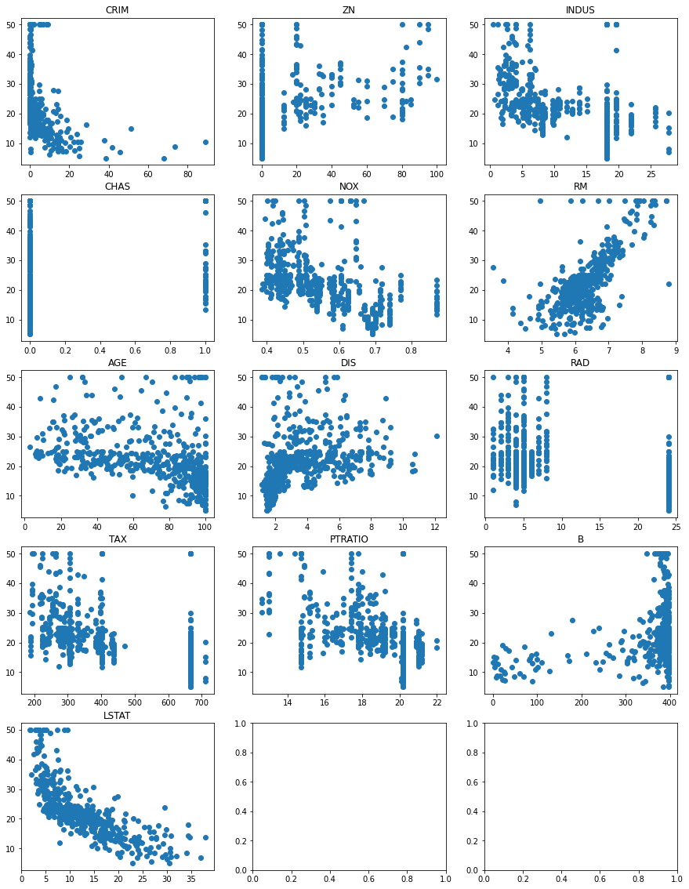
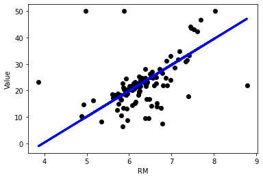

# 회귀분석

종속변수y와 독립변수x의 선형 상관 관계를 모델링 하는 것
예)키와 몸무게 - 키(독립변수) 크면 몸무게(종속변수) 더 많이 나갈 가능성 

독립변수 한개만 사용하면 단순 선형 회귀 
둘 이상 사용하면 나선 선형 회귀
 -예)키와 하루 식사량 등의 정보를 가지고 몸무게 예측

* 독립변수 - 예측에 사용하고자 하는 변수, 영향을 미치는 변수 
* 종속변수 - 예측하고자 하는 변수, 영향을 받는 변수 
* 설명력 -  독립변수로 인해 종속변수가 변할 때 왜 그렇게 되는지 설명을 할 수 있음을 숫자로 나타낸거 
          * 알 제곱 : 0 이면 설명력 하나도 x
                    : 1 이면 정확하게 백프로 예측
 

### 1.scikit learn에서 제공하는 보스톤 데이터 로드 및 train/test 분리

1.sklearn.datasets에서 boston 데이터를 읽어온다.  
2.train_test_split을 이용하여 train set과 test set으로 분리한다  
3.분리된 data set의 크기를 확인한다.


```python
# 데이터 준비하기 
from sklearn.datasets import load_boston
boston = load_boston()
from sklearn.model_selection import train_test_split
X_train, X_test, Y_train, Y_test = train_test_split(boston.data, boston.target, test_size=0.2, random_state=7)
#random state는 랜덤으로 섞긴 하지만 다음에 불러올 때 똑같은 값 나오도록 설정해두는것
#test size 기본값 0.25
print(X_train.shape, Y_train.shape)
print(X_test.shape, Y_test.shape)
```

    (404, 13) (404,)
    (102, 13) (102,)
    

### 2.데이터에 대한 정보를 얻기 위해 그래프 그리기
boston data set에서 X에 해당하는 각각의 값과 y의 값으로 그래프를 그려서 각 x값과 y의 관계를 직관적으로 살펴본다.


```python
%matplotlib inline
import matplotlib.pyplot as plt

fig, axes = plt.subplots(5, 3, figsize=(15, 20))
y = boston.target

for i, ax in enumerate(axes.ravel()): #나누어진 각 subplot에 대해
    if i < boston.data.shape[1]:
        x = boston.data[:,i] #13개까지만 그리도록 설정 

        ax.set_title(boston.feature_names[i])
        ax.scatter(x, y)
plt.show()
```





```python
print(boston.feature_names)
```

    ['CRIM' 'ZN' 'INDUS' 'CHAS' 'NOX' 'RM' 'AGE' 'DIS' 'RAD' 'TAX' 'PTRATIO'
     'B' 'LSTAT']
    

### Sklearn LinearRegression

coefficient: indepenent variables의 계수  
intercept: 상수 (bias)  
Sklearn이 제공하는 LinearRegression을 이용하여 회귀분석을 실시

### 3. 단순회귀분석(Simple linear regression)

독립변수가 하나인 모형  

### 회귀분석 순서 

1. 원하는 클래스 import  
2. 객체 생성  
3. fit()적용 : 모형 생성, 즉 데이터를 가장 잘 설명하는 선형식  
   -쉽게 말해서 직선을 찾는다.  (y = b+bx같은 식 세움)  
    fit()이 수행되면 기울기와 절편이 결정된다.  
4. 모형 기본 정보 확인: fit()에서 결정된 기울기, 절편 등을 확인한다.  
5. score()로 성능 검사 : R2(R square)라고 해서 모형의 설명력을 나타내는 수치를 계산한다.  
6. predict()로 예측 : 새로운 독립변수를 이용하여 종속변수를 예측한다.


```python
# boston.data에서 RM만 가져오려면?
boston.data[:, 5].shape
```


    (506,)


```python
#simple linear regression
from sklearn.linear_model import LinearRegression
# 가장 유의한 영향을 끼치는 RM을 독립변수로 선택

lr = LinearRegression()  #객체를 생성
                         #현재 독립변수 RM 한개임으로 단순회귀분석 실시 

lr.fit(X_train[:,5], Y_train) 
# lr.fit(X_train[:,[5]], Y_train) reshape 대신 이것도 가능 

print(lr) # 모형정보를 확인, 사용된 parameter를 알 수 있음 
```


    ---------------------------------------------------------------------------

    ValueError                                Traceback (most recent call last)

    <ipython-input-5-21f22ecf980b> in <module>
          6                          #현재 독립변수 RM 한개임으로 단순회귀분석 실시
          7 
    ----> 8 lr.fit(X_train[:,5], Y_train)
          9 # lr.fit(X_train[:,[5]], Y_train) reshape 대신 이것도 가능
         10 
    

    ~\anaconda3\lib\site-packages\sklearn\linear_model\_base.py in fit(self, X, y, sample_weight)
        503 
        504         n_jobs_ = self.n_jobs
    --> 505         X, y = self._validate_data(X, y, accept_sparse=['csr', 'csc', 'coo'],
        506                                    y_numeric=True, multi_output=True)
        507 
    

    ~\anaconda3\lib\site-packages\sklearn\base.py in _validate_data(self, X, y, reset, validate_separately, **check_params)
        430                 y = check_array(y, **check_y_params)
        431             else:
    --> 432                 X, y = check_X_y(X, y, **check_params)
        433             out = X, y
        434 
    

    ~\anaconda3\lib\site-packages\sklearn\utils\validation.py in inner_f(*args, **kwargs)
         71                           FutureWarning)
         72         kwargs.update({k: arg for k, arg in zip(sig.parameters, args)})
    ---> 73         return f(**kwargs)
         74     return inner_f
         75 
    

    ~\anaconda3\lib\site-packages\sklearn\utils\validation.py in check_X_y(X, y, accept_sparse, accept_large_sparse, dtype, order, copy, force_all_finite, ensure_2d, allow_nd, multi_output, ensure_min_samples, ensure_min_features, y_numeric, estimator)
        794         raise ValueError("y cannot be None")
        795 
    --> 796     X = check_array(X, accept_sparse=accept_sparse,
        797                     accept_large_sparse=accept_large_sparse,
        798                     dtype=dtype, order=order, copy=copy,
    

    ~\anaconda3\lib\site-packages\sklearn\utils\validation.py in inner_f(*args, **kwargs)
         71                           FutureWarning)
         72         kwargs.update({k: arg for k, arg in zip(sig.parameters, args)})
    ---> 73         return f(**kwargs)
         74     return inner_f
         75 
    

    ~\anaconda3\lib\site-packages\sklearn\utils\validation.py in check_array(array, accept_sparse, accept_large_sparse, dtype, order, copy, force_all_finite, ensure_2d, allow_nd, ensure_min_samples, ensure_min_features, estimator)
        618             # If input is 1D raise error
        619             if array.ndim == 1:
    --> 620                 raise ValueError(
        621                     "Expected 2D array, got 1D array instead:\narray={}.\n"
        622                     "Reshape your data either using array.reshape(-1, 1) if "
    

    ValueError: Expected 2D array, got 1D array instead:
    array=[5.936 6.701 5.87  5.898 5.936 6.51  6.718 5.963 6.38  6.127 6.096 5.868
     5.414 6.254 6.13  6.998 6.251 5.927 5.648 6.101 6.164 7.82  6.629 7.024
     6.433 6.77  7.206 6.8   5.891 5.874 6.495 6.642 6.516 5.593 6.968 6.816
     5.747 6.456 6.968 6.715 6.389 6.358 7.135 5.628 6.556 5.637 6.616 6.163
     6.382 5.304 5.713 5.019 6.728 5.837 5.362 7.802 5.888 6.415 6.481 4.138
     6.619 5.905 6.567 6.782 5.896 6.345 6.98  5.935 5.998 6.471 6.151 8.297
     6.482 5.787 5.565 6.842 3.561 6.951 7.416 6.826 5.186 5.834 8.375 7.923
     5.786 6.015 5.85  4.519 4.368 6.144 5.572 6.245 6.758 6.167 5.807 8.259
     5.935 4.973 6.405 7.007 6.202 6.174 6.604 6.405 7.333 5.859 5.875 6.108
     6.943 6.417 5.822 7.82  6.019 6.216 6.879 6.54  6.49  5.884 5.983 8.337
     5.456 6.315 4.652 5.57  7.249 7.088 6.103 6.398 6.096 6.144 5.604 6.122
     5.783 6.606 6.63  6.683 6.678 8.069 6.086 6.405 6.297 6.129 5.961 6.092
     6.406 7.241 5.88  6.474 6.232 6.249 5.966 5.869 5.759 5.986 6.185 5.887
     6.312 6.006 7.691 6.852 5.924 6.376 6.348 6.027 5.613 5.569 5.983 6.86
     6.208 6.794 6.618 6.579 6.211 5.885 5.841 6.25  6.009 4.903 6.728 5.693
     6.545 6.004 6.513 6.02  7.412 5.96  6.431 5.468 6.095 6.172 6.108 7.016
     6.31  5.631 5.272 6.047 7.014 7.104 5.876 6.003 5.709 5.399 6.064 6.209
     6.421 5.92  5.56  6.312 6.316 6.625 6.317 5.093 5.914 6.176 5.682 7.489
     5.277 6.021 6.315 6.14  5.454 6.762 6.343 5.39  5.981 5.79  7.831 6.059
     6.975 5.976 6.004 5.926 6.436 6.849 6.376 6.066 6.63  8.725 8.398 5.706
     4.628 6.279 5.713 7.313 6.121 6.03  7.155 5.851 6.417 5.602 5.536 6.43
     5.99  6.726 5.531 5.67  5.836 5.757 5.683 8.04  5.412 6.951 6.485 6.426
     7.645 6.674 6.402 7.765 6.727 7.107 5.344 6.335 6.98  6.833 7.274 4.906
     7.929 5.    5.942 6.453 6.037 6.326 6.595 6.182 6.211 5.888 5.304 7.041
     6.301 7.236 5.933 5.705 5.972 7.267 5.879 5.403 6.195 5.708 6.031 6.193
     5.627 6.127 6.341 5.889 6.538 6.03  7.853 6.459 5.731 5.965 6.404 6.167
     6.458 5.762 6.333 6.552 5.39  6.23  5.856 5.701 6.162 7.147 6.657 5.727
     6.373 6.223 6.593 6.824 6.212 5.597 8.266 6.226 5.427 5.404 7.061 5.782
     7.148 8.247 6.377 6.812 5.961 6.957 6.442 6.75  6.939 6.434 4.138 5.987
     7.178 8.704 5.871 5.985 5.707 7.875 6.696 6.454 7.203 5.966 6.162 6.167
     6.861 6.185 7.185 6.438 5.913 6.152 6.563 5.012 6.023 6.431 6.739 6.069
     5.854 6.854 6.012 6.487 6.122 6.286 6.575 6.193 6.051 5.52  6.425 5.594
     6.114 5.877 5.036 5.951 6.169 4.963 6.014 6.065 5.813 5.453 6.153 6.635
     6.137 5.608 5.404 5.878 6.12  5.599 7.287 6.546].
    Reshape your data either using array.reshape(-1, 1) if your data has a single feature or array.reshape(1, -1) if it contains a single sample.


* 에러 발생 이유   
   ndarray형태가 와야하는데 현재 RM은 독립변수가 하나로 벡터 형태  로 불러옴
   --> 이처럼 독립변수 하나인 경우엔 reshape 필요 
   (LinearRegression은 독립변수가 여러개인 모형을 하고 있기 때문)

### numpy의 reshape에 대해 이해

numpy.reshape(a, newshape, order='C')  
            * a가 바꾸고자 하는 대상   
            * newshape은 원하는 모양


```python
import numpy as np
a = np.array([[1, 2], [3, 4], [5, 6]])
print(a.shape)
a
```

    (3, 2)
    


    array([[1, 2],
           [3, 4],
           [5, 6]])


```python
a.reshape((2, 3))
#np.reshape(a, (2, 3))
```


    array([[1, 2, 3],
           [4, 5, 6]])


```python
a.reshape((-1, 3)) 
# -1이면 열 3개 맞추고 알아서 행 설정
```


    array([[1, 2, 3],
           [4, 5, 6]])


```python
a.reshape((-1, 1)) # 위와 마찬가지로 열 1개 맞추면 -1이 알아서 적절한 값 설정
```


    array([[1],
           [2],
           [3],
           [4],
           [5],
           [6]])


```python
lr.fit(X_train[:,5].reshape(-1, 1), Y_train) 
#현재 RM사용으로 독립변수 하나인 모양임으로 reshape(-1,1) 필요 
print(lr) # 모형정보를 확인, 사용된 parameter를 알 수 있음 
```

    LinearRegression()
    


```python
#모형 기본 정보 보기
print('coef_', lr.coef_) #계수 - 즉 기울기
print('intercept_', lr.intercept_) #상수
```

    coef_ [9.79620171]
    intercept_ -38.907661826429276
    


```python
#모형의 성능 보기
print('R2 score for train set', lr.score(X_train[:,5].reshape(-1, 1), Y_train)) 
#train set에 대한 적합도 - 모형이 얼마나 잘 맞나
```

    R2 score for train set 0.5608802132974211
    


```python
# test set에 대한 예측
P_test = lr.predict(X_test[:,5].reshape(-1, 1)) #predict 함수를 이용
print('prediction', P_test)
print('R2 score for test set', lr.score(X_test[:,5].reshape(-1, 1), Y_test)) #test set에 대한 적합도
```

    prediction [23.73904812 18.84094726 20.68263318 19.36994216 19.44831177 13.49222113
     22.11287863 23.94476835 22.71044694 19.39933076  8.89780253 31.26253103
     22.01491662 22.11287863 34.11322573 24.15048859 25.64930745 29.48941852
     19.37973836 19.95771426 24.61091007 29.43064131 35.6414332  16.00004877
      9.3484278  27.53017818 33.78015487 27.6477326  23.54312408 25.40440241
     22.32839507 28.40204013 30.43965009 25.01255434 34.26996496 18.61563462
     17.85153089 27.20690352 20.97651924 28.65674138 23.95456456 26.22728335
     18.4686916  27.52038198 20.66304078 23.59210509 22.4753381  20.96672303
     21.3585711  -1.06493461 25.24766318 22.22063685 17.48907143 47.1029892
     24.38559743 21.11366606 19.16422192 21.9169546  20.99611164 18.4588954
     19.14462952 32.86910811 17.3323322  19.55606999 18.43930299 39.79502272
     23.89578735 23.51373548 20.27119271 26.09013653 22.82800136 18.08663973
     16.56822847 33.17279037 22.99453679 22.11287863 17.05803855 21.26060909
     28.43142874 20.57487497 33.51565743 24.87540752 22.24022926 18.64502323
     23.71945572 26.05095172 23.6214937  17.93969671 31.47804747 21.28999769
      9.77946068 36.38594453 34.75977504 23.0631102  22.54391151 18.41971059
     24.71866829 11.591758   16.11760319 26.99138709 26.28606056 18.03765872]
    R2 score for test set 0.14443708697515478
    

R2 trian set은 **0.5608802132974211**  
R2 test set은 **0.14443708697515478** 로 많이 다른 것 확인 
  
  --> 이는 일반화 성능 부족하거나 test set이 운이 없게 만들어졌다는 것을 의미 


```python
# train set에 대한 graph
Y_predict = lr.predict(X_train[:,5].reshape(-1, 1))
plt.xlabel(boston.feature_names[5])
plt.ylabel('Value')
plt.scatter(X_train[:,5], Y_train, color='black') #검은 점은 실제 값
plt.plot(X_train[:,5], Y_predict, color='blue', linewidth=3) #예측된 값은 직선이 됨
plt.show()
```


```python
#test set에 대한 그래프 
Y_predict = lr.predict(X_test[:,5].reshape(-1, 1))
plt.xlabel(boston.feature_names[5])
plt.ylabel('Value')
plt.scatter(X_test[:,5], Y_test, color='black')
plt.plot(X_test[:,5], Y_predict, color='blue', linewidth=3)
plt.show()
```





```python
from sklearn.linear_model import LinearRegression


#lr = LinearRegression().fit(X_train[:,-1].reshape(-1, 1), Y_train)
lr = LinearRegression().fit(X_train[:,[-1]].reshape(-1, 1), Y_train) 
#LSTAT 역시 독립변수 한개로 reshape
# graph에서 LSTAT이 역방향으로 유의한 영향을 끼치는 것으로 보이므로, LSTAT을 독립변수로 선택
# 위 예는 객체생성과 fit을 한번에 수행

print(lr) #사용된 parameter를 알 수 있음 
```

    LinearRegression()
    


```python
#모형 기본 정보 보기
print('coef_', lr.coef_) #기울기, 그래프를 생각하면 음수가 나와야 함
print('intercept_', lr.intercept_)
print('R2 score for train set: {:.3f}'.format(lr.score(X_train[:,-1].reshape(-1, 1), Y_train)))
# test set에 대한 예측
print('R2 score for test set: {:.3f}'.format(lr.score(X_test[:,-1].reshape(-1, 1), Y_test)))
```

    coef_ [-0.93547456]
    intercept_ 34.461935576365505
    R2 score for train set: 0.542
    R2 score for test set: 0.553
    

### 4. 다중회귀분석(Multiple linear regression)
독립변수가 여러 개인 회귀모형  
보스톤 데이터 셋에서 전체 feature를 전부 사용

2단계 객체 생성하고 3단계 fit하기


```python
lr = LinearRegression().fit(X_train, Y_train)
print(lr) #사용된 parameter를 알 수 있음 
```

    LinearRegression()
    

모형 정보 확인하기


```python
print('coef_', lr.coef_) #사용된 모든 독립변수에 대한 계수(기울기)를 반환
print('intercept_', lr.intercept_)
```

    coef_ [-1.24649091e-01  3.04735052e-02  2.17990089e-02  2.79225761e+00
     -1.52135247e+01  5.27249266e+00 -1.10577742e-02 -1.27320872e+00
      2.65804711e-01 -1.15043029e-02 -9.19571148e-01  1.01624292e-02
     -3.89712044e-01]
    intercept_ 23.554245467591464
    

예측결과와 실제값과의 관계를 그래프로 확인
독립변수가 여러개이기 때문에 독립변수-종속변수 관계로 그래프를 그리기 어려움.
따라서 실제 값을 X축에 놓고 예측된 값을 Y축으로 해서 그래프를 그리고 적합도를 직관적으로 봄


```python
predicted = lr.predict(X_train) #먼저 값을 예측

fig, ax = plt.subplots()
ax.scatter(Y_train, predicted, edgecolors=(0, 0, 0))
#실제값과 예측값으로 점을 찍어 표시 - 둘이 다를 수 있음
ax.plot([Y_train.min(), Y_train.max()], [Y_train.min(), Y_train.max()], 'k--', lw=4)
#실제값과 예측값이 같은 지점을 연결해서 선을 표시
ax.set_xlabel('Measured')
ax.set_ylabel('Predicted')
plt.show()
```


```python
print('R2 score for train set: {:.3f}'.format(lr.score(X_train, Y_train)))
print('R2 score for test set: {:.3f}'.format(lr.score(X_test, Y_test)))
```

    R2 score for train set: 0.770
    R2 score for test set: 0.579
    

R2 score를 보면 단순회귀분석에 비해 적합도(정확하게는 설명력)가 높아진 것을 볼 수 있다.

### 5. 특성 스케일링(feature scaling) - 데이터 변환 혹은 표준화
어떤 머신러닝 알고리즘은 독립변수들의 스케일이 많이 다르면 잘 작동하지 않음
따라서 일정한 범위로 변수들을 조정할 필요가 있음  
StandardScaler는 변수의 값들을 표준화시켜주는데, 표준화는 평균으로 빼고 표준편차로 나누는 것을 의미  
다른 스케일링 방식으로 min-max scaling이 있는데, 이는 최소값을 뺀 후, 최대값과 최소값의 차이로 나누어줌  
그 결과, 값을 0과 1 사이로 변환하는데, min-max에 비해 standardize는 이상치에 더 강하다는 장점이 있음

1단계 import 하기


```python
#다중회귀분석 예제
from sklearn.preprocessing import StandardScaler
scaler = StandardScaler()
print(scaler.fit(X_train))
print('scaler mean:', scaler.mean_)
print('scaler variance:', scaler.var_)

scaled_X_train = scaler.transform(X_train)
scaled_X_test = scaler.transform(X_test)
```

    StandardScaler()
    scaler mean: [3.40301918e+00 1.13886139e+01 1.10690099e+01 6.93069307e-02
     5.51701980e-01 6.27081683e+00 6.83544554e+01 3.81904455e+00
     9.09158416e+00 4.01945545e+02 1.83868812e+01 3.59049653e+02
     1.27629455e+01]
    scaler variance: [6.72975672e+01 5.46459128e+02 4.89588505e+01 6.45034801e-02
     1.33191549e-02 4.98727184e-01 8.00078124e+02 4.54208095e+00
     7.22020084e+01 2.76100812e+04 4.69574374e+00 7.58004037e+03
     5.28223663e+01]
    

2단계 객체 생성  
3단계 fit하기  
4딘계 모형 기본 정보 확인하기(기울기와 y절편)


```python
slr = LinearRegression()
slr.fit(scaled_X_train, Y_train)
print('coef_', slr.coef_)
print('intercept_', slr.intercept_)
```

    coef_ [-1.02255999  0.71236284  0.15252898  0.70916461 -1.75577224  3.72346696
     -0.31277636 -2.71348259  2.25858954 -1.91158736 -1.99267986  0.88477592
     -2.83238805]
    intercept_ 22.522524752475295
    

5단계 score로 성능 검사하기 


```python
print('R2 score for train set: {:.3f}'.format(slr.score(scaled_X_train, Y_train)))
print('R2 score for test set: {:.3f}'.format(slr.score(scaled_X_test, Y_test)))
```

    R2 score for train set: 0.770
    R2 score for test set: 0.579
    

변환된 값을 이용하여 수행한 회귀분석에 대해 설명력을 출력
결과를 보면 변환전과 차이가 없음. 즉, 보스톤 데이터 셋을 이용한 회귀분석에서는 변환이 별 영향을 미치지 않음을 알 수 있음
