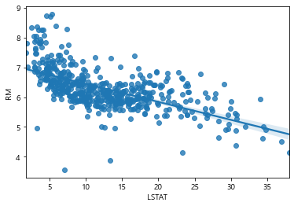

## 특정 스케일링 - 데이터 변환 혹은 표준화 
  
독립변수들의 스케일이 많이 다르면 잘 작동하지 않는다  
그로인해, 일정한 범위로 변수들을 조정할 필요가 있고 이러한 변수의 값들을 표준화하는데,  
이를 StandardScaler라고 하며 표준화는 평균으로 빼고 표준편차로 나누는 것을 말한다.  
다른 방법은 MinMaxScaling이 있고 이는 최소값을 뺀 후 최대값과 최소값의 차이로 나누어주는 것을 말한다. 이 경우엔 값을 0과 1사이로 변환하게 된다.  
MinMax에 비해 Standardize가 이상치에 더 강하다는 장점이 있다.  

#### scikit learn에서 보스톤 데이터 불러와서 준비하기


```python
from sklearn.datasets import load_boston
boston = load_boston()
from sklearn.model_selection import train_test_split
X_train,X_test,Y_train,Y_test = train_test_split(boston.data,boston.target,test_size = 0.2, random_state =7)
print(X_train.shape,Y_train.shape)
print(X_test.shape,Y_test.shape)
```

    (404, 13) (404,)
    (102, 13) (102,)
    


```python
%matplotlib inline
import matplotlib.pyplot as plt

fig,axes = plt.subplots(5,3,figsize=(15,20))
y = boston.target

for i,ax in enumerate (axes.ravel()):
    if i < boston.data.shape[1]:
        x = boston.data[:,i]
        
        ax.set_title(boston.feature_names[i])
        ax.scatter(x,y)
print()
```

    
    


## 다항식 변환 
  
선형회귀분석은 대체로 선으로 연관성을 찾으려고 하지만,  
주어진 독립변수들에 대해 제곱이나 변수들 간의 곱을 이용한 것을 다항식 변환이라 한다.<br>곱을 이용한 것으로 우리는 연관성을 다항식으로 찾아볼 수 있다.


```python
#LSTAT만 가져오기
plt.plot(boston.data[:,-1],boston.target,'bo')
plt.show()
```


LSTAT 그래프는 곡선이 두 변수 간의 관계를 더 잘 설명할 것으로 보여진다.

따라서, 위 그래프는 이차함수일때 가장 잘 설명할 것으로 보이고  
전형적인 이차함수 그래프는 ``y = ax**2+bx+c``로 x의 제곱을 새로운 독립변수로 만들어  
x와 x제곱 두개를 독립변수로 갖게 해야한다 


```python
X2 = X_train[:,-1]**2
X2.shape
```


    (404,)


**x와 x제곱 묶어서 trian set으로 만들기 위해서 vstack사용**
현재 변수는 ``LSTAT``인 ``x``와 ``LSTAT**2``인 ``x**2``이 필요한 것  
그러나 현재 둘의 상태는 각각 벡터로 존재한 상태임으로 하나의 행렬 생성이 필요  
이를 위해 np.vstack을 사용한다 


```python
import numpy as np
X_train_new = np.vstack((X_train[:,-1],X2)) #(404,)형태의 벡터 두개를  
                                            # 행 두개에 404개의 값들로 바꾸기 위해서 
X_train_new.shape 
```


    (2, 404)


새로운 데이터 셋을 생성


```python
X_train_new = X_train_new.T
X_test_new = np.vstack((X_test[:,-1],X_test[:,-1]**2)).T
print(X_test_new.shape)
```

    (102, 2)
    

객체 생성하기 


```python
from sklearn.linear_model import LinearRegression

lr = LinearRegression().fit(X_train_new, Y_train)
```

모형 기본 정보 확인하기 


```python
print('coef_', lr.coef_) 
print('intercept_', lr.intercept_)
```

    coef_ [-2.33661733  0.04361049]
    intercept_ 42.93720207707371
    

값 확인하기 


```python
print('R2 score for train set: {:.3f}'.format(lr.score(X_train_new, Y_train)))
print('R2 score for test set: {:.3f}'.format(lr.score(X_test_new, Y_test)))
```

    R2 score for train set: 0.645
    R2 score for test set: 0.625
    

* 0.55정도의 설명력이 나왔던 회귀분석에 비해서 설명력이 확실히 증가한 것을 확인할 수 있고 이를 눈으로 확인 위해 그래프 생성


```python
plt.plot(X_train[:,-1],Y_train,'bo')
plt.plot(X_train[:,-1],lr.predict(X_train_new),'ro')
plt.show()
```





#### Polynomial Features


```python
from sklearn.preprocessing import PolynomialFeatures
poly = PolynomialFeatures(2) #2차항까지 생성

X_train_poly = poly.fit_transform(X_train[:,[-1]]) #reshape사용 없이 numpy속성 사용해서 바로 
X_test_poly = poly.transform(X_test[:,[-1]])

print(X_train_poly.shape,X_test_poly.shape)
```

    (404, 3) (102, 3)
    


```python
X_train[:5,[-1]]
```


    array([[ 5.57],
           [16.42],
           [14.37],
           [12.67],
           [16.94]])


* LSTAT에 대한 값 위에서부터 5개만 가져온 것 


```python
X_train_poly[:5]
```


    array([[  1.    ,   5.57  ,  31.0249],
           [  1.    ,  16.42  , 269.6164],
           [  1.    ,  14.37  , 206.4969],
           [  1.    ,  12.67  , 160.5289],
           [  1.    ,  16.94  , 286.9636]])


* (1은 상수에 대한 값으로 이해하면 됨 =  y절편같은)  
   상수 , 원래 LSTAT값 ,  LSTAT에 대한 제곱 값


```python
#객체 생성

lr = LinearRegression().fit(X_train_poly,Y_train)
```


```python
#모형 정보 확인

print('coef_',lr.coef_) 
print('intercept_',lr.intercept_)
```

    coef_ [ 0.         -2.33661733  0.04361049]
    intercept_ 42.93720207707378
    


```python
#값 확인 
print('R2 score for train set:{:.3f}'.format(lr.score(X_train_poly,Y_train)))
print('R2 score for test set:{:.3f}'.format(lr.score(X_test_poly,Y_test)))
```

    R2 score for train set:0.645
    R2 score for test set:0.625
    

PolynomialFeatures는 모든 독립변수에 적용하는 것이 가능  
이럴땐, 독립변수의 제곱뿐 아니라 독립변수 간의 곱도 가능  
이 때, 독립변수 간의 곱은 interaction이라 하며, 두 독립변수의 상호작용을 본다란 의미 가짐


```python
from sklearn.preprocessing import PolynomialFeatures
poly = PolynomialFeatures(2)
X_train_poly = poly.fit_transform(X_train)
X_test_poly =poly.transform(X_test)
print('X_train : X_train_Poly:',X_train.shape,X_train_poly.shape)
```

    X_train : X_train_Poly: (404, 13) (404, 105)
    


```python
lr = LinearRegression().fit(X_train_poly, Y_train)
print('R2 score for polynomial train set: {:.3f}'.format(lr.score(X_train_poly, Y_train)))
print('R2 score for polynomial test set: {:.3f}'.format(lr.score(X_test_poly, Y_test)))
```

    R2 score for polynomial train set: 0.934
    R2 score for polynomial test set: 0.617
    

변환된 다항식을 이용하여 회귀분석을 수행  
다항식을 적용하지 않은 다중회귀분석 결과와 비교할 때,  
train과 test 모두 설명력이 향상된 것을 확인할 수 있다  
그러나 LSTAT대해 다항식 적용한 결과와 비교하면 test 값은 떨어진 것을 확인  
test에 비해서 train이 너무 값이 큼으로 이러한 상황은 과대적합으로 의심되는 상황이라 할 수 있다

## 과대적합과 과소적합

* **과대적합** : train set에 대해 너무 과하게 학습된 경우
* **과소적합**: 학습이 부족해서 train set의 구조를 잘 반영하지 못한 경우 

### 릿지회귀
과대적합을 방지하기 위한 방법  
각 독립변수에 대해 계수가 과도하게 커지는 것을 방지 


```python
from sklearn.linear_model import Ridge
```


```python
# 객체 생성 
ridge = Ridge().fit(X_train_poly,Y_train)
```


```python
#결과 확인 
print('Ridge R2 score for Polynomial train set:{:.3f}'.format(ridge.score(X_train_poly,Y_train)))
print('Ridge R2 score for polynomial test set: {:.3f}'.format(ridge.score(X_test_poly, Y_test)))
```

    Ridge R2 score for Polynomial train set:0.930
    Ridge R2 score for polynomial test set: 0.724
    

* test set 설명력 좋아진 것을 확인 가능

### 라쏘회귀 
릿지회귀와 비슷하나 계수가 0에 가까우면 0으로 만드는 성향으로,  
특정 독립변수는 종속변수에 전혀 영향을 미치지 못하게 되면 모형에서 제외됨


```python
from sklearn.linear_model import Lasso
```


```python
# 객체 생성
lasso = Lasso().fit(X_train_poly,Y_train)
```

    C:\Users\juhee\anaconda3\lib\site-packages\sklearn\linear_model\_coordinate_descent.py:529: ConvergenceWarning: Objective did not converge. You might want to increase the number of iterations. Duality gap: 2048.2419962596277, tolerance: 3.4473845024752476
      model = cd_fast.enet_coordinate_descent(
    


```python
# 결과 확인 
print('Lasso R2 for polynomial trian set:{:.3f}'.format(lasso.score(X_train_poly,Y_train)))
print('Lasso R2 for polynomial test set:{:.3f}'.format(lasso.score(X_test_poly,Y_test)))
print('Used features count: {}'.format(np.sum(lasso.coef_ != 0))) #계수가 0이 아닌 독립변수의 수를 출력
```

    Lasso R2 for polynomial trian set:0.897
    Lasso R2 for polynomial test set:0.769
    Used features count: 56
    

결과를 보면 다항식 변환(polynomial)한 후, 변수를 56개만 사용한 것을 확인  
설명력은 train이 릿지회귀에 비해서 떨어지지만 변수 적게 사용한것치고는 높은편을 보임  test set에 대해서는 오히려 릿지회귀보다 조금 더 높은 결과를 보여주고 있다  
그러나 보통 라쏘회귀의 성능이 릿지회귀보다 떨어지는 경우가 많지만, 이 테스트에서는 라쏘회귀가 더 적합했다고 볼 수 있다

위에서 오류는 iter을 조정해서 사용할 것을 권하고 있고 이를 조정하여 다시 결과 확인


```python
lasso01 = Lasso(max_iter=1000000).fit(X_train_poly, Y_train)
print('Lasso R2 score for polynomial train set: {:.3f}'.format(lasso01.score(X_train_poly, Y_train)))
print('Lasso R2 score for polynomial test set: {:.3f}'.format(lasso01.score(X_test_poly, Y_test)))
print('Used features count: {}'.format(np.sum(lasso01.coef_ != 0)))
```

    Lasso R2 score for polynomial train set: 0.902
    Lasso R2 score for polynomial test set: 0.772
    Used features count: 49
    

* 조정해서 돌려본 결과 train과 test 모두 올라간 것을 확인할 수 있다
