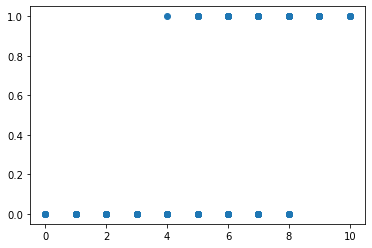

# Logistic Regression -  분류 위한 회귀 

* 종속변수(y)가 범주형 데이터를 대상으로 실시  
* 입력 데이터 주어졌을 때 해당 데이터의 결과가 특정 분류로 나뉘어지는 일종의 분류 기법
* 종속변수의 범주가 두개인 경우 이항 로지스틱
* 종속변수의 범주가 여러개인 경우 다항 로지스틱 혹은 분화 로지스틱

## 이항 로지스틱 회귀 

**독립변수**  - Self_Study_Daily , Tution_Monthly  
**종속변수** - Pass_Or_Fail

### 1. Pandas 이용한 데이터 준비 


```python
import pandas as pd
import numpy as np

df = pd.read_csv('Student-Pass-Fail-Data.csv')
```


```python
df.describe()
```


<div>
<style scoped>
    .dataframe tbody tr th:only-of-type {
        vertical-align: middle;
    }

    .dataframe tbody tr th {
        vertical-align: top;
    }

    .dataframe thead th {
        text-align: right;
    }
</style>
<table border="1" class="dataframe">
  <thead>
    <tr style="text-align: right;">
      <th></th>
      <th>Self_Study_Daily</th>
      <th>Tuition_Monthly</th>
      <th>Pass_Or_Fail</th>
    </tr>
  </thead>
  <tbody>
    <tr>
      <th>count</th>
      <td>1000.000000</td>
      <td>1000.000000</td>
      <td>1000.000000</td>
    </tr>
    <tr>
      <th>mean</th>
      <td>5.744000</td>
      <td>31.230000</td>
      <td>0.499000</td>
    </tr>
    <tr>
      <th>std</th>
      <td>2.121076</td>
      <td>5.976355</td>
      <td>0.500249</td>
    </tr>
    <tr>
      <th>min</th>
      <td>0.000000</td>
      <td>20.000000</td>
      <td>0.000000</td>
    </tr>
    <tr>
      <th>25%</th>
      <td>4.000000</td>
      <td>26.000000</td>
      <td>0.000000</td>
    </tr>
    <tr>
      <th>50%</th>
      <td>6.000000</td>
      <td>30.000000</td>
      <td>0.000000</td>
    </tr>
    <tr>
      <th>75%</th>
      <td>7.000000</td>
      <td>36.000000</td>
      <td>1.000000</td>
    </tr>
    <tr>
      <th>max</th>
      <td>10.000000</td>
      <td>50.000000</td>
      <td>1.000000</td>
    </tr>
  </tbody>
</table>
</div>


```python
df.Pass_Or_Fail.value_counts()
```


    0    501
    1    499
    Name: Pass_Or_Fail, dtype: int64


### 2. 데이터 살펴보기 


```python
%matplotlib inline
import matplotlib.pyplot as plt

plt.scatter(df['Self_Study_Daily'],df['Pass_Or_Fail'])
plt.show()
```





그래프를 그려본 결과 0값을 가지는 x의 좌표들과 1을 가질 때의 x좌표는 알았지만,  
이를 보고는 그 위치에 얼마나 점이 찍혔는지는 알기 어렵다  

이를 해결하기 위한 문제로 아래는 KDE Plot 사용


```python
import seaborn as sns
X_Fail = df.Self_Study_Daily[df.Pass_Or_Fail ==0] # 불리안 인덱싱 사용해서 0일때의 self_study값만
X_Pass = df.Self_Study_Daily[df.Pass_Or_Fail ==1]
g = sns.kdeplot(X_Fail)
g = sns.kdeplot(X_Pass)
```


```python
plt.scatter(df['Tuition_Monthly'],df['Pass_Or_Fail'])
plt.show()
```


```python
X_Fail = df.Tuition_Monthly[df.Pass_Or_Fail == 0]
X_Success = df.Tuition_Monthly[df.Pass_Or_Fail == 1]
g =  sns.kdeplot(X_Fail)
g = sns.kdeplot(X_Success)
```


Self_Study_Daily , Tuition_Monthly,Pass_Or_Fail 3의 관계  
plot 사용하여 2차원 그래프 통해 알아보기 


```python
plt.scatter(df.Self_Study_Daily , df.Tuition_Monthly, c= df.Pass_Or_Fail) 
#c는  self study와 tuition daily에 따라 컬러 설정
plt.xlabel('Self_Study_Daily')
plt.ylabel('Tuition_Daily')
plt.show()
```


노란점 =  pass  /  보라점 = fail 

SNS 패키지의 KDE plot을 이용하면 아래와 같이 2차원에 대한 분포 확인


```python
ax = sns.kdeplot(df.Self_Study_Daily[df.Pass_Or_Fail == 0],df.Tuition_Monthly[df.Pass_Or_Fail == 0],cmap="Reds", shade=True, shade_lowest=False)
ax = sns.kdeplot(df.Self_Study_Daily[df.Pass_Or_Fail == 1], df.Tuition_Monthly[df.Pass_Or_Fail == 1],
                 cmap="Blues", shade=True, shade_lowest=False)
```


```python
from sklearn.model_selection import train_test_split

X =df.drop('Pass_Or_Fail',axis =1)
y = df.Pass_Or_Fail

X_train,X_test,y_train,y_test = train_test_split(X,y,random_state=4)
```

## 이항 로지스틱 회귀분석 실시


```python
from sklearn.linear_model import LogisticRegression

LR_clf = LogisticRegression(solver='lbfgs')
LR_clf.fit(X_train, y_train)
```


    LogisticRegression()


결과값 확인


```python
print('Train set score: {:.3f}'.format(LR_clf.score(X_train, y_train)))
print('Test set score: {:.3f}'.format(LR_clf.score(X_test, y_test)))
```

    Train set score: 0.977
    Test set score: 0.968
    

## 이항 로지스틱 회귀분석 예측 원리 


```python
import numpy as np
np.set_printoptions(precision=3) #값 소수전 이하 둘째짜리까지만 나오도록 설정

#모형 확인
print('coef:',LR_clf.coef_)
print('intercept:',LR_clf.intercept_)
```

    coef: [[ 2.437 -0.744]]
    intercept: [5.111]
    

#### 1.선형 회귀분석 이용하여 값 예측  - ``decision_funcion``사용
k = B +BX +B**2x**2 에 위에서 구한 coef와 intercept를 대입해서 예측값 알아내기 


```python
print(LR_clf.decision_function(X_test[:10])) 
```

    [  3.776   2.827   3.032 -13.412   3.571   3.571   3.981   4.725 -24.443
       3.032]
    

#### 2. 예측된 값 확률로 변환 -``predict_proba``로 확인
0일 확률과 1일 확률을 수치로 나타내는데 둘 중 하나만 수치 구하면 이항 로지스틱임으로 1 에서 빼면 됨


```python
print(np.round(LR_clf.predict_proba(X_test[:10]),3))
```

    [[0.022 0.978]
     [0.056 0.944]
     [0.046 0.954]
     [1.    0.   ]
     [0.027 0.973]
     [0.027 0.973]
     [0.018 0.982]
     [0.009 0.991]
     [1.    0.   ]
     [0.046 0.954]]
    


```python
print('Calculated Prediction Results:', LR_clf.predict_proba(X_test[:10]).argmax(axis=1)) # 각 행 별로 가장 높은 값을 가지는 index가 예측된 분류
```

    Calculated Prediction Results: [1 1 1 0 1 1 1 1 0 1]
    


```python
print('Prediction Results:', LR_clf.predict(X_test[:10]))
```

    Prediction Results: [1 1 1 0 1 1 1 1 0 1]
    

* 계산된 예측결과는 0과 1일때의 확률을 나타낸 후 각 행 별로 가장 높은 값을 반환해 오는 것인데,  
  이는 prediction results와 같은 결과를 가져옴으로 prediction results사용하면 됨

예) 하루평균 7시간을 공부하고 한달평균 30시간 개인과외를 받으면 붙을 수 있을까?


```python
print(LR_clf.predict(np.asarray([[7, 30]])))
```

    [0]
    

 과외를 20시간으로 줄인다면?


```python
print(LR_clf.predict(np.asarray([[7,20]])))
```

    [1]
    
