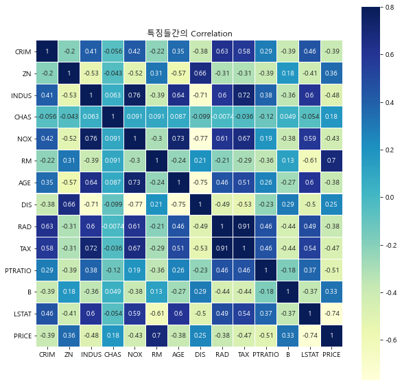
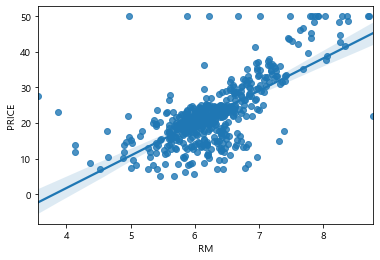
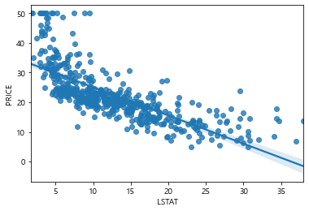

# 다항 로지스틱 

## 1.데이터 준비 


```python
from sklearn.datasets import load_iris
iris = load_iris()
```


```python
print(iris.DESCR)
```

    .. _iris_dataset:
    
    Iris plants dataset
    --------------------
    
    **Data Set Characteristics:**
    
        :Number of Instances: 150 (50 in each of three classes)
        :Number of Attributes: 4 numeric, predictive attributes and the class
        :Attribute Information:
            - sepal length in cm
            - sepal width in cm
            - petal length in cm
            - petal width in cm
            - class:
                    - Iris-Setosa
                    - Iris-Versicolour
                    - Iris-Virginica
                    
        :Summary Statistics:
    
        ============== ==== ==== ======= ===== ====================
                        Min  Max   Mean    SD   Class Correlation
        ============== ==== ==== ======= ===== ====================
        sepal length:   4.3  7.9   5.84   0.83    0.7826
        sepal width:    2.0  4.4   3.05   0.43   -0.4194
        petal length:   1.0  6.9   3.76   1.76    0.9490  (high!)
        petal width:    0.1  2.5   1.20   0.76    0.9565  (high!)
        ============== ==== ==== ======= ===== ====================
    
        :Missing Attribute Values: None
        :Class Distribution: 33.3% for each of 3 classes.
        :Creator: R.A. Fisher
        :Donor: Michael Marshall (MARSHALL%PLU@io.arc.nasa.gov)
        :Date: July, 1988
    
    The famous Iris database, first used by Sir R.A. Fisher. The dataset is taken
    from Fisher's paper. Note that it's the same as in R, but not as in the UCI
    Machine Learning Repository, which has two wrong data points.
    
    This is perhaps the best known database to be found in the
    pattern recognition literature.  Fisher's paper is a classic in the field and
    is referenced frequently to this day.  (See Duda & Hart, for example.)  The
    data set contains 3 classes of 50 instances each, where each class refers to a
    type of iris plant.  One class is linearly separable from the other 2; the
    latter are NOT linearly separable from each other.
    
    .. topic:: References
    
       - Fisher, R.A. "The use of multiple measurements in taxonomic problems"
         Annual Eugenics, 7, Part II, 179-188 (1936); also in "Contributions to
         Mathematical Statistics" (John Wiley, NY, 1950).
       - Duda, R.O., & Hart, P.E. (1973) Pattern Classification and Scene Analysis.
         (Q327.D83) John Wiley & Sons.  ISBN 0-471-22361-1.  See page 218.
       - Dasarathy, B.V. (1980) "Nosing Around the Neighborhood: A New System
         Structure and Classification Rule for Recognition in Partially Exposed
         Environments".  IEEE Transactions on Pattern Analysis and Machine
         Intelligence, Vol. PAMI-2, No. 1, 67-71.
       - Gates, G.W. (1972) "The Reduced Nearest Neighbor Rule".  IEEE Transactions
         on Information Theory, May 1972, 431-433.
       - See also: 1988 MLC Proceedings, 54-64.  Cheeseman et al"s AUTOCLASS II
         conceptual clustering system finds 3 classes in the data.
       - Many, many more ...
    


```python
print(iris.data.shape,iris.target.shape)
```

    (150, 4) (150,)
    


```python
print(iris.data[:5])
```

    [[5.1 3.5 1.4 0.2]
     [4.9 3.  1.4 0.2]
     [4.7 3.2 1.3 0.2]
     [4.6 3.1 1.5 0.2]
     [5.  3.6 1.4 0.2]]
    


```python
print(iris.target[:5])
```

    [0 0 0 0 0]
    


```python
print(iris.target)
```

    [0 0 0 0 0 0 0 0 0 0 0 0 0 0 0 0 0 0 0 0 0 0 0 0 0 0 0 0 0 0 0 0 0 0 0 0 0
     0 0 0 0 0 0 0 0 0 0 0 0 0 1 1 1 1 1 1 1 1 1 1 1 1 1 1 1 1 1 1 1 1 1 1 1 1
     1 1 1 1 1 1 1 1 1 1 1 1 1 1 1 1 1 1 1 1 1 1 1 1 1 1 2 2 2 2 2 2 2 2 2 2 2
     2 2 2 2 2 2 2 2 2 2 2 2 2 2 2 2 2 2 2 2 2 2 2 2 2 2 2 2 2 2 2 2 2 2 2 2 2
     2 2]
    

클래스 = 분류할 대상 이자 현재 이 데이터에서 각각의 하나가 종속변수
* 0: Iris-Setosa
* 1: Iris-Versicolour
* 2: Iris-Virginica


독립변수  : sepal length, sepal width, petal length, petal width

**따라서, 0,1,2 각각에 대해 3개의 확률값을 계산하는 것이 이 데이터의 목표**


```python
from sklearn.model_selection import train_test_split
X_train,X_test,y_train,y_test = train_test_split(iris.data,iris.target,random_state=7,test_size=0.2)
print(X_train.shape,y_train.shape)
print(X_test.shape,y_train.shape)
```

    (120, 4) (120,)
    (30, 4) (120,)
    

### 데이터 살펴보기 


```python
%matplotlib inline
import matplotlib.pyplot as plt

fig,axes = plt.subplots(2,2,figsize=(10,7))
y= iris.target

for i,ax in enumerate (axes.ravel()):
    if i < iris.data.shape[1]:
        x = iris.data[:,i]
        
        ax.set_title(iris.feature_names[i])
        ax.scatter(x,y)
plt.show()
```





```python
fig,axes = plt.subplots(2,2,figsize=(10,7))
fig
axes
```


    array([[<matplotlib.axes._subplots.AxesSubplot object at 0x00000179656E8970>,
            <matplotlib.axes._subplots.AxesSubplot object at 0x0000017965758700>],
           [<matplotlib.axes._subplots.AxesSubplot object at 0x00000179654D4A90>,
            <matplotlib.axes._subplots.AxesSubplot object at 0x0000017965501040>]],
          dtype=object)


sepal의 폭, 길이, 종의 관계 살펴보기


```python
plt.scatter(iris.data[iris.target == 0, 0], iris.data[iris.target == 0, 1], marker='o')
plt.scatter(iris.data[iris.target == 1, 0], iris.data[iris.target == 1, 1], marker='+')
plt.scatter(iris.data[iris.target == 2, 0], iris.data[iris.target == 2, 1], marker='v')

plt.legend(['Iris-Setosa', 'Iris-Versicolour', 'Iris-Virginica'])
plt.xlabel(iris.feature_names[0])
plt.ylabel(iris.feature_names[1])
plt.show()
```





```python

iris.data[iris.target==0, 1]
```


    array([3.5, 3. , 3.2, 3.1, 3.6, 3.9, 3.4, 3.4, 2.9, 3.1, 3.7, 3.4, 3. ,
           3. , 4. , 4.4, 3.9, 3.5, 3.8, 3.8, 3.4, 3.7, 3.6, 3.3, 3.4, 3. ,
           3.4, 3.5, 3.4, 3.2, 3.1, 3.4, 4.1, 4.2, 3.1, 3.2, 3.5, 3.6, 3. ,
           3.4, 3.5, 2.3, 3.2, 3.5, 3.8, 3. , 3.8, 3.2, 3.7, 3.3])


```python
plt.scatter(iris.data[iris.target == 0, 2], iris.data[iris.target == 0, 3], marker='o')
plt.scatter(iris.data[iris.target == 1, 2], iris.data[iris.target == 1, 3], marker='+')
plt.scatter(iris.data[iris.target == 2, 2], iris.data[iris.target == 2, 3], marker='v')

plt.legend(['Iris-Setosa', 'Iris-Versicolour', 'Iris-Virginica'])
plt.xlabel(iris.feature_names[2])
plt.ylabel(iris.feature_names[3])
plt.show()
```





## 3.로지스틱 회귀분석 실시 


```python
from sklearn.linear_model import LogisticRegression
LR_clf = LogisticRegression(solver='lbfgs', multi_class='auto')
LR_clf.fit(X_train[:,[2]],y_train)
```


    LogisticRegression()


```python
print('Train set score: {:.3f}'.format(LR_clf.score(X_train[:, 2].reshape(-1, 1), y_train)))
print('Test set score: {:.3f}'.format(LR_clf.score(X_test[:, 2].reshape(-1, 1), y_test)))
```

    Train set score: 0.975
    Test set score: 0.867
    

전체에 대해 돌려보기 


```python
LR_clf = LogisticRegression(solver='lbfgs', multi_class='auto', max_iter=1000)
LR_clf.fit(X_train, y_train)
```


    LogisticRegression(max_iter=1000)


```python
print('Train set score: {:.3f}'.format(LR_clf.score(X_train, y_train)))
print('Test set score: {:.3f}'.format(LR_clf.score(X_test, y_test)))
```

    Train set score: 0.992
    Test set score: 0.867
    

예측 결과와 실제 결과 확인


```python
print(LR_clf.predict(X_test[:20])) 
print(y_test[:20])
```

    [2 1 0 1 1 0 1 1 0 1 2 1 0 2 0 2 2 2 0 0]
    [2 1 0 1 2 0 1 1 0 1 1 1 0 2 0 1 2 2 0 0]
    

* 3개정도 말고는 비슷한 것 확인 가능


```python
labels = ['Iris-Setosa', 'Iris-Versicolour', 'Iris-Virginica']
print([labels[p] for p in LR_clf.predict(X_test[:10])])
```

    ['Iris-Virginica', 'Iris-Versicolour', 'Iris-Setosa', 'Iris-Versicolour', 'Iris-Versicolour', 'Iris-Setosa', 'Iris-Versicolour', 'Iris-Versicolour', 'Iris-Setosa', 'Iris-Versicolour']
    

## 4.다항 로지스틱 회귀분석 원리에 대한 이해 
y의 각 값 0, 1, 2에 대해 각각 회귀분석을 실시하여 확률을 예측하고, 그 확률값이 가장 높은 것을 선택하여 분류를 결정


```python
import numpy as np
np.set_printoptions(precision=3)
#0,1,2 각각에 대한 네 개의 계수
print('coef:',LR_clf.coef_)
#각각에 대한 상수 
print('intercept:',LR_clf.intercept_)
```

    coef: [[-0.437  0.854 -2.308 -0.993]
     [ 0.342 -0.717 -0.097 -0.899]
     [ 0.095 -0.137  2.406  1.892]]
    intercept: [  9.353   3.799 -13.152]
    


```python
print(LR_clf.decision_function(X_test[:10])) # 0, 1, 2 각각에 대해 예측된 값
print(np.round(LR_clf.predict_proba(X_test[:10]), 3))
print('Prediction Results:', LR_clf.predict_proba(X_test[:10]).argmax(axis=1)) # 각 행 별로 가장 높은 값을 가지는 index가 예측된 분류
```

    [[-4.225  1.554  2.671]
     [-2.323  1.711  0.613]
     [ 6.857  2.605 -9.462]
     [-2.411  1.779  0.632]
     [-2.73   1.718  1.012]
     [ 6.051  3.294 -9.345]
     [-3.817  2.113  1.704]
     [-1.776  2.203 -0.427]
     [ 6.266  2.669 -8.935]
     [-2.59   1.909  0.68 ]]
    [[0.001 0.246 0.753]
     [0.013 0.74  0.247]
     [0.986 0.014 0.   ]
     [0.011 0.75  0.238]
     [0.008 0.664 0.328]
     [0.94  0.06  0.   ]
     [0.002 0.6   0.398]
     [0.017 0.917 0.066]
     [0.973 0.027 0.   ]
     [0.009 0.767 0.224]]
    Prediction Results: [2 1 0 1 1 0 1 1 0 1]
    
