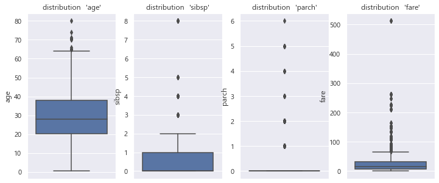
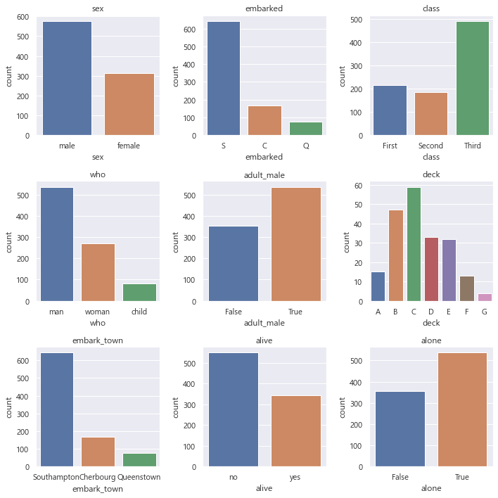
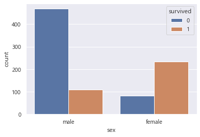
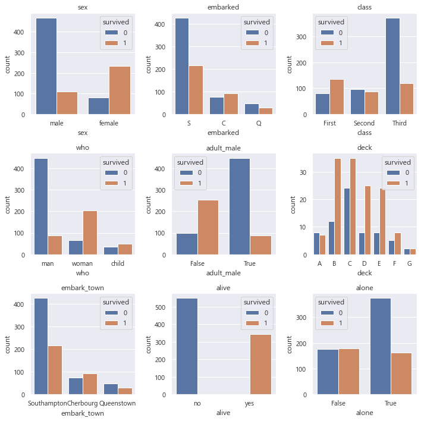

# 타이타닉 사고데이터 분석


```python
import pandas as pd
import matplotlib.pyplot as plt
import seaborn as sns
sns.set()

plt.rcParams['font.family'] = 'Malgun Gothic'  # 한글 출력을 위한 글꼴 설정
```


```python
df = sns.load_dataset('titanic')
```


```python
df.head()
```


<div>
<style scoped>
    .dataframe tbody tr th:only-of-type {
        vertical-align: middle;
    }

    .dataframe tbody tr th {
        vertical-align: top;
    }

    .dataframe thead th {
        text-align: right;
    }
</style>
<table border="1" class="dataframe">
  <thead>
    <tr style="text-align: right;">
      <th></th>
      <th>survived</th>
      <th>pclass</th>
      <th>sex</th>
      <th>age</th>
      <th>sibsp</th>
      <th>parch</th>
      <th>fare</th>
      <th>embarked</th>
      <th>class</th>
      <th>who</th>
      <th>adult_male</th>
      <th>deck</th>
      <th>embark_town</th>
      <th>alive</th>
      <th>alone</th>
    </tr>
  </thead>
  <tbody>
    <tr>
      <th>0</th>
      <td>0</td>
      <td>3</td>
      <td>male</td>
      <td>22.0</td>
      <td>1</td>
      <td>0</td>
      <td>7.2500</td>
      <td>S</td>
      <td>Third</td>
      <td>man</td>
      <td>True</td>
      <td>NaN</td>
      <td>Southampton</td>
      <td>no</td>
      <td>False</td>
    </tr>
    <tr>
      <th>1</th>
      <td>1</td>
      <td>1</td>
      <td>female</td>
      <td>38.0</td>
      <td>1</td>
      <td>0</td>
      <td>71.2833</td>
      <td>C</td>
      <td>First</td>
      <td>woman</td>
      <td>False</td>
      <td>C</td>
      <td>Cherbourg</td>
      <td>yes</td>
      <td>False</td>
    </tr>
    <tr>
      <th>2</th>
      <td>1</td>
      <td>3</td>
      <td>female</td>
      <td>26.0</td>
      <td>0</td>
      <td>0</td>
      <td>7.9250</td>
      <td>S</td>
      <td>Third</td>
      <td>woman</td>
      <td>False</td>
      <td>NaN</td>
      <td>Southampton</td>
      <td>yes</td>
      <td>True</td>
    </tr>
    <tr>
      <th>3</th>
      <td>1</td>
      <td>1</td>
      <td>female</td>
      <td>35.0</td>
      <td>1</td>
      <td>0</td>
      <td>53.1000</td>
      <td>S</td>
      <td>First</td>
      <td>woman</td>
      <td>False</td>
      <td>C</td>
      <td>Southampton</td>
      <td>yes</td>
      <td>False</td>
    </tr>
    <tr>
      <th>4</th>
      <td>0</td>
      <td>3</td>
      <td>male</td>
      <td>35.0</td>
      <td>0</td>
      <td>0</td>
      <td>8.0500</td>
      <td>S</td>
      <td>Third</td>
      <td>man</td>
      <td>True</td>
      <td>NaN</td>
      <td>Southampton</td>
      <td>no</td>
      <td>True</td>
    </tr>
  </tbody>
</table>
</div>


범주형 데이터 수치형 데이터 분리하기


```python
category_cols = ["sex","embarked","class","who","adult_male","deck","embark_town","alive","alone"]
```


```python
numerical_cols = ["age","sibsp","parch","fare"]
```


```python
# .value_counts()를 통해 각 컬럼별로 몇 개의 row가 있는지 셀 수 있습니다
for col in category_cols:
    print(col + " 카운트::")
    print(df.loc[:, col].value_counts())
    print()
```

    sex 카운트::
    male      577
    female    314
    Name: sex, dtype: int64
    
    embarked 카운트::
    S    644
    C    168
    Q     77
    Name: embarked, dtype: int64
    
    class 카운트::
    Third     491
    First     216
    Second    184
    Name: class, dtype: int64
    
    who 카운트::
    man      537
    woman    271
    child     83
    Name: who, dtype: int64
    
    adult_male 카운트::
    True     537
    False    354
    Name: adult_male, dtype: int64
    
    deck 카운트::
    C    59
    B    47
    D    33
    E    32
    A    15
    F    13
    G     4
    Name: deck, dtype: int64
    
    embark_town 카운트::
    Southampton    644
    Cherbourg      168
    Queenstown      77
    Name: embark_town, dtype: int64
    
    alive 카운트::
    no     549
    yes    342
    Name: alive, dtype: int64
    
    alone 카운트::
    True     537
    False    354
    Name: alone, dtype: int64
    
    


```python
figure, ax_list = plt.subplots(nrows=1, ncols=4)
figure.set_size_inches(12,5)

for i in range(4):
    col = numerical_cols[i]
    sns.boxplot(data=df, y=col, showfliers=True, ax=ax_list[i])
    ax_list[i].set_title(f"distribution  '{col}'")

```





```python
figure, ax_list_list = plt.subplots(nrows=3, ncols=3);
figure.set_size_inches(10,10)

ax_list = ax_list_list.reshape(9)  # 다차원 행렬의 차원을 원하는 모양으로 변경합니다.
print(ax_list_list.shape)
print(ax_list.shape)
#출력 위해서 2차원 배열을 1차원으로 배경하여 9개 돌리게 하기 위해서 

for i in range(len(category_cols)):
    col = category_cols[i]
    sns.countplot(data=df, x=col, ax=ax_list[i])
    ax_list[i].set_title(col)

plt.tight_layout()
```

    (3, 3)
    (9,)
    





위에까지만 EDA   
밑에는 추가로 정보 발굴


```python
#성별과 생존 여부
sns.countplot(data=df, x='sex', hue='survived');
```





```python
#좌석 등급과 생존여부 
sns.countplot(data=df, x='pclass', hue='survived');
```


```python
# hue 인자로 'survived' 컬럼을 입력, 각 분류형 데이터 별로 생존/사망 분리하여 살펴보기

figure, ax_list_list = plt.subplots(nrows=3, ncols=3);
figure.set_size_inches(10,10)

ax_list = ax_list_list.reshape(9)
print(ax_list_list.shape)
print(ax_list.shape)

for i in range(len(category_cols)):
    col = category_cols[i]
    sns.countplot(data=df, x=col, ax=ax_list[i], hue='survived')
    ax_list[i].set_title(col)
plt.tight_layout()
```

    (3, 3)
    (9,)
    





## 생존 확률 분석 

1. 좌석 등급별로 높을수록 생존 확률 높음
2. 성별은 여성일수록 생존 확률이 높음
3. 혼자 탑승할수록 생존 확률이 더 낮음 
4. B,D,E 덱 위치의 승객들이 생존율 높음
