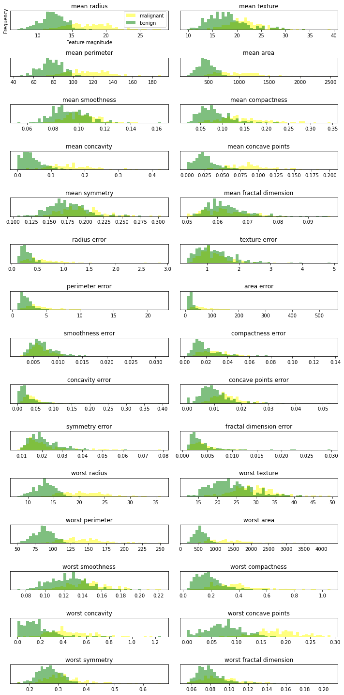
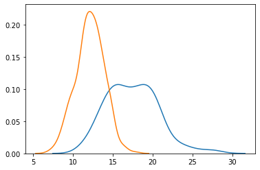
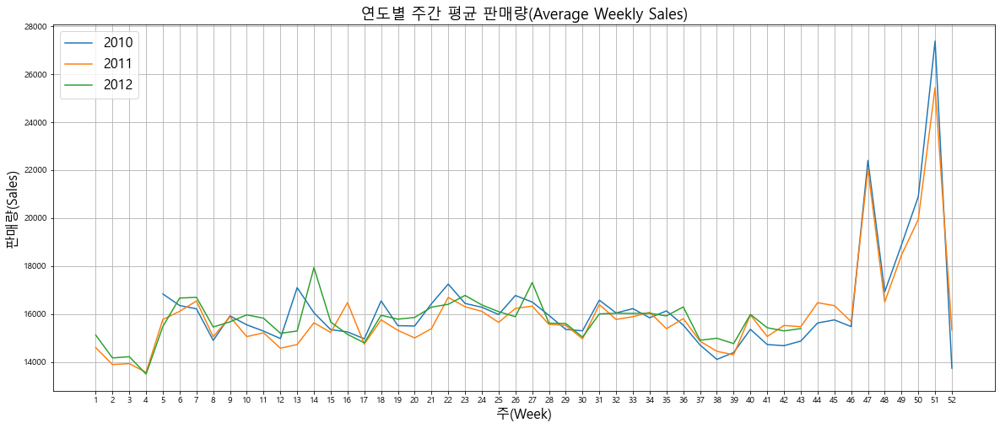

# 다양한 분류 모형

데이터 준비하기 


```python
from sklearn.datasets import load_breast_cancer
cancer = load_breast_cancer()

print(cancer.DESCR)
print(cancer.data.shape,cancer.target.shape)
```

    .. _breast_cancer_dataset:
    
    Breast cancer wisconsin (diagnostic) dataset
    --------------------------------------------
    
    **Data Set Characteristics:**
    
        :Number of Instances: 569
    
        :Number of Attributes: 30 numeric, predictive attributes and the class
    
        :Attribute Information:
            - radius (mean of distances from center to points on the perimeter)
            - texture (standard deviation of gray-scale values)
            - perimeter
            - area
            - smoothness (local variation in radius lengths)
            - compactness (perimeter^2 / area - 1.0)
            - concavity (severity of concave portions of the contour)
            - concave points (number of concave portions of the contour)
            - symmetry
            - fractal dimension ("coastline approximation" - 1)
    
            The mean, standard error, and "worst" or largest (mean of the three
            worst/largest values) of these features were computed for each image,
            resulting in 30 features.  For instance, field 0 is Mean Radius, field
            10 is Radius SE, field 20 is Worst Radius.
    
            - class:
                    - WDBC-Malignant
                    - WDBC-Benign
    
        :Summary Statistics:
    
        ===================================== ====== ======
                                               Min    Max
        ===================================== ====== ======
        radius (mean):                        6.981  28.11
        texture (mean):                       9.71   39.28
        perimeter (mean):                     43.79  188.5
        area (mean):                          143.5  2501.0
        smoothness (mean):                    0.053  0.163
        compactness (mean):                   0.019  0.345
        concavity (mean):                     0.0    0.427
        concave points (mean):                0.0    0.201
        symmetry (mean):                      0.106  0.304
        fractal dimension (mean):             0.05   0.097
        radius (standard error):              0.112  2.873
        texture (standard error):             0.36   4.885
        perimeter (standard error):           0.757  21.98
        area (standard error):                6.802  542.2
        smoothness (standard error):          0.002  0.031
        compactness (standard error):         0.002  0.135
        concavity (standard error):           0.0    0.396
        concave points (standard error):      0.0    0.053
        symmetry (standard error):            0.008  0.079
        fractal dimension (standard error):   0.001  0.03
        radius (worst):                       7.93   36.04
        texture (worst):                      12.02  49.54
        perimeter (worst):                    50.41  251.2
        area (worst):                         185.2  4254.0
        smoothness (worst):                   0.071  0.223
        compactness (worst):                  0.027  1.058
        concavity (worst):                    0.0    1.252
        concave points (worst):               0.0    0.291
        symmetry (worst):                     0.156  0.664
        fractal dimension (worst):            0.055  0.208
        ===================================== ====== ======
    
        :Missing Attribute Values: None
    
        :Class Distribution: 212 - Malignant, 357 - Benign
    
        :Creator:  Dr. William H. Wolberg, W. Nick Street, Olvi L. Mangasarian
    
        :Donor: Nick Street
    
        :Date: November, 1995
    
    This is a copy of UCI ML Breast Cancer Wisconsin (Diagnostic) datasets.
    https://goo.gl/U2Uwz2
    
    Features are computed from a digitized image of a fine needle
    aspirate (FNA) of a breast mass.  They describe
    characteristics of the cell nuclei present in the image.
    
    Separating plane described above was obtained using
    Multisurface Method-Tree (MSM-T) [K. P. Bennett, "Decision Tree
    Construction Via Linear Programming." Proceedings of the 4th
    Midwest Artificial Intelligence and Cognitive Science Society,
    pp. 97-101, 1992], a classification method which uses linear
    programming to construct a decision tree.  Relevant features
    were selected using an exhaustive search in the space of 1-4
    features and 1-3 separating planes.
    
    The actual linear program used to obtain the separating plane
    in the 3-dimensional space is that described in:
    [K. P. Bennett and O. L. Mangasarian: "Robust Linear
    Programming Discrimination of Two Linearly Inseparable Sets",
    Optimization Methods and Software 1, 1992, 23-34].
    
    This database is also available through the UW CS ftp server:
    
    ftp ftp.cs.wisc.edu
    cd math-prog/cpo-dataset/machine-learn/WDBC/
    
    .. topic:: References
    
       - W.N. Street, W.H. Wolberg and O.L. Mangasarian. Nuclear feature extraction 
         for breast tumor diagnosis. IS&T/SPIE 1993 International Symposium on 
         Electronic Imaging: Science and Technology, volume 1905, pages 861-870,
         San Jose, CA, 1993.
       - O.L. Mangasarian, W.N. Street and W.H. Wolberg. Breast cancer diagnosis and 
         prognosis via linear programming. Operations Research, 43(4), pages 570-577, 
         July-August 1995.
       - W.H. Wolberg, W.N. Street, and O.L. Mangasarian. Machine learning techniques
         to diagnose breast cancer from fine-needle aspirates. Cancer Letters 77 (1994) 
         163-171.
    (569, 30) (569,)
    


```python
cancer.target[:10]
```


    array([0, 0, 0, 0, 0, 0, 0, 0, 0, 0])


```python
cancer.feature_names
```


    array(['mean radius', 'mean texture', 'mean perimeter', 'mean area',
           'mean smoothness', 'mean compactness', 'mean concavity',
           'mean concave points', 'mean symmetry', 'mean fractal dimension',
           'radius error', 'texture error', 'perimeter error', 'area error',
           'smoothness error', 'compactness error', 'concavity error',
           'concave points error', 'symmetry error',
           'fractal dimension error', 'worst radius', 'worst texture',
           'worst perimeter', 'worst area', 'worst smoothness',
           'worst compactness', 'worst concavity', 'worst concave points',
           'worst symmetry', 'worst fractal dimension'], dtype='<U23')


```python
cancer.data
```


    array([[1.799e+01, 1.038e+01, 1.228e+02, ..., 2.654e-01, 4.601e-01,
            1.189e-01],
           [2.057e+01, 1.777e+01, 1.329e+02, ..., 1.860e-01, 2.750e-01,
            8.902e-02],
           [1.969e+01, 2.125e+01, 1.300e+02, ..., 2.430e-01, 3.613e-01,
            8.758e-02],
           ...,
           [1.660e+01, 2.808e+01, 1.083e+02, ..., 1.418e-01, 2.218e-01,
            7.820e-02],
           [2.060e+01, 2.933e+01, 1.401e+02, ..., 2.650e-01, 4.087e-01,
            1.240e-01],
           [7.760e+00, 2.454e+01, 4.792e+01, ..., 0.000e+00, 2.871e-01,
            7.039e-02]])


```python
from sklearn.model_selection import train_test_split
X_train,X_test,y_train,y_test = train_test_split(cancer.data,cancer.target,random_state=1)

print(X_train.shape,y_train.shape)
print(X_test.shape,y_test.shape)

```

    (426, 30) (426,)
    (143, 30) (143,)
    

## 데이터 살펴보기 


```python
%matplotlib inline
import matplotlib.pyplot as plt

fig, axes = plt.subplots(10, 3, figsize=(15, 10)) #총 30개의 독립변수가 있으므로 10x3 타일을 이용
#y = iris.target
y = cancer.target.astype('str') # target data의 type을 string으로 변환

for i, ax in enumerate(axes.ravel()): #나누어진 각 subplot에 대해
    if i < cancer.data.shape[1]:
        x = cancer.data[:,i]
        ax.set_title(cancer.feature_names[i])
        ax.scatter(x, y)
plt.show()

```


#### 히스토그램 생성   
겹친 부분 더 잘 보기 위해서 


```python
%matplotlib inline
import matplotlib.pyplot as plt
import numpy as np

fig,axes = plt.subplots(15,2,figsize=(10,20))

#암에 걸린 사람과 아닌 사람 구분하기 
malignant = cancer.data[cancer.target == 0]
benign = cancer.data[cancer.target == 1]

ax = axes.ravel()
colors = ['yellow', 'green']

for i in range(30):
    _, bins = np.histogram(cancer.data[:, i], bins=50)
    ax[i].hist(malignant[:, i], bins=bins, color=colors[0], alpha=.5)
    ax[i].hist(benign[:, i], bins=bins, color=colors[1], alpha=.5)
    ax[i].set_title(cancer.feature_names[i])
    ax[i].set_yticks(())
    
ax[0].set_xlabel("Feature magnitude")
ax[0].set_ylabel("Frequency")
ax[0].legend(["malignant", "benign"], loc="best")
fig.tight_layout()
```





### seaborn package
seaborn package는 pairplot을 이용해 한 변수의 kde, 두 변수 간의 2차원 scatter graph를 쉽게 볼 수 있음


```python
import seaborn as sns
from scipy import stats
import numpy as np
import pandas as pd

#같은 로우끼리 붙여서 그래프 표현 
df = pd.DataFrame(np.c_[cancer['data'], cancer['target']],
                  columns= np.append(cancer['feature_names'], ['target']))

g = sns.pairplot(df, height=3, hue='target',vars=['mean radius', 'mean texture'])
#hue가 어떤 것을 가지고 분리할 것인지 설정 vars는 변수 설정
#df을 받아서 target을 가지고 분리 
```


```python
df.head()
```


<div>
<style scoped>
    .dataframe tbody tr th:only-of-type {
        vertical-align: middle;
    }

    .dataframe tbody tr th {
        vertical-align: top;
    }

    .dataframe thead th {
        text-align: right;
    }
</style>
<table border="1" class="dataframe">
  <thead>
    <tr style="text-align: right;">
      <th></th>
      <th>mean radius</th>
      <th>mean texture</th>
      <th>mean perimeter</th>
      <th>mean area</th>
      <th>mean smoothness</th>
      <th>mean compactness</th>
      <th>mean concavity</th>
      <th>mean concave points</th>
      <th>mean symmetry</th>
      <th>mean fractal dimension</th>
      <th>...</th>
      <th>worst texture</th>
      <th>worst perimeter</th>
      <th>worst area</th>
      <th>worst smoothness</th>
      <th>worst compactness</th>
      <th>worst concavity</th>
      <th>worst concave points</th>
      <th>worst symmetry</th>
      <th>worst fractal dimension</th>
      <th>target</th>
    </tr>
  </thead>
  <tbody>
    <tr>
      <th>0</th>
      <td>17.99</td>
      <td>10.38</td>
      <td>122.80</td>
      <td>1001.0</td>
      <td>0.11840</td>
      <td>0.27760</td>
      <td>0.3001</td>
      <td>0.14710</td>
      <td>0.2419</td>
      <td>0.07871</td>
      <td>...</td>
      <td>17.33</td>
      <td>184.60</td>
      <td>2019.0</td>
      <td>0.1622</td>
      <td>0.6656</td>
      <td>0.7119</td>
      <td>0.2654</td>
      <td>0.4601</td>
      <td>0.11890</td>
      <td>0.0</td>
    </tr>
    <tr>
      <th>1</th>
      <td>20.57</td>
      <td>17.77</td>
      <td>132.90</td>
      <td>1326.0</td>
      <td>0.08474</td>
      <td>0.07864</td>
      <td>0.0869</td>
      <td>0.07017</td>
      <td>0.1812</td>
      <td>0.05667</td>
      <td>...</td>
      <td>23.41</td>
      <td>158.80</td>
      <td>1956.0</td>
      <td>0.1238</td>
      <td>0.1866</td>
      <td>0.2416</td>
      <td>0.1860</td>
      <td>0.2750</td>
      <td>0.08902</td>
      <td>0.0</td>
    </tr>
    <tr>
      <th>2</th>
      <td>19.69</td>
      <td>21.25</td>
      <td>130.00</td>
      <td>1203.0</td>
      <td>0.10960</td>
      <td>0.15990</td>
      <td>0.1974</td>
      <td>0.12790</td>
      <td>0.2069</td>
      <td>0.05999</td>
      <td>...</td>
      <td>25.53</td>
      <td>152.50</td>
      <td>1709.0</td>
      <td>0.1444</td>
      <td>0.4245</td>
      <td>0.4504</td>
      <td>0.2430</td>
      <td>0.3613</td>
      <td>0.08758</td>
      <td>0.0</td>
    </tr>
    <tr>
      <th>3</th>
      <td>11.42</td>
      <td>20.38</td>
      <td>77.58</td>
      <td>386.1</td>
      <td>0.14250</td>
      <td>0.28390</td>
      <td>0.2414</td>
      <td>0.10520</td>
      <td>0.2597</td>
      <td>0.09744</td>
      <td>...</td>
      <td>26.50</td>
      <td>98.87</td>
      <td>567.7</td>
      <td>0.2098</td>
      <td>0.8663</td>
      <td>0.6869</td>
      <td>0.2575</td>
      <td>0.6638</td>
      <td>0.17300</td>
      <td>0.0</td>
    </tr>
    <tr>
      <th>4</th>
      <td>20.29</td>
      <td>14.34</td>
      <td>135.10</td>
      <td>1297.0</td>
      <td>0.10030</td>
      <td>0.13280</td>
      <td>0.1980</td>
      <td>0.10430</td>
      <td>0.1809</td>
      <td>0.05883</td>
      <td>...</td>
      <td>16.67</td>
      <td>152.20</td>
      <td>1575.0</td>
      <td>0.1374</td>
      <td>0.2050</td>
      <td>0.4000</td>
      <td>0.1625</td>
      <td>0.2364</td>
      <td>0.07678</td>
      <td>0.0</td>
    </tr>
  </tbody>
</table>
<p>5 rows × 31 columns</p>
</div>


```python
#위에서 그린 4개 그래프 중 하나만 보려고 할 때 
import numpy as np
import seaborn as sns
#sns.set_style('whitegrid')
g = sns.kdeplot(np.array(cancer.data[cancer.target == 0, 0]))
g = sns.kdeplot(np.array(cancer.data[cancer.target == 1, 0]))
```





```python
cancer.data
```


    array([[1.799e+01, 1.038e+01, 1.228e+02, ..., 2.654e-01, 4.601e-01,
            1.189e-01],
           [2.057e+01, 1.777e+01, 1.329e+02, ..., 1.860e-01, 2.750e-01,
            8.902e-02],
           [1.969e+01, 2.125e+01, 1.300e+02, ..., 2.430e-01, 3.613e-01,
            8.758e-02],
           ...,
           [1.660e+01, 2.808e+01, 1.083e+02, ..., 1.418e-01, 2.218e-01,
            7.820e-02],
           [2.060e+01, 2.933e+01, 1.401e+02, ..., 2.650e-01, 4.087e-01,
            1.240e-01],
           [7.760e+00, 2.454e+01, 4.792e+01, ..., 0.000e+00, 2.871e-01,
            7.039e-02]])


```python
cancer.target
```


    array([0, 0, 0, 0, 0, 0, 0, 0, 0, 0, 0, 0, 0, 0, 0, 0, 0, 0, 0, 1, 1, 1,
           0, 0, 0, 0, 0, 0, 0, 0, 0, 0, 0, 0, 0, 0, 0, 1, 0, 0, 0, 0, 0, 0,
           0, 0, 1, 0, 1, 1, 1, 1, 1, 0, 0, 1, 0, 0, 1, 1, 1, 1, 0, 1, 0, 0,
           1, 1, 1, 1, 0, 1, 0, 0, 1, 0, 1, 0, 0, 1, 1, 1, 0, 0, 1, 0, 0, 0,
           1, 1, 1, 0, 1, 1, 0, 0, 1, 1, 1, 0, 0, 1, 1, 1, 1, 0, 1, 1, 0, 1,
           1, 1, 1, 1, 1, 1, 1, 0, 0, 0, 1, 0, 0, 1, 1, 1, 0, 0, 1, 0, 1, 0,
           0, 1, 0, 0, 1, 1, 0, 1, 1, 0, 1, 1, 1, 1, 0, 1, 1, 1, 1, 1, 1, 1,
           1, 1, 0, 1, 1, 1, 1, 0, 0, 1, 0, 1, 1, 0, 0, 1, 1, 0, 0, 1, 1, 1,
           1, 0, 1, 1, 0, 0, 0, 1, 0, 1, 0, 1, 1, 1, 0, 1, 1, 0, 0, 1, 0, 0,
           0, 0, 1, 0, 0, 0, 1, 0, 1, 0, 1, 1, 0, 1, 0, 0, 0, 0, 1, 1, 0, 0,
           1, 1, 1, 0, 1, 1, 1, 1, 1, 0, 0, 1, 1, 0, 1, 1, 0, 0, 1, 0, 1, 1,
           1, 1, 0, 1, 1, 1, 1, 1, 0, 1, 0, 0, 0, 0, 0, 0, 0, 0, 0, 0, 0, 0,
           0, 0, 1, 1, 1, 1, 1, 1, 0, 1, 0, 1, 1, 0, 1, 1, 0, 1, 0, 0, 1, 1,
           1, 1, 1, 1, 1, 1, 1, 1, 1, 1, 1, 0, 1, 1, 0, 1, 0, 1, 1, 1, 1, 1,
           1, 1, 1, 1, 1, 1, 1, 1, 1, 0, 1, 1, 1, 0, 1, 0, 1, 1, 1, 1, 0, 0,
           0, 1, 1, 1, 1, 0, 1, 0, 1, 0, 1, 1, 1, 0, 1, 1, 1, 1, 1, 1, 1, 0,
           0, 0, 1, 1, 1, 1, 1, 1, 1, 1, 1, 1, 1, 0, 0, 1, 0, 0, 0, 1, 0, 0,
           1, 1, 1, 1, 1, 0, 1, 1, 1, 1, 1, 0, 1, 1, 1, 0, 1, 1, 0, 0, 1, 1,
           1, 1, 1, 1, 0, 1, 1, 1, 1, 1, 1, 1, 0, 1, 1, 1, 1, 1, 0, 1, 1, 0,
           1, 1, 1, 1, 1, 1, 1, 1, 1, 1, 1, 1, 0, 1, 0, 0, 1, 0, 1, 1, 1, 1,
           1, 0, 1, 1, 0, 1, 0, 1, 1, 0, 1, 0, 1, 1, 1, 1, 1, 1, 1, 1, 0, 0,
           1, 1, 1, 1, 1, 1, 0, 1, 1, 1, 1, 1, 1, 1, 1, 1, 1, 0, 1, 1, 1, 1,
           1, 1, 1, 0, 1, 0, 1, 1, 0, 1, 1, 1, 1, 1, 0, 0, 1, 0, 1, 0, 1, 1,
           1, 1, 1, 0, 1, 1, 0, 1, 0, 1, 0, 0, 1, 1, 1, 0, 1, 1, 1, 1, 1, 1,
           1, 1, 1, 1, 1, 0, 1, 0, 0, 1, 1, 1, 1, 1, 1, 1, 1, 1, 1, 1, 1, 1,
           1, 1, 1, 1, 1, 1, 1, 1, 1, 1, 1, 1, 0, 0, 0, 0, 0, 0, 1])


```python
import seaborn as sns
fig, axes = plt.subplots(8,4, figsize = (15,30))
X = cancer.data
Y = cancer.target


for i,a in enumerate(axes.ravel()):
    if i < X.shape[1]:
        sns.kdeplot(X[Y==0,i], ax=a, color = 'blue')
        sns.kdeplot(X[Y==1,i], ax=a, color = 'red')
        a.set_title(cancer.feature_names[i])
plt.show()
```


파란선과 빨간석을 구분하는 구간이 있는 것이 분석하기 좋은 그래프  
완전히 겹친 compactness error와 같은 그래프는 비교하기 어려움


```python
from sklearn.linear_model import LogisticRegression

LR_clf = LogisticRegression(max_iter=10000, solver='lbfgs')
LR_clf.fit(X_train, y_train)
```


    LogisticRegression(max_iter=10000)


```python
print('Train set score: {:.3f}'.format(LR_clf.score(X_train, y_train)))
print('Test set score: {:.3f}'.format(LR_clf.score(X_test, y_test)))
```

    Train set score: 0.965
    Test set score: 0.944
    

### k-최근접 이웃
가장 단순한 분류 방법
가장 가까운 훈련 데이터 포인트 k개를 찾아 평균을 계산하여 예측에 사용

직관적으로 봤을 때 아래 그림에서 Test점은 어디에 속하는지 
그렇게 생각한 이유는 무엇인가? -> 주변에 Benign이 많기 때문에
어떻게 구현할 수 있을까? -> 가까운 점들을 기반으로 판단


```python
plt.scatter(X_train[y_train == 0,0],X_train[y_train == 0,1],marker='o')
plt.scatter(X_train[y_train == 1, 0], X_train[y_train == 1, 1], marker='+')
plt.scatter(X_test[0, 0], X_test[0, 1], marker='v')

plt.legend(['Malignant', 'Benign', 'Test'])
plt.xlabel(cancer.feature_names[0])
plt.ylabel(cancer.feature_names[1])
plt.show()
```





구분하는 선을 찾는 것이 이 분석의 목표인데  
오른쪽으로 갔을 때는 malignant고 왼쪽으로는 benign일때  
그것의 반대가 되는 점이나 플러스는 잘못 예측한 것  
test역시 찾은 선보다 밑으로 내려가 있음으로 잘못 예측  


```python
from sklearn.neighbors import KNeighborsClassifier
knn = KNeighborsClassifier(n_neighbors=3) #객체 생성 /
#K=n_neighbors=3으로 가장 가까운 3개만 확인하도록 
knn.fit(X_train, y_train) #fit

#score확인
print('K-neighbor train set score: {:.3f}'.format(knn.score(X_train, y_train)))
print('K-neighbor test set score: {:.3f}'.format(knn.score(X_test, y_test)))
```

    K-neighbor train set score: 0.946
    K-neighbor test set score: 0.923
    

 KNeighborsClassifier란 test나온 거에서 가장 가까운 값들을 k개 찾아 평균을 계산하여 예측에 사용하는 것  
  
현재는 test에서 malignant가 많음으로 malignant으로 예측

n_neighbors : 사용할 이웃의 수, 커질수록 훈련 데이터에 대한 예측은 좋아짐
훈련과 관계없이 테스트 세트의 정확도는 너무 작거나 너무 크면 좋지 않은 경향이 있어, 적절하게 선택해야 함


```python
knn = KNeighborsClassifier(n_neighbors=7)
knn.fit(X_train, y_train)

print('K-neighbor train set score: {:.3f}'.format(knn.score(X_train, y_train)))
print('K-neighbor test set score: {:.3f}'.format(knn.score(X_test, y_test)))
```

    K-neighbor train set score: 0.932
    K-neighbor test set score: 0.930
    

KNN 장단점 : 이해가 쉽고 별다른 노력 없이 좋은 성능을 보이는 경우가 있음
훈련 세트가 커지면 예측이 느려지고 특성이 많은 경우에는 잘 동작하지 않음
희소한(많은 특성이 0인) 데이터에서는 특히 성능이 낮음

### 결정트리 
결정 트리(decision tree)는 의사 결정 규칙과 그 결과들을 트리 구조로 도식화한 의사 결정 지원 도구의 일종이다. 결정 트리는 운용 과학, 그 중에서도 의사 결정 분석에서 목표에 가장 가까운 결과를 낼 수 있는 전략을 찾기 위해 주로 사용된다.


```python
from sklearn.tree import DecisionTreeClassifier

tree = DecisionTreeClassifier(random_state=7)
tree.fit(X_train, y_train)
print('Decision Tree train set score: {:.3f}'.format(tree.score(X_train, y_train)))
print('Decision Tree test set score: {:.3f}'.format(tree.score(X_test, y_test)))
```

    Decision Tree train set score: 1.000
    Decision Tree test set score: 0.944
    

결정트리는 train이 항상 높게 나오는 과대적합의 경우가 많음  
각각의 값들에 대해 무조건적으로 맞춰서 나오게 하기 때문에 


```python
from sklearn.tree import export_graphviz

export_graphviz(tree, out_file='tree.dot', class_names=['악성', '양성'],
               impurity=False, filled=True)
```


```python
import graphviz

with open('tree.dot', encoding='utf8') as f:
    dot_graph = f.read()
display(graphviz.Source(dot_graph))
```


### 트리의 특성 중요도: 각 특성이 분류에 기여한 정도
    
featureimportances, 이 값이 0이면 분류에서 사용되지 않았다는 뜻이나, 다른 특성과 겹쳐서 그럴 수도 있으므로 특성이 의미 없다는 것을 나타내지는 않는다

(대부분 오버피팅 - 이미 있는 걸로 학습하고 테스트하기 때문에)


```python
import numpy as np
np.set_printoptions(precision=3) #값이 소수점 이하 3째자리까지만 나오도록 세팅

print('특성 중요도: \n{}\n'.format(tree.feature_importances_))

for feature, value in zip(cancer.feature_names, tree.feature_importances_):
    print('%s: %.3f' % (feature, value))
```

    특성 중요도: 
    [0.    0.022 0.    0.    0.    0.    0.    0.021 0.    0.008 0.003 0.
     0.    0.007 0.    0.    0.    0.036 0.    0.    0.    0.081 0.743 0.022
     0.01  0.    0.    0.047 0.    0.   ]
    
    mean radius: 0.000
    mean texture: 0.022
    mean perimeter: 0.000
    mean area: 0.000
    mean smoothness: 0.000
    mean compactness: 0.000
    mean concavity: 0.000
    mean concave points: 0.021
    mean symmetry: 0.000
    mean fractal dimension: 0.008
    radius error: 0.003
    texture error: 0.000
    perimeter error: 0.000
    area error: 0.007
    smoothness error: 0.000
    compactness error: 0.000
    concavity error: 0.000
    concave points error: 0.036
    symmetry error: 0.000
    fractal dimension error: 0.000
    worst radius: 0.000
    worst texture: 0.081
    worst perimeter: 0.743
    worst area: 0.022
    worst smoothness: 0.010
    worst compactness: 0.000
    worst concavity: 0.000
    worst concave points: 0.047
    worst symmetry: 0.000
    worst fractal dimension: 0.000
    

0이라고 영향을 미치지 않은 것은 아님  
앞에서 영향을 안 미친 것으로 나와서 0으로 나온 걸 수도 있음

표준화한 후 계수(기울기)를 통해서 y에 얼마나 영향 미치는지 확인 가능  

### Lasso
lasso와 비교하는 이유는 lasso도 영향을 미치지 않는 것은 0으로 설정하기 때문에 둘의 차이 비교 가능 


```python
from sklearn.linear_model import LogisticRegression

LR_clf = LogisticRegression(penalty='l1', solver='liblinear')
#penalty l1으로 하면 라쏘 수행 l2로 하면 릿지
LR_clf.fit(X_train, y_train)

print('Train set score: {:.3f}'.format(LR_clf.score(X_train, y_train)))
print('Test set score: {:.3f}'.format(LR_clf.score(X_test, y_test)))
```

    Train set score: 0.962
    Test set score: 0.958
    


```python
for feature, tvalue, lvalue in zip(cancer.feature_names, tree.feature_importances_, LR_clf.coef_[0]):
    print('%s: %.3f %.3f' % (feature, tvalue, lvalue))
```

    mean radius: 0.000 4.920
    mean texture: 0.022 0.051
    mean perimeter: 0.000 -0.336
    mean area: 0.000 -0.014
    mean smoothness: 0.000 0.000
    mean compactness: 0.000 0.000
    mean concavity: 0.000 0.000
    mean concave points: 0.021 0.000
    mean symmetry: 0.000 0.000
    mean fractal dimension: 0.008 0.000
    radius error: 0.003 0.000
    texture error: 0.000 0.000
    perimeter error: 0.000 0.000
    area error: 0.007 -0.028
    smoothness error: 0.000 0.000
    compactness error: 0.000 0.000
    concavity error: 0.000 0.000
    concave points error: 0.036 0.000
    symmetry error: 0.000 0.000
    fractal dimension error: 0.000 0.000
    worst radius: 0.000 0.000
    worst texture: 0.081 -0.215
    worst perimeter: 0.743 -0.078
    worst area: 0.022 -0.019
    worst smoothness: 0.010 0.000
    worst compactness: 0.000 0.000
    worst concavity: 0.000 -2.767
    worst concave points: 0.047 0.000
    worst symmetry: 0.000 0.000
    worst fractal dimension: 0.000 0.000
    

### 결정 트리 복잡도 제어 
트리의 깊이가 무한하게 깊어지지 않고 적절한 선에서 멈추도록 제한


```python
tree = DecisionTreeClassifier(max_depth=4, random_state=7)
#depth 위에서 5개로 결과 보여줬는데 현재 4개까지만 설정
tree.fit(X_train, y_train)
print('Decision Tree train set score: {:.3f}'.format(tree.score(X_train, y_train)))
print('Decision Tree test set score: {:.3f}'.format(tree.score(X_test, y_test)))
```

    Decision Tree train set score: 0.998
    Decision Tree test set score: 0.951
    

### Decision tree의 중요한 특성
훈련 데이터에 과대적합되는 경향이 있다.  
알고리즘의 특성 상 외삽(extrapolation), 즉 훈련 데이터 범위 밖의 포인트에 대해서는 예측을 할 수 없다.  
외삽 : 그래프 그렸을 때 내가 예측하고자 하는 범위 밖에 있는 부분 관측된 값 이용하여 값 추정하는 것

### 랜덤포레스트 
랜덤포레스트란 의사결정 나무의 단점인 과적합 문제 해결 위해서 여러 개의 의사결정 나무를 앙상블(=합쳐서)학습하여 만든 모델
  
학습 원리  
1.주어진 트레이닝 데이터 세트에서 무작위로 중복 허용해서 n개 선택    
2.선택한 n개의 데이터 샘플에서 데이터 특성값 중복 허용없이 d개 선택  
3.이를 이용해 의사결정 트리 학습하고 생성  
4.1-3단계 여러번 반복  
5.위 단계 통해 생성된 k개의 의사결정트리를 이용해 예측하고, 예측된 결과의 평균이나 가장 많이 등장한 예측 결과 선택해서 최종 예측값 결정


앙상블 : 여러 머신러닝 모델을 연결하여 더 강력한 모델을 만드는 기법
기본적으로 조금씩 다른 여러 결정 트리의 묶음
서로 다른 방향으로 과대적합된 트리를 많이 만들어 그 결과를 평균을 냄으로써 과대적합을 줄임  
즉, 하나의 모델 활용하는 것이 아니라 여러 모델 학습시켜서 결합하는 방식으로 문제 처리  
개별로 학습한 여러 모델 결합시킴으로 일반화 성능 향상 가능 = 과적합 해결 

부트스트랩 샘플 : n개의 data에서 중복을 허용하여 n개를 추출하는 과정    
부트스트랩 샘플을 여러 번 (트리의 갯수 만큼) 수행하면 서로 다른 데이터로 이루어진 여러 샘플을 만들 수 있음
각 트리는 서로 다른 데이터를 사용할 뿐 아니라, 서로 다른 특성 집합을 사용하도록 함
이 때 사용할 특성 집합의 수는 max_features로 조정하고 각 트리마다 무작위로 선택
max_features는 전체 특성 수보다는 적게 설정해야 서로 다른 트리를 만들어낼 수 있음


```python
from sklearn.ensemble import RandomForestClassifier

forest = RandomForestClassifier(n_estimators=5, random_state=7) # n_estimators의 default value는 100
forest.fit(X_train, y_train)

print('Random Forest train set score: {:.3f}'.format(forest.score(X_train, y_train)))
print('Random Forest test set score: {:.3f}'.format(forest.score(X_test, y_test)))
```

    Random Forest train set score: 0.993
    Random Forest test set score: 0.937
    


```python
forest.estimators_[0].feature_importances_
```


    array([0.   , 0.   , 0.041, 0.681, 0.007, 0.057, 0.   , 0.007, 0.001,
           0.008, 0.008, 0.   , 0.   , 0.   , 0.   , 0.   , 0.   , 0.003,
           0.   , 0.   , 0.016, 0.   , 0.06 , 0.02 , 0.   , 0.   , 0.   ,
           0.078, 0.   , 0.01 ])


```python
forest.estimators_[1].feature_importances_
```


    array([0.   , 0.01 , 0.   , 0.611, 0.   , 0.025, 0.133, 0.   , 0.   ,
           0.   , 0.   , 0.01 , 0.   , 0.01 , 0.001, 0.   , 0.   , 0.01 ,
           0.   , 0.061, 0.01 , 0.014, 0.   , 0.   , 0.   , 0.01 , 0.   ,
           0.078, 0.018, 0.   ])


```python
features = np.asarray([tree.feature_importances_ for tree in forest.estimators_])
features.T
```


    array([[0.000e+00, 0.000e+00, 6.903e-01, 0.000e+00, 0.000e+00],
           [0.000e+00, 9.521e-03, 6.640e-03, 1.250e-02, 0.000e+00],
           [4.126e-02, 0.000e+00, 0.000e+00, 0.000e+00, 0.000e+00],
           [6.811e-01, 6.113e-01, 0.000e+00, 0.000e+00, 5.787e-02],
           [6.839e-03, 0.000e+00, 0.000e+00, 0.000e+00, 0.000e+00],
           [5.747e-02, 2.488e-02, 0.000e+00, 0.000e+00, 0.000e+00],
           [0.000e+00, 1.328e-01, 6.640e-03, 8.684e-03, 0.000e+00],
           [7.392e-03, 0.000e+00, 1.258e-01, 5.710e-02, 0.000e+00],
           [1.368e-03, 0.000e+00, 0.000e+00, 0.000e+00, 9.153e-03],
           [8.378e-03, 0.000e+00, 0.000e+00, 0.000e+00, 0.000e+00],
           [8.207e-03, 0.000e+00, 0.000e+00, 0.000e+00, 5.107e-02],
           [0.000e+00, 1.039e-02, 0.000e+00, 0.000e+00, 9.763e-03],
           [0.000e+00, 0.000e+00, 1.296e-02, 7.582e-03, 0.000e+00],
           [0.000e+00, 1.007e-02, 0.000e+00, 0.000e+00, 4.625e-02],
           [0.000e+00, 7.046e-04, 0.000e+00, 0.000e+00, 5.424e-03],
           [0.000e+00, 0.000e+00, 0.000e+00, 0.000e+00, 0.000e+00],
           [0.000e+00, 0.000e+00, 0.000e+00, 0.000e+00, 0.000e+00],
           [2.736e-03, 1.039e-02, 0.000e+00, 0.000e+00, 0.000e+00],
           [0.000e+00, 0.000e+00, 0.000e+00, 0.000e+00, 0.000e+00],
           [0.000e+00, 6.077e-02, 0.000e+00, 0.000e+00, 0.000e+00],
           [1.641e-02, 9.588e-03, 3.299e-02, 9.183e-03, 3.616e-03],
           [0.000e+00, 1.385e-02, 7.064e-02, 6.080e-02, 3.663e-02],
           [6.010e-02, 0.000e+00, 0.000e+00, 0.000e+00, 0.000e+00],
           [2.020e-02, 0.000e+00, 9.920e-03, 7.549e-01, 0.000e+00],
           [0.000e+00, 0.000e+00, 0.000e+00, 1.250e-02, 0.000e+00],
           [0.000e+00, 1.011e-02, 3.479e-02, 6.876e-02, 0.000e+00],
           [0.000e+00, 0.000e+00, 0.000e+00, 0.000e+00, 0.000e+00],
           [7.828e-02, 7.799e-02, 9.297e-03, 8.013e-03, 7.628e-01],
           [0.000e+00, 1.758e-02, 0.000e+00, 0.000e+00, 1.743e-02],
           [1.022e-02, 0.000e+00, 0.000e+00, 0.000e+00, 0.000e+00]])


```python
#전체 tree들의 특성 중요도를 종합한 random forest의 특성 중요도
#개별적인 특성 중요도보다 신뢰할 수 있음
forest.feature_importances_
```


    array([0.138, 0.006, 0.008, 0.27 , 0.001, 0.016, 0.03 , 0.038, 0.002,
           0.002, 0.012, 0.004, 0.004, 0.011, 0.001, 0.   , 0.   , 0.003,
           0.   , 0.012, 0.014, 0.036, 0.012, 0.157, 0.003, 0.023, 0.   ,
           0.187, 0.007, 0.002])


```python
#랜덤포레스트 결과와 ridge regression결과 비교
#라쏘는 0으로 만들기 때문에 릿지 사용하는 것이 더 좋음
forest = RandomForestClassifier(n_estimators=100, random_state=7)
forest.fit(X_train, y_train)

LR_clf = LogisticRegression(penalty='l2', max_iter=1000, solver='liblinear')
LR_clf.fit(X_train, y_train)
```


    LogisticRegression(max_iter=1000, solver='liblinear')


### 그래디언트 부스팅 회귀트리 
이전 트리의 오차를 보완하는 방식으로 순차적으로 트리를 생성  
가장 강력하고 널리 사용하는 모델 중 하나  
트리 기반 모델은 특성상 희소한 고차원 데이터에는 잘 작동하지 않음  
고차원 = feature가 많다 - 오버피팅 가능성 0 / 희소한 = 0이거나 비어있는 값  
중요 매개변수: n_estimators, learning_rate, max_depth


```python
from sklearn.ensemble import GradientBoostingClassifier

gb = GradientBoostingClassifier(random_state=7)
gb.fit(X_train, y_train)

print('Random Forest train set score: {:.3f}'.format(gb.score(X_train, y_train)))
print('Random Forest test set score: {:.3f}'.format(gb.score(X_test, y_test)))
```

    Random Forest train set score: 1.000
    Random Forest test set score: 0.965
    


```python
gb.feature_importances_
```


    array([9.042e-05, 1.860e-02, 8.843e-04, 1.227e-03, 3.070e-04, 4.505e-04,
           9.946e-04, 4.371e-02, 1.931e-03, 1.586e-04, 2.072e-03, 7.531e-04,
           8.436e-04, 6.272e-03, 5.198e-05, 1.458e-03, 1.612e-03, 1.771e-05,
           3.399e-05, 1.565e-03, 2.182e-01, 6.313e-02, 5.148e-01, 2.595e-02,
           3.475e-03, 1.996e-03, 1.604e-02, 7.287e-02, 5.085e-04, 2.703e-05])


### Support Vector Machine (SVM)
서포트 벡터 머신(support vector machine, SVM[1].[2])은 기계 학습의 분야 중 하나로 패턴 인식, 자료 분석을 위한 지도 학습 모델이며, 주로 분류와 회귀 분석을 위해 사용한다. 두 카테고리 중 어느 하나에 속한 데이터의 집합이 주어졌을 때, SVM 알고리즘은 주어진 데이터 집합을 바탕으로 하여 새로운 데이터가 어느 카테고리에 속할지 판단하는 비확률적 이진 선형 분류 모델을 만든다. 만들어진 분류 모델은 데이터가 사상된 공간에서 경계로 표현되는데 SVM 알고리즘은 그 중 가장 큰 폭을 가진 경계를 찾는 알고리즘이다. SVM은 선형 분류와 더불어 비선형 분류에서도 사용될 수 있다. 비선형 분류를 하기 위해서 주어진 데이터를 고차원 특징 공간으로 사상하는 작업이 필요한데, 이를 효율적으로 하기 위해 커널 트릭을 사용하기도 한다.


```python
from sklearn import svm
svm_clf = svm.SVC(gamma='auto')
svm_clf.fit(X_train, y_train) 
svm_clf
```


    SVC(gamma='auto')


```python
print('SVM train set score: {:.3f}'.format(svm_clf.score(X_train, y_train)))
print('SVM test set score: {:.3f}'.format(svm_clf.score(X_test, y_test)))
```

    SVM train set score: 1.000
    SVM test set score: 0.615
    

결과 낮은 것을 보니 스케일링(표준화) 필요하다는 것을 알 수 있음

### Scaling의 효과
어떤 종류의 알고리즘은 scaling에 매우 민감한데, SVM의 그런 알고리즘 중 하나임
따라서 SVM을 쓰고자 할 때는 가급적 scaling을 하는 것이 바람직함


```python
from sklearn.preprocessing import MinMaxScaler
# preprocessing using 0-1 scaling
scaler = MinMaxScaler()
scaler.fit(X_train)
X_train_scaled = scaler.transform(X_train)
X_test_scaled = scaler.transform(X_test)

# learning an SVM on the scaled training data
svm_clf.fit(X_train_scaled, y_train)

# scoring on the scaled test set
print("Scaled test set accuracy: {:.3f}".format(
    svm_clf.score(X_test_scaled, y_test)))
```

    Scaled test set accuracy: 0.944
    

### kernel 선택
svm은 다양한 kernel을 사용할 수 있음
default는 rbf 이며, linear, poly, rbf, sigmoid의 사용이 가능


```python
#스케일된 것으로 결과 확인
svm_clf = svm.SVC(kernel='linear', gamma='auto')
#svm_clf.fit(X_train, y_train) 
svm_clf.fit(X_train_scaled, y_train) 

#rint('SVM train set score: {:.3f}'.format(svm_clf.score(X_train, y_train)))
#rint('SVM test set score: {:.3f}'.format(svm_clf.score(X_test, y_test)))
print('SVM train set score: {:.3f}'.format(svm_clf.score(X_train_scaled, y_train)))
print('SVM test set score: {:.3f}'.format(svm_clf.score(X_test_scaled, y_test)))
```

    SVM train set score: 0.986
    SVM test set score: 0.958
    

### SVM의 매개변수 튜닝
gamma : 가우시안 커널 폭의 역수, 하나의 훈련 샘플이 미치는 영향의 범위, 값이 작을수록 영향이 넓음
Kernel coefficient for ‘rbf’, ‘poly’ and ‘sigmoid’
C : 규제매개변수, linear regression에서 사용한 alpha의 역수 즉 값이 클수록 규제가 약해짐, default는 1.0


```python
#스케일된 값으로 확인
svm_clf = svm.SVC(kernel='linear', gamma='auto', C=10)
#svm_clf.fit(X_train, y_train) 
#print('SVM train set score: {:.3f}'.format(svm_clf.score(X_train, y_train)))
#print('SVM test set score: {:.3f}'.format(svm_clf.score(X_test, y_test)))

svm_clf.fit(X_train_scaled, y_train) 
print('SVM train set score: {:.3f}'.format(svm_clf.score(X_train_scaled, y_train)))
print('SVM test set score: {:.3f}'.format(svm_clf.score(X_test_scaled, y_test)))
```

    SVM train set score: 0.986
    SVM test set score: 0.965
    


```python

```
