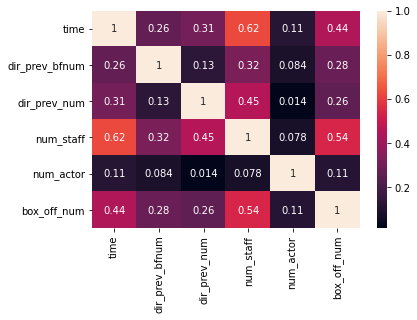

# 따릉이 데이터 활용한 데이터 분석 

### 데이콘 lv.1 서울시 따릉이 이용현황 예측하기 

각 날짜의 1시간 전 기상상황 가지고 1시간 후 따릉이 대여수 예측

## 1.라이브러리 및 데이터 


```python
import pandas as pd #판다스 패키지 불러오기
from sklearn.tree import DecisionTreeRegressor
from sklearn.ensemble import RandomForestRegressor #랜덤 포레스트 불러오기
```


```python
#파일 불러오기 
trn_file = pd.read_csv('dacon_1_train.csv')
tst_file= pd.read_csv('dacon_1_test.csv')
submission = pd.read_csv('dacon_1_submission.csv') 
```

## 2.EDA


```python
trn_file.head()
```


<div>
<style scoped>
    .dataframe tbody tr th:only-of-type {
        vertical-align: middle;
    }

    .dataframe tbody tr th {
        vertical-align: top;
    }

    .dataframe thead th {
        text-align: right;
    }
</style>
<table border="1" class="dataframe">
  <thead>
    <tr style="text-align: right;">
      <th></th>
      <th>id</th>
      <th>hour</th>
      <th>hour_bef_temperature</th>
      <th>hour_bef_precipitation</th>
      <th>hour_bef_windspeed</th>
      <th>hour_bef_humidity</th>
      <th>hour_bef_visibility</th>
      <th>hour_bef_ozone</th>
      <th>hour_bef_pm10</th>
      <th>hour_bef_pm2.5</th>
      <th>count</th>
    </tr>
  </thead>
  <tbody>
    <tr>
      <th>0</th>
      <td>3</td>
      <td>20</td>
      <td>16.3</td>
      <td>1.0</td>
      <td>1.5</td>
      <td>89.0</td>
      <td>576.0</td>
      <td>0.027</td>
      <td>76.0</td>
      <td>33.0</td>
      <td>49.0</td>
    </tr>
    <tr>
      <th>1</th>
      <td>6</td>
      <td>13</td>
      <td>20.1</td>
      <td>0.0</td>
      <td>1.4</td>
      <td>48.0</td>
      <td>916.0</td>
      <td>0.042</td>
      <td>73.0</td>
      <td>40.0</td>
      <td>159.0</td>
    </tr>
    <tr>
      <th>2</th>
      <td>7</td>
      <td>6</td>
      <td>13.9</td>
      <td>0.0</td>
      <td>0.7</td>
      <td>79.0</td>
      <td>1382.0</td>
      <td>0.033</td>
      <td>32.0</td>
      <td>19.0</td>
      <td>26.0</td>
    </tr>
    <tr>
      <th>3</th>
      <td>8</td>
      <td>23</td>
      <td>8.1</td>
      <td>0.0</td>
      <td>2.7</td>
      <td>54.0</td>
      <td>946.0</td>
      <td>0.040</td>
      <td>75.0</td>
      <td>64.0</td>
      <td>57.0</td>
    </tr>
    <tr>
      <th>4</th>
      <td>9</td>
      <td>18</td>
      <td>29.5</td>
      <td>0.0</td>
      <td>4.8</td>
      <td>7.0</td>
      <td>2000.0</td>
      <td>0.057</td>
      <td>27.0</td>
      <td>11.0</td>
      <td>431.0</td>
    </tr>
  </tbody>
</table>
</div>


```python
trn_file.tail()
```


<div>
<style scoped>
    .dataframe tbody tr th:only-of-type {
        vertical-align: middle;
    }

    .dataframe tbody tr th {
        vertical-align: top;
    }

    .dataframe thead th {
        text-align: right;
    }
</style>
<table border="1" class="dataframe">
  <thead>
    <tr style="text-align: right;">
      <th></th>
      <th>id</th>
      <th>hour</th>
      <th>hour_bef_temperature</th>
      <th>hour_bef_precipitation</th>
      <th>hour_bef_windspeed</th>
      <th>hour_bef_humidity</th>
      <th>hour_bef_visibility</th>
      <th>hour_bef_ozone</th>
      <th>hour_bef_pm10</th>
      <th>hour_bef_pm2.5</th>
      <th>count</th>
    </tr>
  </thead>
  <tbody>
    <tr>
      <th>1454</th>
      <td>2174</td>
      <td>4</td>
      <td>16.8</td>
      <td>0.0</td>
      <td>1.6</td>
      <td>53.0</td>
      <td>2000.0</td>
      <td>0.031</td>
      <td>37.0</td>
      <td>27.0</td>
      <td>21.0</td>
    </tr>
    <tr>
      <th>1455</th>
      <td>2175</td>
      <td>3</td>
      <td>10.8</td>
      <td>0.0</td>
      <td>3.8</td>
      <td>45.0</td>
      <td>2000.0</td>
      <td>0.039</td>
      <td>34.0</td>
      <td>19.0</td>
      <td>20.0</td>
    </tr>
    <tr>
      <th>1456</th>
      <td>2176</td>
      <td>5</td>
      <td>18.3</td>
      <td>0.0</td>
      <td>1.9</td>
      <td>54.0</td>
      <td>2000.0</td>
      <td>0.009</td>
      <td>30.0</td>
      <td>21.0</td>
      <td>22.0</td>
    </tr>
    <tr>
      <th>1457</th>
      <td>2178</td>
      <td>21</td>
      <td>20.7</td>
      <td>0.0</td>
      <td>3.7</td>
      <td>37.0</td>
      <td>1395.0</td>
      <td>0.082</td>
      <td>71.0</td>
      <td>36.0</td>
      <td>216.0</td>
    </tr>
    <tr>
      <th>1458</th>
      <td>2179</td>
      <td>17</td>
      <td>21.1</td>
      <td>0.0</td>
      <td>3.1</td>
      <td>47.0</td>
      <td>1973.0</td>
      <td>0.046</td>
      <td>38.0</td>
      <td>17.0</td>
      <td>170.0</td>
    </tr>
  </tbody>
</table>
</div>


```python
print(trn_file.shape)
```

    (1459, 11)
    


```python
trn_file.info()
```

    <class 'pandas.core.frame.DataFrame'>
    RangeIndex: 1459 entries, 0 to 1458
    Data columns (total 11 columns):
     #   Column                  Non-Null Count  Dtype  
    ---  ------                  --------------  -----  
     0   id                      1459 non-null   int64  
     1   hour                    1459 non-null   int64  
     2   hour_bef_temperature    1457 non-null   float64
     3   hour_bef_precipitation  1457 non-null   float64
     4   hour_bef_windspeed      1450 non-null   float64
     5   hour_bef_humidity       1457 non-null   float64
     6   hour_bef_visibility     1457 non-null   float64
     7   hour_bef_ozone          1383 non-null   float64
     8   hour_bef_pm10           1369 non-null   float64
     9   hour_bef_pm2.5          1342 non-null   float64
     10  count                   1459 non-null   float64
    dtypes: float64(9), int64(2)
    memory usage: 125.5 KB
    


```python
trn_file.describe()
```


<div>
<style scoped>
    .dataframe tbody tr th:only-of-type {
        vertical-align: middle;
    }

    .dataframe tbody tr th {
        vertical-align: top;
    }

    .dataframe thead th {
        text-align: right;
    }
</style>
<table border="1" class="dataframe">
  <thead>
    <tr style="text-align: right;">
      <th></th>
      <th>id</th>
      <th>hour</th>
      <th>hour_bef_temperature</th>
      <th>hour_bef_precipitation</th>
      <th>hour_bef_windspeed</th>
      <th>hour_bef_humidity</th>
      <th>hour_bef_visibility</th>
      <th>hour_bef_ozone</th>
      <th>hour_bef_pm10</th>
      <th>hour_bef_pm2.5</th>
      <th>count</th>
    </tr>
  </thead>
  <tbody>
    <tr>
      <th>count</th>
      <td>1459.000000</td>
      <td>1459.000000</td>
      <td>1457.000000</td>
      <td>1457.000000</td>
      <td>1450.000000</td>
      <td>1457.000000</td>
      <td>1457.000000</td>
      <td>1383.000000</td>
      <td>1369.000000</td>
      <td>1342.000000</td>
      <td>1459.000000</td>
    </tr>
    <tr>
      <th>mean</th>
      <td>1105.914325</td>
      <td>11.493489</td>
      <td>16.717433</td>
      <td>0.031572</td>
      <td>2.479034</td>
      <td>52.231297</td>
      <td>1405.216884</td>
      <td>0.039149</td>
      <td>57.168736</td>
      <td>30.327124</td>
      <td>108.563400</td>
    </tr>
    <tr>
      <th>std</th>
      <td>631.338681</td>
      <td>6.922790</td>
      <td>5.239150</td>
      <td>0.174917</td>
      <td>1.378265</td>
      <td>20.370387</td>
      <td>583.131708</td>
      <td>0.019509</td>
      <td>31.771019</td>
      <td>14.713252</td>
      <td>82.631733</td>
    </tr>
    <tr>
      <th>min</th>
      <td>3.000000</td>
      <td>0.000000</td>
      <td>3.100000</td>
      <td>0.000000</td>
      <td>0.000000</td>
      <td>7.000000</td>
      <td>78.000000</td>
      <td>0.003000</td>
      <td>9.000000</td>
      <td>8.000000</td>
      <td>1.000000</td>
    </tr>
    <tr>
      <th>25%</th>
      <td>555.500000</td>
      <td>5.500000</td>
      <td>12.800000</td>
      <td>0.000000</td>
      <td>1.400000</td>
      <td>36.000000</td>
      <td>879.000000</td>
      <td>0.025500</td>
      <td>36.000000</td>
      <td>20.000000</td>
      <td>37.000000</td>
    </tr>
    <tr>
      <th>50%</th>
      <td>1115.000000</td>
      <td>11.000000</td>
      <td>16.600000</td>
      <td>0.000000</td>
      <td>2.300000</td>
      <td>51.000000</td>
      <td>1577.000000</td>
      <td>0.039000</td>
      <td>51.000000</td>
      <td>26.000000</td>
      <td>96.000000</td>
    </tr>
    <tr>
      <th>75%</th>
      <td>1651.000000</td>
      <td>17.500000</td>
      <td>20.100000</td>
      <td>0.000000</td>
      <td>3.400000</td>
      <td>69.000000</td>
      <td>1994.000000</td>
      <td>0.052000</td>
      <td>69.000000</td>
      <td>37.000000</td>
      <td>150.000000</td>
    </tr>
    <tr>
      <th>max</th>
      <td>2179.000000</td>
      <td>23.000000</td>
      <td>30.000000</td>
      <td>1.000000</td>
      <td>8.000000</td>
      <td>99.000000</td>
      <td>2000.000000</td>
      <td>0.125000</td>
      <td>269.000000</td>
      <td>90.000000</td>
      <td>431.000000</td>
    </tr>
  </tbody>
</table>
</div>


```python
sample_file.head()
```


<div>
<style scoped>
    .dataframe tbody tr th:only-of-type {
        vertical-align: middle;
    }

    .dataframe tbody tr th {
        vertical-align: top;
    }

    .dataframe thead th {
        text-align: right;
    }
</style>
<table border="1" class="dataframe">
  <thead>
    <tr style="text-align: right;">
      <th></th>
      <th>id</th>
      <th>count</th>
    </tr>
  </thead>
  <tbody>
    <tr>
      <th>0</th>
      <td>0</td>
      <td>NaN</td>
    </tr>
    <tr>
      <th>1</th>
      <td>1</td>
      <td>NaN</td>
    </tr>
    <tr>
      <th>2</th>
      <td>2</td>
      <td>NaN</td>
    </tr>
    <tr>
      <th>3</th>
      <td>4</td>
      <td>NaN</td>
    </tr>
    <tr>
      <th>4</th>
      <td>5</td>
      <td>NaN</td>
    </tr>
  </tbody>
</table>
</div>


### 시간별로 평균 구해서 시각화하기 


```python
import matplotlib.pyplot as plt
```


```python
trn_file.groupby('hour').mean()['count'].plot()
```


    <AxesSubplot:xlabel='hour'>


    

    


데이터를 시각화해본 결과 출퇴근 시간이나 등하교 시간에 사용량이 많은 것을 확인할 수 있다.

#### 위에 나타난 그래프 좀 더 한눈에 알아보기 쉽게 나타내기


```python
plt.plot(trn_file.groupby('hour').mean()['count'],'o-')
plt.title('count by hours')
plt.xlabel('hour')
plt.ylabel('count')
```


    Text(0, 0.5, 'count')


    

    


## 변수별 상관관계 파악 


```python
trn_file.corr()
```


<div>
<style scoped>
    .dataframe tbody tr th:only-of-type {
        vertical-align: middle;
    }

    .dataframe tbody tr th {
        vertical-align: top;
    }

    .dataframe thead th {
        text-align: right;
    }
</style>
<table border="1" class="dataframe">
  <thead>
    <tr style="text-align: right;">
      <th></th>
      <th>id</th>
      <th>hour</th>
      <th>hour_bef_temperature</th>
      <th>hour_bef_precipitation</th>
      <th>hour_bef_windspeed</th>
      <th>hour_bef_humidity</th>
      <th>hour_bef_visibility</th>
      <th>hour_bef_ozone</th>
      <th>hour_bef_pm10</th>
      <th>hour_bef_pm2.5</th>
      <th>count</th>
    </tr>
  </thead>
  <tbody>
    <tr>
      <th>id</th>
      <td>1.000000</td>
      <td>-0.010901</td>
      <td>-0.000029</td>
      <td>-0.056267</td>
      <td>-0.003353</td>
      <td>-0.017948</td>
      <td>0.008950</td>
      <td>0.055234</td>
      <td>-0.025510</td>
      <td>0.003545</td>
      <td>-0.002131</td>
    </tr>
    <tr>
      <th>hour</th>
      <td>-0.010901</td>
      <td>1.000000</td>
      <td>0.407306</td>
      <td>0.021646</td>
      <td>0.462797</td>
      <td>-0.329612</td>
      <td>0.176491</td>
      <td>0.390188</td>
      <td>-0.035907</td>
      <td>-0.061229</td>
      <td>0.626047</td>
    </tr>
    <tr>
      <th>hour_bef_temperature</th>
      <td>-0.000029</td>
      <td>0.407306</td>
      <td>1.000000</td>
      <td>-0.097056</td>
      <td>0.375618</td>
      <td>-0.496088</td>
      <td>0.197417</td>
      <td>0.541228</td>
      <td>-0.003830</td>
      <td>-0.078665</td>
      <td>0.619404</td>
    </tr>
    <tr>
      <th>hour_bef_precipitation</th>
      <td>-0.056267</td>
      <td>0.021646</td>
      <td>-0.097056</td>
      <td>1.000000</td>
      <td>0.022746</td>
      <td>0.276481</td>
      <td>-0.217155</td>
      <td>-0.062461</td>
      <td>-0.051266</td>
      <td>0.004742</td>
      <td>-0.163985</td>
    </tr>
    <tr>
      <th>hour_bef_windspeed</th>
      <td>-0.003353</td>
      <td>0.462797</td>
      <td>0.375618</td>
      <td>0.022746</td>
      <td>1.000000</td>
      <td>-0.433012</td>
      <td>0.252092</td>
      <td>0.520526</td>
      <td>0.010176</td>
      <td>-0.199113</td>
      <td>0.459906</td>
    </tr>
    <tr>
      <th>hour_bef_humidity</th>
      <td>-0.017948</td>
      <td>-0.329612</td>
      <td>-0.496088</td>
      <td>0.276481</td>
      <td>-0.433012</td>
      <td>1.000000</td>
      <td>-0.592244</td>
      <td>-0.421047</td>
      <td>-0.108106</td>
      <td>0.167736</td>
      <td>-0.471142</td>
    </tr>
    <tr>
      <th>hour_bef_visibility</th>
      <td>0.008950</td>
      <td>0.176491</td>
      <td>0.197417</td>
      <td>-0.217155</td>
      <td>0.252092</td>
      <td>-0.592244</td>
      <td>1.000000</td>
      <td>0.101899</td>
      <td>-0.403277</td>
      <td>-0.644989</td>
      <td>0.299094</td>
    </tr>
    <tr>
      <th>hour_bef_ozone</th>
      <td>0.055234</td>
      <td>0.390188</td>
      <td>0.541228</td>
      <td>-0.062461</td>
      <td>0.520526</td>
      <td>-0.421047</td>
      <td>0.101899</td>
      <td>1.000000</td>
      <td>0.113015</td>
      <td>0.017313</td>
      <td>0.477614</td>
    </tr>
    <tr>
      <th>hour_bef_pm10</th>
      <td>-0.025510</td>
      <td>-0.035907</td>
      <td>-0.003830</td>
      <td>-0.051266</td>
      <td>0.010176</td>
      <td>-0.108106</td>
      <td>-0.403277</td>
      <td>0.113015</td>
      <td>1.000000</td>
      <td>0.489558</td>
      <td>-0.114288</td>
    </tr>
    <tr>
      <th>hour_bef_pm2.5</th>
      <td>0.003545</td>
      <td>-0.061229</td>
      <td>-0.078665</td>
      <td>0.004742</td>
      <td>-0.199113</td>
      <td>0.167736</td>
      <td>-0.644989</td>
      <td>0.017313</td>
      <td>0.489558</td>
      <td>1.000000</td>
      <td>-0.134293</td>
    </tr>
    <tr>
      <th>count</th>
      <td>-0.002131</td>
      <td>0.626047</td>
      <td>0.619404</td>
      <td>-0.163985</td>
      <td>0.459906</td>
      <td>-0.471142</td>
      <td>0.299094</td>
      <td>0.477614</td>
      <td>-0.114288</td>
      <td>-0.134293</td>
      <td>1.000000</td>
    </tr>
  </tbody>
</table>
</div>


### 한눈에 알아보기 쉽게 히트맵 사용해서 파악하기


```python
import seaborn as sns
```


```python
plt.figure(figsize=(10,10))
sns.heatmap(trn_file.corr(),annot=True) #수치와 같이 표현 
```


    <AxesSubplot:>


    

    


## 3.데이터 전처리

### 결측치 여부 확인


```python
trn_file.isna().sum()
```


    id                          0
    hour                        0
    hour_bef_temperature        2
    hour_bef_precipitation      2
    hour_bef_windspeed          9
    hour_bef_humidity           2
    hour_bef_visibility         2
    hour_bef_ozone             76
    hour_bef_pm10              90
    hour_bef_pm2.5            117
    count                       0
    dtype: int64


--> count 따릉이 사용수, hour_bef_temperature 한시간 전 온도와 hour_bef_windspeed 한시간 전 풍속 데이터 사용


```python
#파일에서 결측치 값이 어디에 있는지 확인
trn_file[trn_file['hour_bef_temperature'].isna()]
```


<div>
<style scoped>
    .dataframe tbody tr th:only-of-type {
        vertical-align: middle;
    }

    .dataframe tbody tr th {
        vertical-align: top;
    }

    .dataframe thead th {
        text-align: right;
    }
</style>
<table border="1" class="dataframe">
  <thead>
    <tr style="text-align: right;">
      <th></th>
      <th>id</th>
      <th>hour</th>
      <th>hour_bef_temperature</th>
      <th>hour_bef_precipitation</th>
      <th>hour_bef_windspeed</th>
      <th>hour_bef_humidity</th>
      <th>hour_bef_visibility</th>
      <th>hour_bef_ozone</th>
      <th>hour_bef_pm10</th>
      <th>hour_bef_pm2.5</th>
      <th>count</th>
    </tr>
  </thead>
  <tbody>
    <tr>
      <th>934</th>
      <td>1420</td>
      <td>0</td>
      <td>NaN</td>
      <td>NaN</td>
      <td>NaN</td>
      <td>NaN</td>
      <td>NaN</td>
      <td>NaN</td>
      <td>NaN</td>
      <td>NaN</td>
      <td>39.0</td>
    </tr>
    <tr>
      <th>1035</th>
      <td>1553</td>
      <td>18</td>
      <td>NaN</td>
      <td>NaN</td>
      <td>NaN</td>
      <td>NaN</td>
      <td>NaN</td>
      <td>NaN</td>
      <td>NaN</td>
      <td>NaN</td>
      <td>1.0</td>
    </tr>
  </tbody>
</table>
</div>


```python
trn_file.groupby('hour').mean()['hour_bef_temperature']
```


    hour
    0     14.788136
    1     14.155738
    2     13.747541
    3     13.357377
    4     13.001639
    5     12.673770
    6     12.377049
    7     12.191803
    8     12.600000
    9     14.318033
    10    16.242623
    11    18.019672
    12    19.457377
    13    20.648333
    14    21.234426
    15    21.744262
    16    22.015000
    17    21.603333
    18    20.926667
    19    19.704918
    20    18.191803
    21    16.978333
    22    16.063934
    23    15.418033
    Name: hour_bef_temperature, dtype: float64


```python
#시간별 온도평균 알아보기 

trn_file.groupby('hour').mean()['hour_bef_temperature'].plot()
plt.axhline(trn_file.groupby('hour').mean()['hour_bef_temperature'].mean())
# axhline수평선 / axvline  수직선 나타낼때 사용
```


    <matplotlib.lines.Line2D at 0x1be57c714f0>


    

    


### 결측값 대체


```python
trn_file['hour_bef_temperature'].fillna({934:14.788136,1035:20.926667},inplace = True) 
#대체해서 저장까지하기 위해서는 inplace = True 하면 됨 
```


```python
#결측값 대체 되었는지 확인 
trn_file.loc[[934,1035],:]
```


<div>
<style scoped>
    .dataframe tbody tr th:only-of-type {
        vertical-align: middle;
    }

    .dataframe tbody tr th {
        vertical-align: top;
    }

    .dataframe thead th {
        text-align: right;
    }
</style>
<table border="1" class="dataframe">
  <thead>
    <tr style="text-align: right;">
      <th></th>
      <th>id</th>
      <th>hour</th>
      <th>hour_bef_temperature</th>
      <th>hour_bef_precipitation</th>
      <th>hour_bef_windspeed</th>
      <th>hour_bef_humidity</th>
      <th>hour_bef_visibility</th>
      <th>hour_bef_ozone</th>
      <th>hour_bef_pm10</th>
      <th>hour_bef_pm2.5</th>
      <th>count</th>
    </tr>
  </thead>
  <tbody>
    <tr>
      <th>934</th>
      <td>1420</td>
      <td>0</td>
      <td>14.788136</td>
      <td>NaN</td>
      <td>NaN</td>
      <td>NaN</td>
      <td>NaN</td>
      <td>NaN</td>
      <td>NaN</td>
      <td>NaN</td>
      <td>39.0</td>
    </tr>
    <tr>
      <th>1035</th>
      <td>1553</td>
      <td>18</td>
      <td>20.926667</td>
      <td>NaN</td>
      <td>NaN</td>
      <td>NaN</td>
      <td>NaN</td>
      <td>NaN</td>
      <td>NaN</td>
      <td>NaN</td>
      <td>1.0</td>
    </tr>
  </tbody>
</table>
</div>


### 위와 같은 방식으로 풍속도 결측값 확인해서 대체하기


```python
trn_file[trn_file['hour_bef_windspeed'].isna()]
```


<div>
<style scoped>
    .dataframe tbody tr th:only-of-type {
        vertical-align: middle;
    }

    .dataframe tbody tr th {
        vertical-align: top;
    }

    .dataframe thead th {
        text-align: right;
    }
</style>
<table border="1" class="dataframe">
  <thead>
    <tr style="text-align: right;">
      <th></th>
      <th>id</th>
      <th>hour</th>
      <th>hour_bef_temperature</th>
      <th>hour_bef_precipitation</th>
      <th>hour_bef_windspeed</th>
      <th>hour_bef_humidity</th>
      <th>hour_bef_visibility</th>
      <th>hour_bef_ozone</th>
      <th>hour_bef_pm10</th>
      <th>hour_bef_pm2.5</th>
      <th>count</th>
    </tr>
  </thead>
  <tbody>
    <tr>
      <th>18</th>
      <td>33</td>
      <td>13</td>
      <td>22.600000</td>
      <td>0.0</td>
      <td>NaN</td>
      <td>41.0</td>
      <td>987.0</td>
      <td>0.046</td>
      <td>64.0</td>
      <td>39.0</td>
      <td>208.0</td>
    </tr>
    <tr>
      <th>244</th>
      <td>381</td>
      <td>1</td>
      <td>14.100000</td>
      <td>0.0</td>
      <td>NaN</td>
      <td>55.0</td>
      <td>1992.0</td>
      <td>NaN</td>
      <td>NaN</td>
      <td>NaN</td>
      <td>38.0</td>
    </tr>
    <tr>
      <th>260</th>
      <td>404</td>
      <td>3</td>
      <td>14.000000</td>
      <td>0.0</td>
      <td>NaN</td>
      <td>50.0</td>
      <td>2000.0</td>
      <td>0.049</td>
      <td>35.0</td>
      <td>22.0</td>
      <td>17.0</td>
    </tr>
    <tr>
      <th>376</th>
      <td>570</td>
      <td>0</td>
      <td>14.300000</td>
      <td>0.0</td>
      <td>NaN</td>
      <td>49.0</td>
      <td>2000.0</td>
      <td>0.044</td>
      <td>37.0</td>
      <td>20.0</td>
      <td>58.0</td>
    </tr>
    <tr>
      <th>780</th>
      <td>1196</td>
      <td>20</td>
      <td>16.500000</td>
      <td>0.0</td>
      <td>NaN</td>
      <td>31.0</td>
      <td>2000.0</td>
      <td>0.058</td>
      <td>39.0</td>
      <td>18.0</td>
      <td>181.0</td>
    </tr>
    <tr>
      <th>934</th>
      <td>1420</td>
      <td>0</td>
      <td>14.788136</td>
      <td>NaN</td>
      <td>NaN</td>
      <td>NaN</td>
      <td>NaN</td>
      <td>NaN</td>
      <td>NaN</td>
      <td>NaN</td>
      <td>39.0</td>
    </tr>
    <tr>
      <th>1035</th>
      <td>1553</td>
      <td>18</td>
      <td>20.926667</td>
      <td>NaN</td>
      <td>NaN</td>
      <td>NaN</td>
      <td>NaN</td>
      <td>NaN</td>
      <td>NaN</td>
      <td>NaN</td>
      <td>1.0</td>
    </tr>
    <tr>
      <th>1138</th>
      <td>1717</td>
      <td>12</td>
      <td>21.400000</td>
      <td>0.0</td>
      <td>NaN</td>
      <td>44.0</td>
      <td>1375.0</td>
      <td>0.044</td>
      <td>61.0</td>
      <td>37.0</td>
      <td>116.0</td>
    </tr>
    <tr>
      <th>1229</th>
      <td>1855</td>
      <td>2</td>
      <td>14.000000</td>
      <td>0.0</td>
      <td>NaN</td>
      <td>52.0</td>
      <td>2000.0</td>
      <td>0.044</td>
      <td>37.0</td>
      <td>20.0</td>
      <td>20.0</td>
    </tr>
  </tbody>
</table>
</div>


```python
trn_file[trn_file['hour_bef_windspeed'].isna()].index
```


    Int64Index([18, 244, 260, 376, 780, 934, 1035, 1138, 1229], dtype='int64')


```python
trn_file.groupby('hour').mean()['hour_bef_windspeed']
```


    hour
    0     1.965517
    1     1.836667
    2     1.633333
    3     1.620000
    4     1.409836
    5     1.296721
    6     1.331148
    7     1.262295
    8     1.632787
    9     1.829508
    10    2.122951
    11    2.485246
    12    2.766667
    13    3.281356
    14    3.522951
    15    3.768852
    16    3.820000
    17    3.801667
    18    3.838333
    19    3.595082
    20    3.278333
    21    2.755000
    22    2.498361
    23    2.195082
    Name: hour_bef_windspeed, dtype: float64


```python
trn_file.groupby('hour').mean()['hour_bef_windspeed'].plot()
plt.axhline(trn_file.groupby('hour').mean()['hour_bef_windspeed'].mean())
```


    <matplotlib.lines.Line2D at 0x1be57cc9970>


    

    


```python
trn_file['hour_bef_windspeed'].fillna({18:3.281356, 244:1.836667, 260:1.620000, 376:1.965517, 780:3.278333, 934:1.965517, 1035:3.838333, 1138:2.766667, 1229:1.633333},inplace = True) 

```


```python
trn_file.loc[[18,376],:]
```


<div>
<style scoped>
    .dataframe tbody tr th:only-of-type {
        vertical-align: middle;
    }

    .dataframe tbody tr th {
        vertical-align: top;
    }

    .dataframe thead th {
        text-align: right;
    }
</style>
<table border="1" class="dataframe">
  <thead>
    <tr style="text-align: right;">
      <th></th>
      <th>id</th>
      <th>hour</th>
      <th>hour_bef_temperature</th>
      <th>hour_bef_precipitation</th>
      <th>hour_bef_windspeed</th>
      <th>hour_bef_humidity</th>
      <th>hour_bef_visibility</th>
      <th>hour_bef_ozone</th>
      <th>hour_bef_pm10</th>
      <th>hour_bef_pm2.5</th>
      <th>count</th>
    </tr>
  </thead>
  <tbody>
    <tr>
      <th>18</th>
      <td>33</td>
      <td>13</td>
      <td>22.6</td>
      <td>0.0</td>
      <td>3.281356</td>
      <td>41.0</td>
      <td>987.0</td>
      <td>0.046</td>
      <td>64.0</td>
      <td>39.0</td>
      <td>208.0</td>
    </tr>
    <tr>
      <th>376</th>
      <td>570</td>
      <td>0</td>
      <td>14.3</td>
      <td>0.0</td>
      <td>1.965517</td>
      <td>49.0</td>
      <td>2000.0</td>
      <td>0.044</td>
      <td>37.0</td>
      <td>20.0</td>
      <td>58.0</td>
    </tr>
  </tbody>
</table>
</div>


```python
trn_file.isna().sum()
```


    id                          0
    hour                        0
    hour_bef_temperature        0
    hour_bef_precipitation      2
    hour_bef_windspeed          0
    hour_bef_humidity           2
    hour_bef_visibility         2
    hour_bef_ozone             76
    hour_bef_pm10              90
    hour_bef_pm2.5            117
    count                       0
    dtype: int64


--> 최종적으로 사용할 데이터에 대해서 결측값이 없는 것을 확인 할 수 있음

### 위와 같은 방식으로 test 파일의 결측값도 제거 


```python
tst_file.isna().sum()
```


    id                         0
    hour                       0
    hour_bef_temperature       1
    hour_bef_precipitation     1
    hour_bef_windspeed         1
    hour_bef_humidity          1
    hour_bef_visibility        1
    hour_bef_ozone            35
    hour_bef_pm10             37
    hour_bef_pm2.5            36
    dtype: int64


```python
tst_file[tst_file['hour_bef_temperature'].isna()]
```


<div>
<style scoped>
    .dataframe tbody tr th:only-of-type {
        vertical-align: middle;
    }

    .dataframe tbody tr th {
        vertical-align: top;
    }

    .dataframe thead th {
        text-align: right;
    }
</style>
<table border="1" class="dataframe">
  <thead>
    <tr style="text-align: right;">
      <th></th>
      <th>id</th>
      <th>hour</th>
      <th>hour_bef_temperature</th>
      <th>hour_bef_precipitation</th>
      <th>hour_bef_windspeed</th>
      <th>hour_bef_humidity</th>
      <th>hour_bef_visibility</th>
      <th>hour_bef_ozone</th>
      <th>hour_bef_pm10</th>
      <th>hour_bef_pm2.5</th>
    </tr>
  </thead>
  <tbody>
    <tr>
      <th>653</th>
      <td>1943</td>
      <td>19</td>
      <td>NaN</td>
      <td>NaN</td>
      <td>NaN</td>
      <td>NaN</td>
      <td>NaN</td>
      <td>NaN</td>
      <td>NaN</td>
      <td>NaN</td>
    </tr>
  </tbody>
</table>
</div>


```python
tst_file.groupby('hour').mean()['hour_bef_temperature']
```


    hour
    0     21.386667
    1     20.986667
    2     20.600000
    3     20.203333
    4     19.853333
    5     19.634483
    6     19.243333
    7     19.190000
    8     19.846667
    9     21.266667
    10    22.683333
    11    24.110000
    12    25.430000
    13    26.630000
    14    27.473333
    15    28.040000
    16    28.255172
    17    27.848276
    18    27.010345
    19    26.110345
    20    24.803333
    21    23.696552
    22    22.523333
    23    21.926667
    Name: hour_bef_temperature, dtype: float64


```python
tst_file['hour_bef_temperature'].fillna({653:26.110345},inplace = True) 
```


```python
tst_file[tst_file['hour_bef_windspeed'].isna()]
```


<div>
<style scoped>
    .dataframe tbody tr th:only-of-type {
        vertical-align: middle;
    }

    .dataframe tbody tr th {
        vertical-align: top;
    }

    .dataframe thead th {
        text-align: right;
    }
</style>
<table border="1" class="dataframe">
  <thead>
    <tr style="text-align: right;">
      <th></th>
      <th>id</th>
      <th>hour</th>
      <th>hour_bef_temperature</th>
      <th>hour_bef_precipitation</th>
      <th>hour_bef_windspeed</th>
      <th>hour_bef_humidity</th>
      <th>hour_bef_visibility</th>
      <th>hour_bef_ozone</th>
      <th>hour_bef_pm10</th>
      <th>hour_bef_pm2.5</th>
    </tr>
  </thead>
  <tbody>
    <tr>
      <th>653</th>
      <td>1943</td>
      <td>19</td>
      <td>26.110345</td>
      <td>NaN</td>
      <td>NaN</td>
      <td>NaN</td>
      <td>NaN</td>
      <td>NaN</td>
      <td>NaN</td>
      <td>NaN</td>
    </tr>
  </tbody>
</table>
</div>


```python
tst_file.groupby('hour').mean()['hour_bef_windspeed']
```


    hour
    0     1.986667
    1     1.840000
    2     1.823333
    3     1.636667
    4     1.543333
    5     1.589655
    6     1.396667
    7     1.453333
    8     1.446667
    9     1.646667
    10    1.920000
    11    2.186667
    12    2.636667
    13    2.836667
    14    2.903333
    15    3.140000
    16    3.406897
    17    3.558621
    18    3.503448
    19    3.541379
    20    3.406667
    21    3.041379
    22    2.686667
    23    2.336667
    Name: hour_bef_windspeed, dtype: float64


```python
tst_file['hour_bef_windspeed'].fillna({653:3.541379},inplace = True) 
```


```python
tst_file.isna().sum()
```


    id                         0
    hour                       0
    hour_bef_temperature       0
    hour_bef_precipitation     1
    hour_bef_windspeed         0
    hour_bef_humidity          1
    hour_bef_visibility        1
    hour_bef_ozone            35
    hour_bef_pm10             37
    hour_bef_pm2.5            36
    dtype: int64


# 4. 모델 구축하기


```python
features = ['hour','hour_bef_temperature','hour_bef_windspeed'] 
X_train = trn_file[features]
y_train = trn_file['count']

X_test = tst_file[features]
```


```python
print(X_train.shape)
print(y_train.shape)
print(X_test.shape)
```

    (1459, 3)
    (1459,)
    (715, 3)
    


```python
model100 = RandomForestRegressor(n_estimators=100,random_state=0)
model100_5 = RandomForestRegressor(n_estimators=100,max_depth=5,random_state=0)
model200=RandomForestRegressor(n_estimators=200)
```


```python
model100.fit(X_train,y_train)
model100_5.fit(X_train,y_train)
model200.fit(X_train,y_train)
```


    RandomForestRegressor(n_estimators=200)


```python
ypred1 = model100.predict(X_test)
ypred2 = model100_5.predict(X_test)
ypred3 = model200.predict(X_test)
```


```python
submission['count']=ypred1
submission.to_csv('model100.csv',index=False)
```


```python
submission['count']=ypred2
submission.to_csv('model100_5.csv',index=False)
```


```python
submission['count']=ypred3
submission.to_csv('model200.csv',index=False)
```
