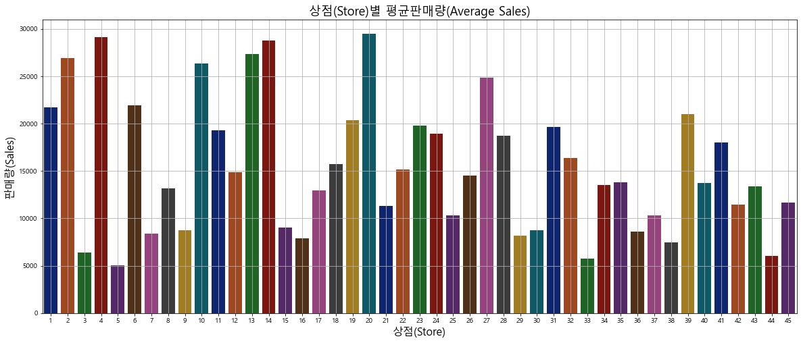
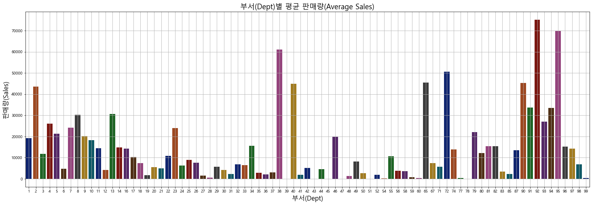
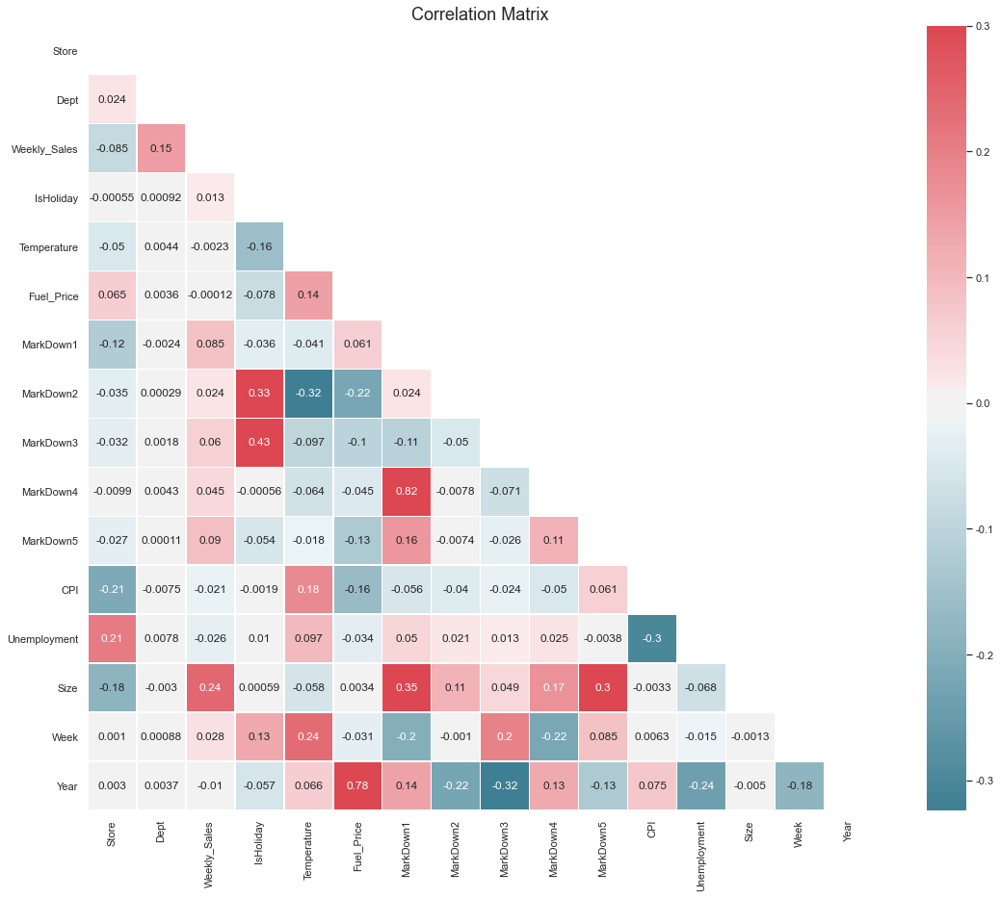
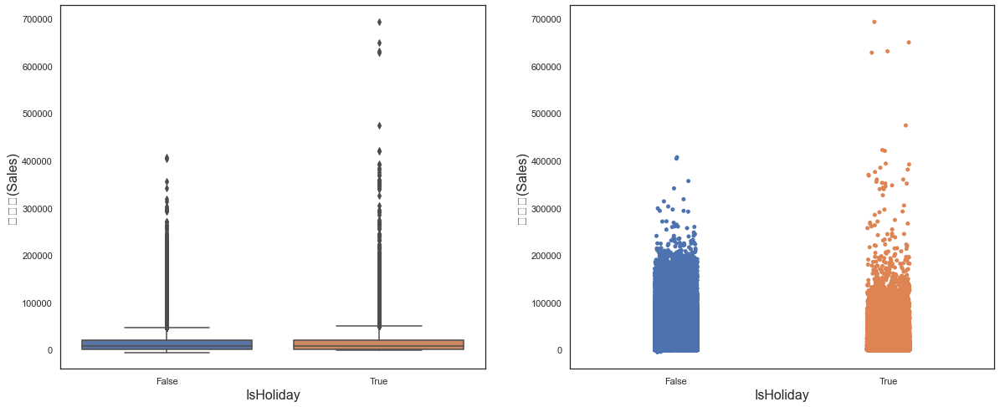
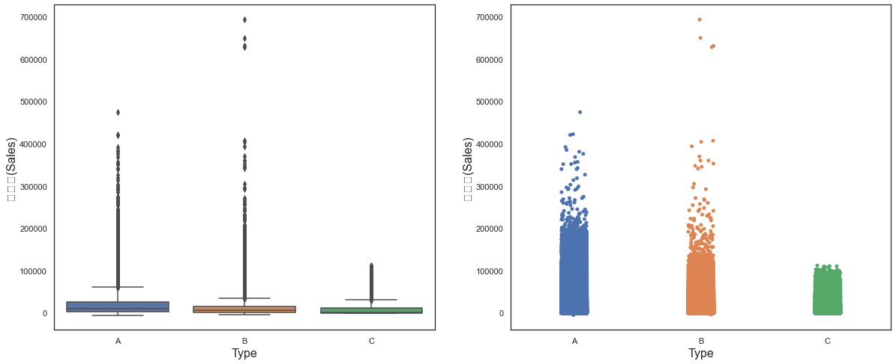
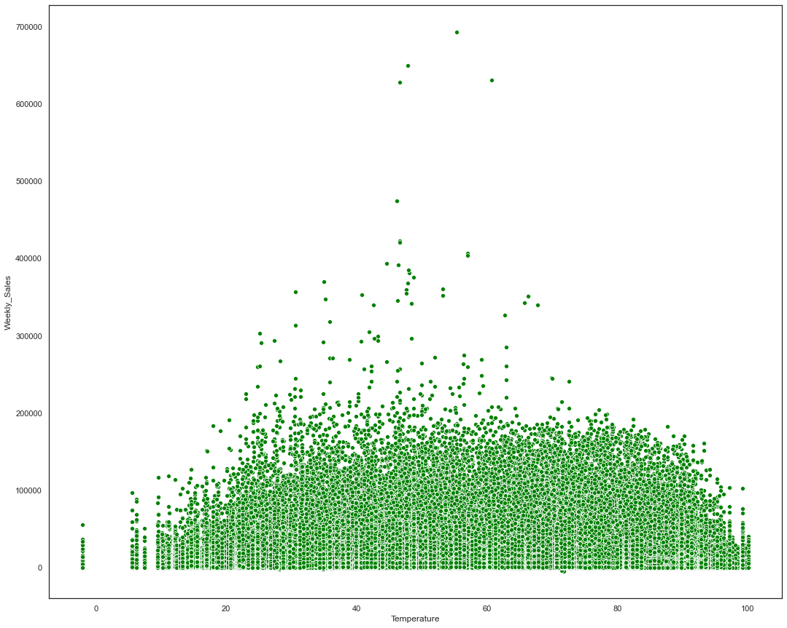
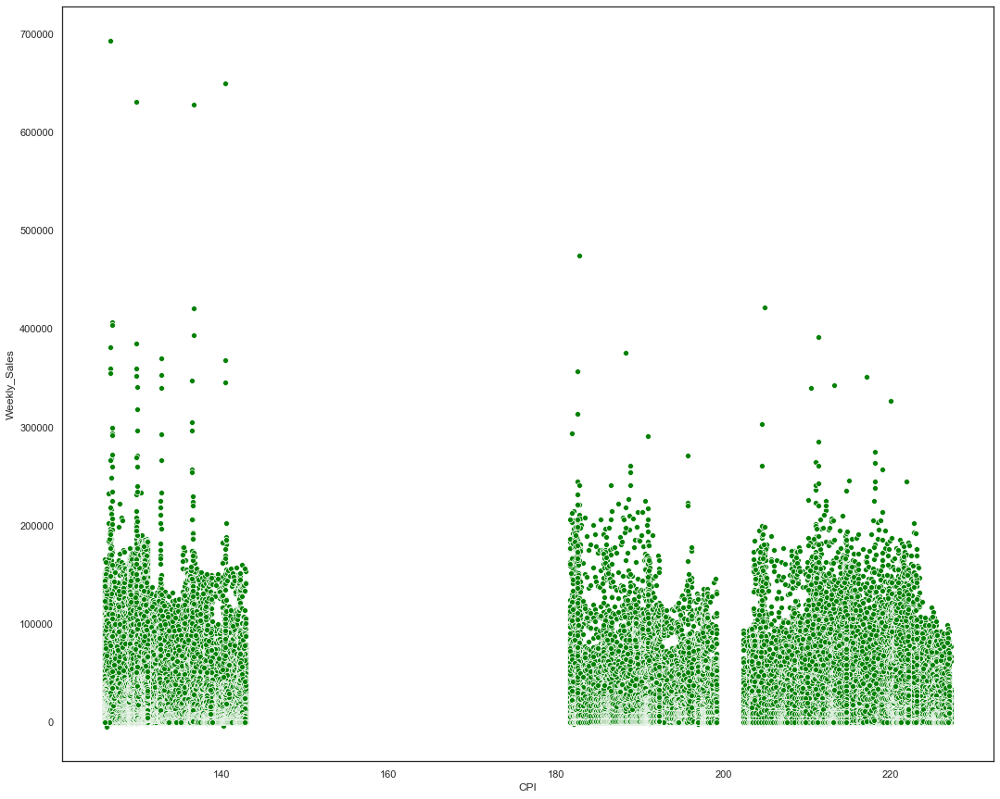
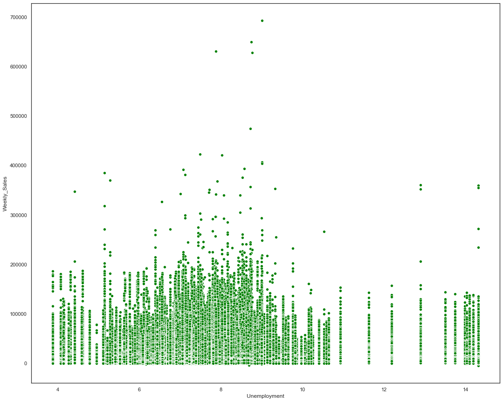
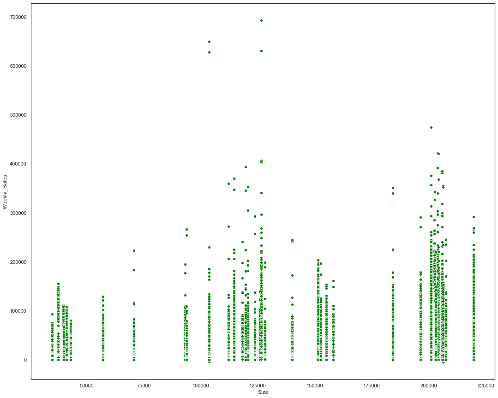

# 데이터 준비 


```python
import pandas as pd
import numpy as np
from matplotlib import pyplot as plt
from matplotlib.gridspec import GridSpec
import seaborn as sns

from sklearn.model_selection import train_test_split
from sklearn.ensemble import RandomForestRegressor

plt.rcParams['font.family'] = 'Malgun Gothic'  # (Windows 용) 한글 출력을 위한 글꼴 설정
plt.rcParams['axes.unicode_minus'] = False    # 문자 - (마이너스) 정상 출력을 위한 코드
```


```python
features = pd.read_csv('features.csv')
train = pd.read_csv('train1.csv')
stores = pd.read_csv('stores.csv')
test = pd.read_csv('test.csv')
sample_submission = pd.read_csv('sampleSubmission.csv')
```

# Exploratory Data Analysis(EDA) & Data Cleansing

## feature데이터와 store데이터 조합해서 새로운 데이터셋 생성


```python
features.head(5)
```


<div>
<style scoped>
    .dataframe tbody tr th:only-of-type {
        vertical-align: middle;
    }

    .dataframe tbody tr th {
        vertical-align: top;
    }

    .dataframe thead th {
        text-align: right;
    }
</style>
<table border="1" class="dataframe">
  <thead>
    <tr style="text-align: right;">
      <th></th>
      <th>Store</th>
      <th>Date</th>
      <th>Temperature</th>
      <th>Fuel_Price</th>
      <th>MarkDown1</th>
      <th>MarkDown2</th>
      <th>MarkDown3</th>
      <th>MarkDown4</th>
      <th>MarkDown5</th>
      <th>CPI</th>
      <th>Unemployment</th>
      <th>IsHoliday</th>
    </tr>
  </thead>
  <tbody>
    <tr>
      <th>0</th>
      <td>1</td>
      <td>2010-02-05</td>
      <td>42.31</td>
      <td>2.572</td>
      <td>NaN</td>
      <td>NaN</td>
      <td>NaN</td>
      <td>NaN</td>
      <td>NaN</td>
      <td>211.096358</td>
      <td>8.106</td>
      <td>False</td>
    </tr>
    <tr>
      <th>1</th>
      <td>1</td>
      <td>2010-02-12</td>
      <td>38.51</td>
      <td>2.548</td>
      <td>NaN</td>
      <td>NaN</td>
      <td>NaN</td>
      <td>NaN</td>
      <td>NaN</td>
      <td>211.242170</td>
      <td>8.106</td>
      <td>True</td>
    </tr>
    <tr>
      <th>2</th>
      <td>1</td>
      <td>2010-02-19</td>
      <td>39.93</td>
      <td>2.514</td>
      <td>NaN</td>
      <td>NaN</td>
      <td>NaN</td>
      <td>NaN</td>
      <td>NaN</td>
      <td>211.289143</td>
      <td>8.106</td>
      <td>False</td>
    </tr>
    <tr>
      <th>3</th>
      <td>1</td>
      <td>2010-02-26</td>
      <td>46.63</td>
      <td>2.561</td>
      <td>NaN</td>
      <td>NaN</td>
      <td>NaN</td>
      <td>NaN</td>
      <td>NaN</td>
      <td>211.319643</td>
      <td>8.106</td>
      <td>False</td>
    </tr>
    <tr>
      <th>4</th>
      <td>1</td>
      <td>2010-03-05</td>
      <td>46.50</td>
      <td>2.625</td>
      <td>NaN</td>
      <td>NaN</td>
      <td>NaN</td>
      <td>NaN</td>
      <td>NaN</td>
      <td>211.350143</td>
      <td>8.106</td>
      <td>False</td>
    </tr>
  </tbody>
</table>
</div>


```python
stores.head(5)
```


<div>
<style scoped>
    .dataframe tbody tr th:only-of-type {
        vertical-align: middle;
    }

    .dataframe tbody tr th {
        vertical-align: top;
    }

    .dataframe thead th {
        text-align: right;
    }
</style>
<table border="1" class="dataframe">
  <thead>
    <tr style="text-align: right;">
      <th></th>
      <th>Store</th>
      <th>Type</th>
      <th>Size</th>
    </tr>
  </thead>
  <tbody>
    <tr>
      <th>0</th>
      <td>1</td>
      <td>A</td>
      <td>151315</td>
    </tr>
    <tr>
      <th>1</th>
      <td>2</td>
      <td>A</td>
      <td>202307</td>
    </tr>
    <tr>
      <th>2</th>
      <td>3</td>
      <td>B</td>
      <td>37392</td>
    </tr>
    <tr>
      <th>3</th>
      <td>4</td>
      <td>A</td>
      <td>205863</td>
    </tr>
    <tr>
      <th>4</th>
      <td>5</td>
      <td>B</td>
      <td>34875</td>
    </tr>
  </tbody>
</table>
</div>


```python
feat_sto = features.merge(stores, how='inner', on='Store')
```


```python
feat_sto.head(5)
```


<div>
<style scoped>
    .dataframe tbody tr th:only-of-type {
        vertical-align: middle;
    }

    .dataframe tbody tr th {
        vertical-align: top;
    }

    .dataframe thead th {
        text-align: right;
    }
</style>
<table border="1" class="dataframe">
  <thead>
    <tr style="text-align: right;">
      <th></th>
      <th>Store</th>
      <th>Date</th>
      <th>Temperature</th>
      <th>Fuel_Price</th>
      <th>MarkDown1</th>
      <th>MarkDown2</th>
      <th>MarkDown3</th>
      <th>MarkDown4</th>
      <th>MarkDown5</th>
      <th>CPI</th>
      <th>Unemployment</th>
      <th>IsHoliday</th>
      <th>Type</th>
      <th>Size</th>
    </tr>
  </thead>
  <tbody>
    <tr>
      <th>0</th>
      <td>1</td>
      <td>2010-02-05</td>
      <td>42.31</td>
      <td>2.572</td>
      <td>NaN</td>
      <td>NaN</td>
      <td>NaN</td>
      <td>NaN</td>
      <td>NaN</td>
      <td>211.096358</td>
      <td>8.106</td>
      <td>False</td>
      <td>A</td>
      <td>151315</td>
    </tr>
    <tr>
      <th>1</th>
      <td>1</td>
      <td>2010-02-12</td>
      <td>38.51</td>
      <td>2.548</td>
      <td>NaN</td>
      <td>NaN</td>
      <td>NaN</td>
      <td>NaN</td>
      <td>NaN</td>
      <td>211.242170</td>
      <td>8.106</td>
      <td>True</td>
      <td>A</td>
      <td>151315</td>
    </tr>
    <tr>
      <th>2</th>
      <td>1</td>
      <td>2010-02-19</td>
      <td>39.93</td>
      <td>2.514</td>
      <td>NaN</td>
      <td>NaN</td>
      <td>NaN</td>
      <td>NaN</td>
      <td>NaN</td>
      <td>211.289143</td>
      <td>8.106</td>
      <td>False</td>
      <td>A</td>
      <td>151315</td>
    </tr>
    <tr>
      <th>3</th>
      <td>1</td>
      <td>2010-02-26</td>
      <td>46.63</td>
      <td>2.561</td>
      <td>NaN</td>
      <td>NaN</td>
      <td>NaN</td>
      <td>NaN</td>
      <td>NaN</td>
      <td>211.319643</td>
      <td>8.106</td>
      <td>False</td>
      <td>A</td>
      <td>151315</td>
    </tr>
    <tr>
      <th>4</th>
      <td>1</td>
      <td>2010-03-05</td>
      <td>46.50</td>
      <td>2.625</td>
      <td>NaN</td>
      <td>NaN</td>
      <td>NaN</td>
      <td>NaN</td>
      <td>NaN</td>
      <td>211.350143</td>
      <td>8.106</td>
      <td>False</td>
      <td>A</td>
      <td>151315</td>
    </tr>
  </tbody>
</table>
</div>


```python
feat_sto.dtypes
```


    Store             int64
    Date             object
    Temperature     float64
    Fuel_Price      float64
    MarkDown1       float64
    MarkDown2       float64
    MarkDown3       float64
    MarkDown4       float64
    MarkDown5       float64
    CPI             float64
    Unemployment    float64
    IsHoliday          bool
    Type             object
    Size              int64
    dtype: object


```python
train.head(5)
```


<div>
<style scoped>
    .dataframe tbody tr th:only-of-type {
        vertical-align: middle;
    }

    .dataframe tbody tr th {
        vertical-align: top;
    }

    .dataframe thead th {
        text-align: right;
    }
</style>
<table border="1" class="dataframe">
  <thead>
    <tr style="text-align: right;">
      <th></th>
      <th>Store</th>
      <th>Dept</th>
      <th>Date</th>
      <th>Weekly_Sales</th>
      <th>IsHoliday</th>
    </tr>
  </thead>
  <tbody>
    <tr>
      <th>0</th>
      <td>1</td>
      <td>1</td>
      <td>2010-02-05</td>
      <td>24924.50</td>
      <td>False</td>
    </tr>
    <tr>
      <th>1</th>
      <td>1</td>
      <td>1</td>
      <td>2010-02-12</td>
      <td>46039.49</td>
      <td>True</td>
    </tr>
    <tr>
      <th>2</th>
      <td>1</td>
      <td>1</td>
      <td>2010-02-19</td>
      <td>41595.55</td>
      <td>False</td>
    </tr>
    <tr>
      <th>3</th>
      <td>1</td>
      <td>1</td>
      <td>2010-02-26</td>
      <td>19403.54</td>
      <td>False</td>
    </tr>
    <tr>
      <th>4</th>
      <td>1</td>
      <td>1</td>
      <td>2010-03-05</td>
      <td>21827.90</td>
      <td>False</td>
    </tr>
  </tbody>
</table>
</div>


date필드가 string타입으로 지정되어 있어 이를 datetime타입으로 변경


```python
feat_sto.Date = pd.to_datetime(feat_sto.Date)
train.Date = pd.to_datetime(train.Date)
test.Date = pd.to_datetime(test.Date)
```

# Date로부터 Week와 Year컬럼 추가


```python
feat_sto['Week'] = feat_sto.Date.dt.week 
feat_sto['Year'] = feat_sto.Date.dt.year
```

    <ipython-input-23-0cdbe1a1e629>:1: FutureWarning: Series.dt.weekofyear and Series.dt.week have been deprecated.  Please use Series.dt.isocalendar().week instead.
      feat_sto['Week'] = feat_sto.Date.dt.week
    


```python
feat_sto.head(10)
```


<div>
<style scoped>
    .dataframe tbody tr th:only-of-type {
        vertical-align: middle;
    }

    .dataframe tbody tr th {
        vertical-align: top;
    }

    .dataframe thead th {
        text-align: right;
    }
</style>
<table border="1" class="dataframe">
  <thead>
    <tr style="text-align: right;">
      <th></th>
      <th>Store</th>
      <th>Date</th>
      <th>Temperature</th>
      <th>Fuel_Price</th>
      <th>MarkDown1</th>
      <th>MarkDown2</th>
      <th>MarkDown3</th>
      <th>MarkDown4</th>
      <th>MarkDown5</th>
      <th>CPI</th>
      <th>Unemployment</th>
      <th>IsHoliday</th>
      <th>Type</th>
      <th>Size</th>
      <th>Week</th>
      <th>Year</th>
    </tr>
  </thead>
  <tbody>
    <tr>
      <th>0</th>
      <td>1</td>
      <td>2010-02-05</td>
      <td>42.31</td>
      <td>2.572</td>
      <td>NaN</td>
      <td>NaN</td>
      <td>NaN</td>
      <td>NaN</td>
      <td>NaN</td>
      <td>211.096358</td>
      <td>8.106</td>
      <td>False</td>
      <td>A</td>
      <td>151315</td>
      <td>5</td>
      <td>2010</td>
    </tr>
    <tr>
      <th>1</th>
      <td>1</td>
      <td>2010-02-12</td>
      <td>38.51</td>
      <td>2.548</td>
      <td>NaN</td>
      <td>NaN</td>
      <td>NaN</td>
      <td>NaN</td>
      <td>NaN</td>
      <td>211.242170</td>
      <td>8.106</td>
      <td>True</td>
      <td>A</td>
      <td>151315</td>
      <td>6</td>
      <td>2010</td>
    </tr>
    <tr>
      <th>2</th>
      <td>1</td>
      <td>2010-02-19</td>
      <td>39.93</td>
      <td>2.514</td>
      <td>NaN</td>
      <td>NaN</td>
      <td>NaN</td>
      <td>NaN</td>
      <td>NaN</td>
      <td>211.289143</td>
      <td>8.106</td>
      <td>False</td>
      <td>A</td>
      <td>151315</td>
      <td>7</td>
      <td>2010</td>
    </tr>
    <tr>
      <th>3</th>
      <td>1</td>
      <td>2010-02-26</td>
      <td>46.63</td>
      <td>2.561</td>
      <td>NaN</td>
      <td>NaN</td>
      <td>NaN</td>
      <td>NaN</td>
      <td>NaN</td>
      <td>211.319643</td>
      <td>8.106</td>
      <td>False</td>
      <td>A</td>
      <td>151315</td>
      <td>8</td>
      <td>2010</td>
    </tr>
    <tr>
      <th>4</th>
      <td>1</td>
      <td>2010-03-05</td>
      <td>46.50</td>
      <td>2.625</td>
      <td>NaN</td>
      <td>NaN</td>
      <td>NaN</td>
      <td>NaN</td>
      <td>NaN</td>
      <td>211.350143</td>
      <td>8.106</td>
      <td>False</td>
      <td>A</td>
      <td>151315</td>
      <td>9</td>
      <td>2010</td>
    </tr>
    <tr>
      <th>5</th>
      <td>1</td>
      <td>2010-03-12</td>
      <td>57.79</td>
      <td>2.667</td>
      <td>NaN</td>
      <td>NaN</td>
      <td>NaN</td>
      <td>NaN</td>
      <td>NaN</td>
      <td>211.380643</td>
      <td>8.106</td>
      <td>False</td>
      <td>A</td>
      <td>151315</td>
      <td>10</td>
      <td>2010</td>
    </tr>
    <tr>
      <th>6</th>
      <td>1</td>
      <td>2010-03-19</td>
      <td>54.58</td>
      <td>2.720</td>
      <td>NaN</td>
      <td>NaN</td>
      <td>NaN</td>
      <td>NaN</td>
      <td>NaN</td>
      <td>211.215635</td>
      <td>8.106</td>
      <td>False</td>
      <td>A</td>
      <td>151315</td>
      <td>11</td>
      <td>2010</td>
    </tr>
    <tr>
      <th>7</th>
      <td>1</td>
      <td>2010-03-26</td>
      <td>51.45</td>
      <td>2.732</td>
      <td>NaN</td>
      <td>NaN</td>
      <td>NaN</td>
      <td>NaN</td>
      <td>NaN</td>
      <td>211.018042</td>
      <td>8.106</td>
      <td>False</td>
      <td>A</td>
      <td>151315</td>
      <td>12</td>
      <td>2010</td>
    </tr>
    <tr>
      <th>8</th>
      <td>1</td>
      <td>2010-04-02</td>
      <td>62.27</td>
      <td>2.719</td>
      <td>NaN</td>
      <td>NaN</td>
      <td>NaN</td>
      <td>NaN</td>
      <td>NaN</td>
      <td>210.820450</td>
      <td>7.808</td>
      <td>False</td>
      <td>A</td>
      <td>151315</td>
      <td>13</td>
      <td>2010</td>
    </tr>
    <tr>
      <th>9</th>
      <td>1</td>
      <td>2010-04-09</td>
      <td>65.86</td>
      <td>2.770</td>
      <td>NaN</td>
      <td>NaN</td>
      <td>NaN</td>
      <td>NaN</td>
      <td>NaN</td>
      <td>210.622857</td>
      <td>7.808</td>
      <td>False</td>
      <td>A</td>
      <td>151315</td>
      <td>14</td>
      <td>2010</td>
    </tr>
  </tbody>
</table>
</div>


# 새로운 프레임 생성


```python
train_detail = train.merge(feat_sto, 
                           how='inner',
                           on=['Store','Date','IsHoliday']).sort_values(by=['Store',
                                                                            'Dept',
                                                                            'Date']).reset_index(drop=True)
```


```python
test_detail = test.merge(feat_sto, 
                         how='inner',
                         on=['Store','Date','IsHoliday']).sort_values(by=['Store',
                                                                          'Dept',
                                                                          'Date']).reset_index(drop=True)
```


```python
train_detail.head(5)
```


<div>
<style scoped>
    .dataframe tbody tr th:only-of-type {
        vertical-align: middle;
    }

    .dataframe tbody tr th {
        vertical-align: top;
    }

    .dataframe thead th {
        text-align: right;
    }
</style>
<table border="1" class="dataframe">
  <thead>
    <tr style="text-align: right;">
      <th></th>
      <th>Store</th>
      <th>Dept</th>
      <th>Date</th>
      <th>Weekly_Sales</th>
      <th>IsHoliday</th>
      <th>Temperature</th>
      <th>Fuel_Price</th>
      <th>MarkDown1</th>
      <th>MarkDown2</th>
      <th>MarkDown3</th>
      <th>MarkDown4</th>
      <th>MarkDown5</th>
      <th>CPI</th>
      <th>Unemployment</th>
      <th>Type</th>
      <th>Size</th>
      <th>Week</th>
      <th>Year</th>
    </tr>
  </thead>
  <tbody>
    <tr>
      <th>0</th>
      <td>1</td>
      <td>1</td>
      <td>2010-02-05</td>
      <td>24924.50</td>
      <td>False</td>
      <td>42.31</td>
      <td>2.572</td>
      <td>NaN</td>
      <td>NaN</td>
      <td>NaN</td>
      <td>NaN</td>
      <td>NaN</td>
      <td>211.096358</td>
      <td>8.106</td>
      <td>A</td>
      <td>151315</td>
      <td>5</td>
      <td>2010</td>
    </tr>
    <tr>
      <th>1</th>
      <td>1</td>
      <td>1</td>
      <td>2010-02-12</td>
      <td>46039.49</td>
      <td>True</td>
      <td>38.51</td>
      <td>2.548</td>
      <td>NaN</td>
      <td>NaN</td>
      <td>NaN</td>
      <td>NaN</td>
      <td>NaN</td>
      <td>211.242170</td>
      <td>8.106</td>
      <td>A</td>
      <td>151315</td>
      <td>6</td>
      <td>2010</td>
    </tr>
    <tr>
      <th>2</th>
      <td>1</td>
      <td>1</td>
      <td>2010-02-19</td>
      <td>41595.55</td>
      <td>False</td>
      <td>39.93</td>
      <td>2.514</td>
      <td>NaN</td>
      <td>NaN</td>
      <td>NaN</td>
      <td>NaN</td>
      <td>NaN</td>
      <td>211.289143</td>
      <td>8.106</td>
      <td>A</td>
      <td>151315</td>
      <td>7</td>
      <td>2010</td>
    </tr>
    <tr>
      <th>3</th>
      <td>1</td>
      <td>1</td>
      <td>2010-02-26</td>
      <td>19403.54</td>
      <td>False</td>
      <td>46.63</td>
      <td>2.561</td>
      <td>NaN</td>
      <td>NaN</td>
      <td>NaN</td>
      <td>NaN</td>
      <td>NaN</td>
      <td>211.319643</td>
      <td>8.106</td>
      <td>A</td>
      <td>151315</td>
      <td>8</td>
      <td>2010</td>
    </tr>
    <tr>
      <th>4</th>
      <td>1</td>
      <td>1</td>
      <td>2010-03-05</td>
      <td>21827.90</td>
      <td>False</td>
      <td>46.50</td>
      <td>2.625</td>
      <td>NaN</td>
      <td>NaN</td>
      <td>NaN</td>
      <td>NaN</td>
      <td>NaN</td>
      <td>211.350143</td>
      <td>8.106</td>
      <td>A</td>
      <td>151315</td>
      <td>9</td>
      <td>2010</td>
    </tr>
  </tbody>
</table>
</div>


```python
test_detail.head(5)
```


<div>
<style scoped>
    .dataframe tbody tr th:only-of-type {
        vertical-align: middle;
    }

    .dataframe tbody tr th {
        vertical-align: top;
    }

    .dataframe thead th {
        text-align: right;
    }
</style>
<table border="1" class="dataframe">
  <thead>
    <tr style="text-align: right;">
      <th></th>
      <th>Store</th>
      <th>Dept</th>
      <th>Date</th>
      <th>IsHoliday</th>
      <th>Temperature</th>
      <th>Fuel_Price</th>
      <th>MarkDown1</th>
      <th>MarkDown2</th>
      <th>MarkDown3</th>
      <th>MarkDown4</th>
      <th>MarkDown5</th>
      <th>CPI</th>
      <th>Unemployment</th>
      <th>Type</th>
      <th>Size</th>
      <th>Week</th>
      <th>Year</th>
    </tr>
  </thead>
  <tbody>
    <tr>
      <th>0</th>
      <td>1</td>
      <td>1</td>
      <td>2012-11-02</td>
      <td>False</td>
      <td>55.32</td>
      <td>3.386</td>
      <td>6766.44</td>
      <td>5147.70</td>
      <td>50.82</td>
      <td>3639.90</td>
      <td>2737.42</td>
      <td>223.462779</td>
      <td>6.573</td>
      <td>A</td>
      <td>151315</td>
      <td>44</td>
      <td>2012</td>
    </tr>
    <tr>
      <th>1</th>
      <td>1</td>
      <td>1</td>
      <td>2012-11-09</td>
      <td>False</td>
      <td>61.24</td>
      <td>3.314</td>
      <td>11421.32</td>
      <td>3370.89</td>
      <td>40.28</td>
      <td>4646.79</td>
      <td>6154.16</td>
      <td>223.481307</td>
      <td>6.573</td>
      <td>A</td>
      <td>151315</td>
      <td>45</td>
      <td>2012</td>
    </tr>
    <tr>
      <th>2</th>
      <td>1</td>
      <td>1</td>
      <td>2012-11-16</td>
      <td>False</td>
      <td>52.92</td>
      <td>3.252</td>
      <td>9696.28</td>
      <td>292.10</td>
      <td>103.78</td>
      <td>1133.15</td>
      <td>6612.69</td>
      <td>223.512911</td>
      <td>6.573</td>
      <td>A</td>
      <td>151315</td>
      <td>46</td>
      <td>2012</td>
    </tr>
    <tr>
      <th>3</th>
      <td>1</td>
      <td>1</td>
      <td>2012-11-23</td>
      <td>True</td>
      <td>56.23</td>
      <td>3.211</td>
      <td>883.59</td>
      <td>4.17</td>
      <td>74910.32</td>
      <td>209.91</td>
      <td>303.32</td>
      <td>223.561947</td>
      <td>6.573</td>
      <td>A</td>
      <td>151315</td>
      <td>47</td>
      <td>2012</td>
    </tr>
    <tr>
      <th>4</th>
      <td>1</td>
      <td>1</td>
      <td>2012-11-30</td>
      <td>False</td>
      <td>52.34</td>
      <td>3.207</td>
      <td>2460.03</td>
      <td>NaN</td>
      <td>3838.35</td>
      <td>150.57</td>
      <td>6966.34</td>
      <td>223.610984</td>
      <td>6.573</td>
      <td>A</td>
      <td>151315</td>
      <td>48</td>
      <td>2012</td>
    </tr>
  </tbody>
</table>
</div>


# 연도별 날짜별 판매량 그래프 그리기


```python
weekly_sales_2010 = train_detail[train_detail.Year==2010]['Weekly_Sales'].groupby(train_detail['Week']).mean()
weekly_sales_2011 = train_detail[train_detail.Year==2011]['Weekly_Sales'].groupby(train_detail['Week']).mean()
weekly_sales_2012 = train_detail[train_detail.Year==2012]['Weekly_Sales'].groupby(train_detail['Week']).mean()
plt.figure(figsize=(20,8))
sns.lineplot(weekly_sales_2010.index, weekly_sales_2010.values)
sns.lineplot(weekly_sales_2011.index, weekly_sales_2011.values)
sns.lineplot(weekly_sales_2012.index, weekly_sales_2012.values)
plt.grid()
plt.xticks(np.arange(1, 53, step=1))
plt.legend(['2010', '2011', '2012'], loc='best', fontsize=16)
plt.title('연도별 주간 평균 판매량(Average Weekly Sales)', fontsize=18)
plt.ylabel('판매량(Sales)', fontsize=16)
plt.xlabel('주(Week)', fontsize=16)
plt.show()
```


# 날짜별 판매량 평균값과 중앙값 구하기


```python
weekly_sales_mean = train_detail['Weekly_Sales'].groupby(train_detail['Date']).mean()
weekly_sales_median = train_detail['Weekly_Sales'].groupby(train_detail['Date']).median()
plt.figure(figsize=(20,8))
sns.lineplot(weekly_sales_mean.index, weekly_sales_mean.values)
sns.lineplot(weekly_sales_median.index, weekly_sales_median.values)
plt.grid()
plt.legend(['평균(Mean)', '중앙값(Median)'], loc='best', fontsize=16)
plt.title('주별 판매량(Weekly Sales) - 평균(Mean)과 중앙값(Median)', fontsize=18)
plt.ylabel('판매량(Sales)', fontsize=16)
plt.xlabel('날짜(Date)', fontsize=16)
plt.show()
```


평균값과 중앙값이 매우 다른 것을 확인할 수 있고 이는 어떤 상점이나 부서가 다른 상점보다 훨씬 많이 판매한다는 것을 알 수 있음

# 상점과 부서별 평균 판매량 


```python
#상점별 평균 판매량 

weekly_sales = train_detail['Weekly_Sales'].groupby(train_detail['Store']).mean()
plt.figure(figsize=(20,8))
sns.barplot(weekly_sales.index, weekly_sales.values, palette='dark')
plt.grid()
plt.title('상점(Store)별 평균판매량(Average Sales)', fontsize=18)
plt.ylabel('판매량(Sales)', fontsize=16)
plt.xlabel('상점(Store)', fontsize=16)
plt.show()
```





```python
#부서별 평균 판매량

weekly_sales = train_detail['Weekly_Sales'].groupby(train_detail['Dept']).mean()
plt.figure(figsize=(25,8))
sns.barplot(weekly_sales.index, weekly_sales.values, palette='dark')
plt.grid()
plt.title('부서(Dept)별 평균 판매량(Average Sales)', fontsize=18)
plt.ylabel('판매량(Sales)', fontsize=16)
plt.xlabel('부서(Dept)', fontsize=16)
plt.show()
```





* 그래프 결과 보면 상점별로 판매량이 다른 것을 확인할 수 있다
* 부서별로도 판매량이 다른 것을 확인할 수 있다

# 상관분석 수행

* 0: 전혀 연관관계 없음
* 0 - 0.3 : 약간 있음
* 0.3 - 0.7 : 중간 정도
* 0.7 - 1.0 : 강함 


```python
sns.set(style="white")
corr = train_detail.corr()
mask = np.triu(np.ones_like(corr, dtype=np.bool))
f, ax = plt.subplots(figsize=(20, 15))
cmap = sns.diverging_palette(220, 10, as_cmap=True)
plt.title('Correlation Matrix', fontsize=18)
sns.heatmap(corr, mask=mask, cmap=cmap, vmax=.3, center=0,
            square=True, linewidths=.5, annot=True)
plt.show()
```





# 연관관계 크지 않은 feature들 드롭 수행


```python
train_detail = train_detail.drop(columns=['Fuel_Price','MarkDown1','MarkDown2','MarkDown3','MarkDown4','MarkDown5'])
test_detail = test_detail.drop(columns=['Fuel_Price','MarkDown1','MarkDown2','MarkDown3','MarkDown4','MarkDown5'])
```

# feature 더 자세히 분석


```python
def make_discrete_plot(feature):
    fig = plt.figure(figsize=(20,8))
    gs = GridSpec(1,2)
    sns.boxplot(y = train_detail.Weekly_Sales, x = train_detail[feature], ax = fig.add_subplot(gs[0,0]))
    plt.ylabel('판매량(Sales)', fontsize=16)
    plt.xlabel(feature, fontsize=16)
    sns.stripplot(y=train_detail.Weekly_Sales, x=train_detail[feature], ax=fig.add_subplot(gs[0,1]))
    plt.ylabel('판매량(Sales)', fontsize=16)
    plt.xlabel(feature, fontsize=16)
    fig.show()
```


```python
def make_continuous_plot(feature):    
    fig = plt.figure(figsize=(18,15))
    sns.scatterplot(data=train_detail, x=feature, y='Weekly_Sales', color='green')
    fig.show()
```

# Weekly_Sales 컬럼과 IsHoliday 컬럼의 상관관계 분석# 


```python
make_discrete_plot('IsHoliday')
```

    <ipython-input-39-35aebe3cd8db>:10: UserWarning: Matplotlib is currently using module://ipykernel.pylab.backend_inline, which is a non-GUI backend, so cannot show the figure.
      fig.show()
    C:\Users\juhee\anaconda3\lib\site-packages\matplotlib\backends\backend_agg.py:214: RuntimeWarning: Glyph 54032 missing from current font.
      font.set_text(s, 0.0, flags=flags)
    C:\Users\juhee\anaconda3\lib\site-packages\matplotlib\backends\backend_agg.py:214: RuntimeWarning: Glyph 47588 missing from current font.
      font.set_text(s, 0.0, flags=flags)
    C:\Users\juhee\anaconda3\lib\site-packages\matplotlib\backends\backend_agg.py:214: RuntimeWarning: Glyph 47049 missing from current font.
      font.set_text(s, 0.0, flags=flags)
    C:\Users\juhee\anaconda3\lib\site-packages\matplotlib\backends\backend_agg.py:183: RuntimeWarning: Glyph 54032 missing from current font.
      font.set_text(s, 0, flags=flags)
    C:\Users\juhee\anaconda3\lib\site-packages\matplotlib\backends\backend_agg.py:183: RuntimeWarning: Glyph 47588 missing from current font.
      font.set_text(s, 0, flags=flags)
    C:\Users\juhee\anaconda3\lib\site-packages\matplotlib\backends\backend_agg.py:183: RuntimeWarning: Glyph 47049 missing from current font.
      font.set_text(s, 0, flags=flags)
    





공휴일 주간에 더욱 많은 판매량 기록한 데이터들이 존재하는 것을 살펴볼 수 있음


```python
make_discrete_plot('Type')
```

    <ipython-input-39-35aebe3cd8db>:10: UserWarning: Matplotlib is currently using module://ipykernel.pylab.backend_inline, which is a non-GUI backend, so cannot show the figure.
      fig.show()
    C:\Users\juhee\anaconda3\lib\site-packages\matplotlib\backends\backend_agg.py:214: RuntimeWarning: Glyph 54032 missing from current font.
      font.set_text(s, 0.0, flags=flags)
    C:\Users\juhee\anaconda3\lib\site-packages\matplotlib\backends\backend_agg.py:214: RuntimeWarning: Glyph 47588 missing from current font.
      font.set_text(s, 0.0, flags=flags)
    C:\Users\juhee\anaconda3\lib\site-packages\matplotlib\backends\backend_agg.py:214: RuntimeWarning: Glyph 47049 missing from current font.
      font.set_text(s, 0.0, flags=flags)
    C:\Users\juhee\anaconda3\lib\site-packages\matplotlib\backends\backend_agg.py:183: RuntimeWarning: Glyph 54032 missing from current font.
      font.set_text(s, 0, flags=flags)
    C:\Users\juhee\anaconda3\lib\site-packages\matplotlib\backends\backend_agg.py:183: RuntimeWarning: Glyph 47588 missing from current font.
      font.set_text(s, 0, flags=flags)
    C:\Users\juhee\anaconda3\lib\site-packages\matplotlib\backends\backend_agg.py:183: RuntimeWarning: Glyph 47049 missing from current font.
      font.set_text(s, 0, flags=flags)
    





# Type 컬럼을 Ordinal 형태로 변경


```python
train_detail.Type = train_detail.Type.apply(lambda x: 3 if x == 'A' else(2 if x == 'B' else 1))
test_detail.Type = test_detail.Type.apply(lambda x: 3 if x == 'A' else(2 if x == 'B' else 1))
```

# Weekly_Sales 컬럼과 Temperature 컬럼의 상관관계 분석


```python
make_continuous_plot('Temperature')
```

    <ipython-input-40-7a664a5a1ed9>:4: UserWarning: Matplotlib is currently using module://ipykernel.pylab.backend_inline, which is a non-GUI backend, so cannot show the figure.
      fig.show()
    





연관관계가 없어보이므로 제거 


```python
train_detail = train_detail.drop(columns=['Temperature'])
test_detail = test_detail.drop(columns=['Temperature'])
```

# Weekly_Sales 컬럼과 CPI 컬럼의 상관관계 분석


```python
make_continuous_plot('CPI')
```

    <ipython-input-40-7a664a5a1ed9>:4: UserWarning: Matplotlib is currently using module://ipykernel.pylab.backend_inline, which is a non-GUI backend, so cannot show the figure.
      fig.show()
    





```python
train_detail = train_detail.drop(columns=['CPI'])
test_detail = test_detail.drop(columns=['CPI'])
```

# Weekly_Sales 컬럼과 Unemployment 컬럼의 상관관계 분석


```python
make_continuous_plot('Unemployment')
```

    <ipython-input-40-7a664a5a1ed9>:4: UserWarning: Matplotlib is currently using module://ipykernel.pylab.backend_inline, which is a non-GUI backend, so cannot show the figure.
      fig.show()
    





```python
train_detail = train_detail.drop(columns=['Unemployment'])
test_detail = test_detail.drop(columns=['Unemployment'])
```

고용률과 CPI는 연관관계가 없어보이므로 둘 다 제거

# Weekly_Sales 컬럼과 Size 컬럼의 상관관계 분석


```python
make_continuous_plot('Size')
```

    <ipython-input-40-7a664a5a1ed9>:4: UserWarning: Matplotlib is currently using module://ipykernel.pylab.backend_inline, which is a non-GUI backend, so cannot show the figure.
      fig.show()
    





연관관계가 있는 것으로 확인되며 이를 제거하지 않음

# 머신러닝 이용한 예측 모델 생성
공휴일 포함된 주에 5 가중치 수행되도록 아래와 같이 함수 새로 설정


```python
def WMAE(dataset, real, predicted):
    weights = dataset.IsHoliday.apply(lambda x: 5 if x else 1)
    
    return np.round(np.sum(weights*abs(real-predicted))/(np.sum(weights)), 2)
```


```python
# 트레이닝 데이터 준비
train_detail.head()
```


<div>
<style scoped>
    .dataframe tbody tr th:only-of-type {
        vertical-align: middle;
    }

    .dataframe tbody tr th {
        vertical-align: top;
    }

    .dataframe thead th {
        text-align: right;
    }
</style>
<table border="1" class="dataframe">
  <thead>
    <tr style="text-align: right;">
      <th></th>
      <th>Store</th>
      <th>Dept</th>
      <th>Date</th>
      <th>Weekly_Sales</th>
      <th>IsHoliday</th>
      <th>Type</th>
      <th>Size</th>
      <th>Week</th>
      <th>Year</th>
    </tr>
  </thead>
  <tbody>
    <tr>
      <th>0</th>
      <td>1</td>
      <td>1</td>
      <td>2010-02-05</td>
      <td>24924.50</td>
      <td>False</td>
      <td>3</td>
      <td>151315</td>
      <td>5</td>
      <td>2010</td>
    </tr>
    <tr>
      <th>1</th>
      <td>1</td>
      <td>1</td>
      <td>2010-02-12</td>
      <td>46039.49</td>
      <td>True</td>
      <td>3</td>
      <td>151315</td>
      <td>6</td>
      <td>2010</td>
    </tr>
    <tr>
      <th>2</th>
      <td>1</td>
      <td>1</td>
      <td>2010-02-19</td>
      <td>41595.55</td>
      <td>False</td>
      <td>3</td>
      <td>151315</td>
      <td>7</td>
      <td>2010</td>
    </tr>
    <tr>
      <th>3</th>
      <td>1</td>
      <td>1</td>
      <td>2010-02-26</td>
      <td>19403.54</td>
      <td>False</td>
      <td>3</td>
      <td>151315</td>
      <td>8</td>
      <td>2010</td>
    </tr>
    <tr>
      <th>4</th>
      <td>1</td>
      <td>1</td>
      <td>2010-03-05</td>
      <td>21827.90</td>
      <td>False</td>
      <td>3</td>
      <td>151315</td>
      <td>9</td>
      <td>2010</td>
    </tr>
  </tbody>
</table>
</div>


```python
X_train = train_detail[['Store','Dept','IsHoliday','Size','Week','Type','Year']]
Y_train = train_detail['Weekly_Sales']
```

# Random Forest Estimator


```python
x_train, x_test, y_train, y_test = train_test_split(X_train, Y_train, test_size=0.2)
RF = RandomForestRegressor()
RF.fit(x_train, y_train)
predicted = RF.predict(x_test)
```


```python
print('WMAE :', WMAE(x_test, y_test, predicted))
```

    WMAE : 1483.41
    

## 테스트 데이터 예측 수행


```python
X_test = test_detail[['Store', 'Dept', 'IsHoliday', 'Size', 'Week', 'Type', 'Year']]
predict = RF.predict(X_test)
```
